# statgenHTP: A short overview

## The statgenHTP Package

The statgenHTP package is developed as an easy-to-use package for
analyzing data coming from high throughput phenotyping (HTP) platform
experiments. The package provides many options for plotting and
exporting the results of the analyses. It was developed within the
[EPPN²⁰²⁰project](https://cordis.europa.eu/project/id/731013) to meet
the needs for automated analyses of HTP data.

New phenotyping techniques enable measuring traits at high throughput,
with traits being measured at multiple time points for hundreds or
thousands of plants. This requires automatic modeling of the data
([Tardieu et al. 2017](#ref-Tardieu2017)) with a model that is robust,
flexible and has easy selection steps.

The aim of this package is to provide a suit of functions to (1) detect
outliers at the time point or at the plant levels, (2) accurately
separate the genetic effects from the spatial effects at each time
point, (3) model the temporal evolution of the genetic signal, and (4)
estimate relevant parameters from a modeled time course. It will provide
the user with either genotypic values or corrected values that can be
used for further modeling, e.g. extract responses to environment
([Eeuwijk et al. 2019](#ref-vanEeuw2019)).

**Structure of the package**

The overall structure of the package is in six main parts:

1.  Data description and preparation - [*statgenHTP tutorial: 1.
    Introduction, data description and
    preparation*](https://biometris.github.io/statgenHTP/articles/vignettesSite/Intro_HTP.html)
2.  Outlier detection: single observations - [*statgenHTP tutorial: 2.
    Outlier detection for single
    observations*](https://biometris.github.io/statgenHTP/articles/vignettesSite/OutlierSingleObs_HTP.html)
3.  Correction for spatial trends - [*statgenHTP tutorial: 3. Correction
    for spatial
    trends*](https://biometris.github.io/statgenHTP/articles/vignettesSite/SpatialModel_HTP.html)
4.  Outlier detection: series of observations - [*statgenHTP
    tutorial: 4. Outlier detection for series of
    observations*](https://biometris.github.io/statgenHTP/articles/vignettesSite/OutlierSerieObs_HTP.html)
5.  Modeling genetic signal - [*statgenHTP tutorial: 5. Modelling the
    temporal evolution of the genetic
    signal*](https://biometris.github.io/statgenHTP/articles/vignettesSite/HierarchicalDataModel_HTP.html)
6.  Parameter estimation - [*statgenHTP tutorial: 6. Estimation of
    parameters for time
    courses*](https://biometris.github.io/statgenHTP/articles/vignettesSite/ParameterEstimation_HTP.html)

This document gives an overview of these steps and how to use the
package to perform an analysis. For a more in depth description of the
data, a theoretical background for the different steps and examples with
additional data sets see the package
[website](https://biometris.github.io/statgenHTP/).

------------------------------------------------------------------------

## Data description

### Example 1: photosystem efficiency in Arabidopsis

The used in this vignette contains data from an experiment in the
Phenovator platform (WUR, Netherlands, ([Flood et al.
2016](#ref-Flood2016))) with Arabidopsis plants. It consists of one
experiment with 1440 plants grown in a growth chamber with different
light intensity. The data set called “PhenovatorDat1” is included in the
package.

The number of tested genotypes (`Genotype`) is 192 with 6-7 replicates
per genotype (`Replicate`). Four reference genotypes were also tested
with 15 or 30 replicates. The studied trait is the photosystem II
efficiency (`EffpsII`) extracted from the pictures over time ([Rooijen
et al. 2017](#ref-vanRooi2017)). The unique ID of the plant is recorded
(`pos`), together with the pot position in row (`x`) and in column
(`y`). The data set also includes factors from the design: the position
of the camera (`Image_pos`) and the pots table (`Basin`).

``` r

data("PhenovatorDat1")
```

| Genotype | Basin | Image_pos | Replicate | x | y | Sowing_Position | timepoints | EffpsII | pos |
|:--:|:--:|:--:|:--:|:--:|:--:|:--:|:--:|:--:|:--:|
| G001 | 2 | 1b | 8 | 14 | 32 | 8R02 | 2018-05-31 16:37:00 | 0.685 | c14r32 |
| G001 | 2 | 1b | 8 | 14 | 32 | 8R02 | 2018-06-01 09:07:00 | 0.688 | c14r32 |
| G001 | 2 | 1b | 8 | 14 | 32 | 8R02 | 2018-06-01 11:37:00 | 0.652 | c14r32 |
| G001 | 2 | 1b | 8 | 14 | 32 | 8R02 | 2018-06-01 14:37:00 | 0.671 | c14r32 |
| G001 | 2 | 1b | 8 | 14 | 32 | 8R02 | 2018-06-01 16:37:00 | 0.616 | c14r32 |
| G001 | 2 | 1b | 8 | 14 | 32 | 8R02 | 2018-06-02 09:07:00 | 0.678 | c14r32 |

## Data preparation

The first step when modeling platform experiment data with the
statgenHTP package is creating an object of class `TP` (Time Points). In
this object, the time points are split into single `data.frames`. It is
then used throughout the statgenHTP package as input for analyses.

``` r

## Create a TP object containing the data from the Phenovator.
phenoTP <- createTimePoints(dat = PhenovatorDat1,
                            experimentName = "Phenovator",
                            genotype = "Genotype",
                            timePoint = "timepoints",
                            repId = "Replicate",
                            plotId = "pos",
                            rowNum = "y", colNum = "x",
                            addCheck = TRUE,
                            checkGenotypes = c("check1", "check2", "check3", "check4"))
#> Warning: The following plotIds have observations for less than 50% of the time points:
#> c24r41, c7r18, c7r49
summary(phenoTP)
#> phenoTP contains data for experiment Phenovator.
#> 
#> It contains 73 time points.
#> First time point: 2018-05-31 16:37:00 
#> Last time point: 2018-06-18 16:37:00 
#> 
#> The following genotypes are defined as check genotypes: check1, check2, check3, check4.
```

In this data set, 3 plants contain less than 50% of the 73 time points.
The user may choose to check the data for these plants and eventually to
remove them from the data set.

The function
[`getTimePoints()`](https://biometris.github.io/statgenHTP/index.html/reference/getTimePoints.md)
allows to generate a `data.frame` containing the time points and their
numbers in the `TP` object. Below is an example with the first 6 time
points of the `phenoTP`:

``` r

## Extract the time points table.
timepoint <- getTimePoints(phenoTP)
```

| timeNumber |      timePoint      |
|:----------:|:-------------------:|
|     1      | 2018-05-31 16:37:00 |
|     2      | 2018-06-01 09:07:00 |
|     3      | 2018-06-01 11:37:00 |
|     4      | 2018-06-01 14:37:00 |
|     5      | 2018-06-01 16:37:00 |
|     6      | 2018-06-02 09:07:00 |

## Data visualization

Several plots can be made to further investigate the content of a `TP`
object.

### Layout plot

The first type of plot displays the layout of the experiment as a grid
using the row and column coordinates. The default option creates plots
of all time points in the `TP` object. This can be restricted to a
selection of time points using their number in the option `timePoints`.
If `repId` was specified when creating the `TP` object, replicate blocks
are delineated by a black line. Missing plots are indicated in white
enclosed with a bold black line. This type of plot allows checking the
design of the experiment.

``` r

## Plot the layout for the third time point.
plot(phenoTP, 
     plotType = "layout",
     timePoints = 3)
```

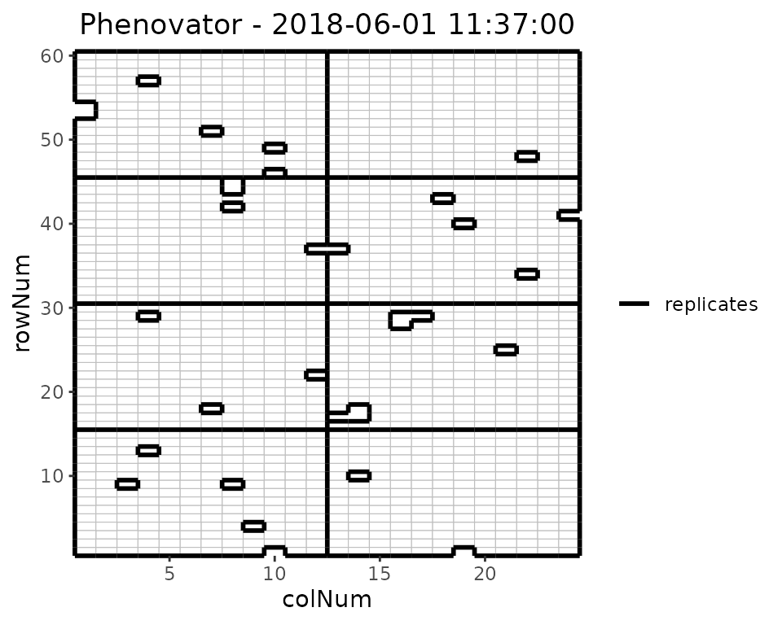

Here, the third time point is displayed which corresponds to the 1^(st)
of June 2018 at 11:37. Note that the title can be manually changed using
the `title` option. This plot can be extended by highlighting
interesting genotypes in the layout. Hereafter the check genotypes are
highlighted:

``` r

## Plot the layout for the third time point with the check genotypes highlighted.
plot(phenoTP, 
     plotType = "layout",
     timePoints = 3,  
     highlight = c("check1", "check2", "check3", "check4"))
```


It is possible to add the labels of the genotypes to the layout.

``` r

## Plot the layout for the third time point.
plot(phenoTP, 
     plotType = "layout",
     timePoints = 3,  
     highlight = c("check1", "check2", "check3", "check4"),
     showGeno = TRUE)
```

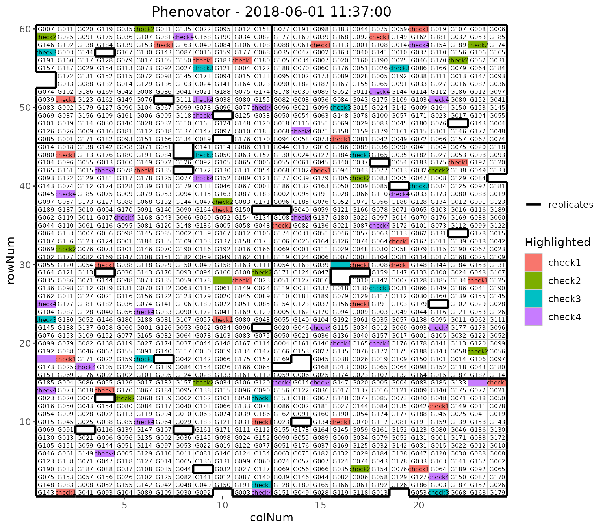

We can visualize the raw data of a given trait on the layout, as a
heatmap. This type of plot gives a first indication of the spatial
variability at a given time point. This can be further investigated with
the spatial modeling.

``` r

## Plot the layout for the third time point.
plot(phenoTP, 
     plotType = "layout",
     timePoints = 3,  
     traits = "EffpsII")
```

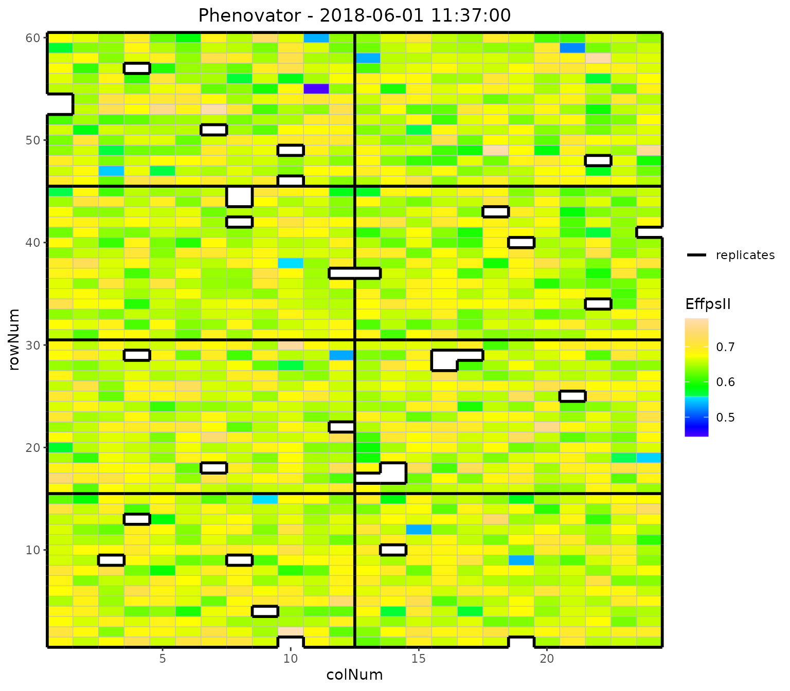

### Raw data plot

Raw data can be displayed per genotype with one color per plotId.

``` r

## Create the raw data time courses for three genotypes.
plot(phenoTP, 
     traits = "EffpsII",
     plotType = "raw",
     genotypes = c("G001", "G002", "check1"))
```


### Boxplot

Boxplots can be made to visually assess the variability of the trait(s)
in the `TP` object. By default a box is plotted per time point for the
specified trait using all time points.

``` r

## Create a boxplot for "EffpsII" using the default all time points.
plot(phenoTP, 
     plotType = "box",
     traits = "EffpsII") 
```

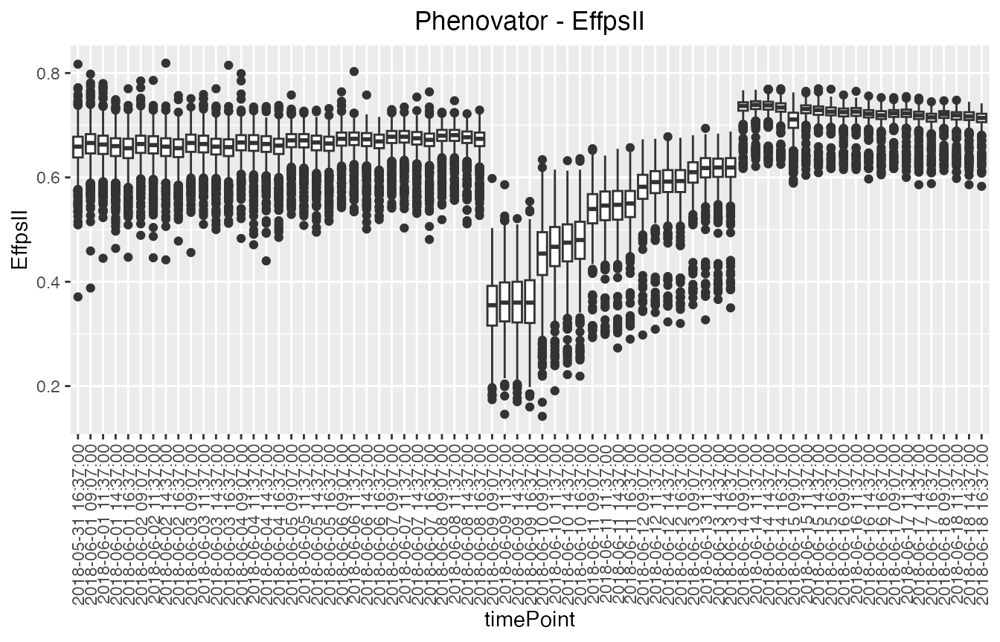

### Correlation plot

Finally, a plot of the correlations between the observations in time for
a specified trait can be made. The order of the plot is chronological
and by default all time points are used.

``` r

## Create a correlation plot for "EffpsII" for a selection of time points.
plot(phenoTP, 
     plotType = "cor",
     traits = "EffpsII",
     timePoints = seq(from = 1, to = 73, by = 5))
```

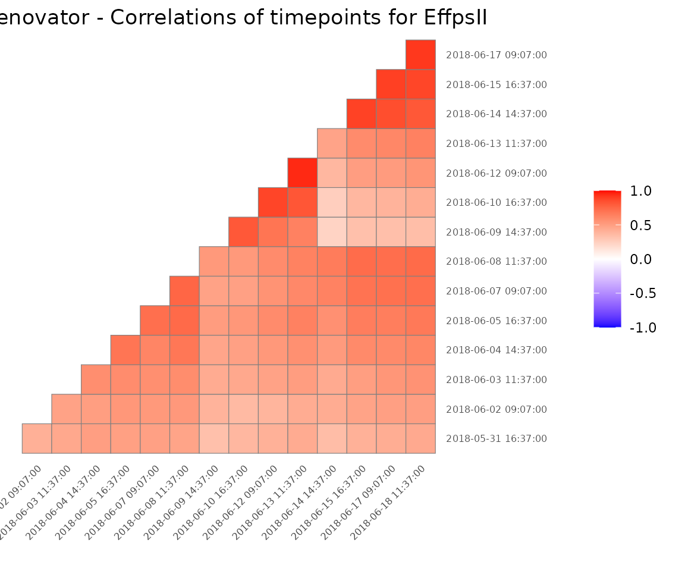

## Outlier detection for single observations

Time courses of phenotypic data are viewed as continuous time-related
functions. The first cleaning step consists of roughly checking the
consistency of each point with its neighbors within a time course.
Outlying single observations are measurements that do not follow the
expected behavior at a given time. The detection of outlying
observations is done “one time course after the other”.

Local regression is used to locally approximate the time courses by
parametric functions. First a local regression is fitted at a set of
points, then the fit is interpolated to other points. A confidence
interval can then be calculated. Points outside this interval will be
annotated as outliers.

``` r

# First select a subset of plants, for example here 4 plants.
plantSel <- c("c1r17","c13r17","c6r51","c21r24") 
# Then run on the subset
resuVatorHTP <- detectSingleOut(TP = phenoTP,
                                trait = "EffpsII",
                                plotIds = plantSel,
                                confIntSize = 3,
                                nnLocfit = 0.1)
```

| plotId | timePoint | EffpsII | yPred | sd_yPred | lwr | upr | outlier |
|:--:|:--:|:--:|:--:|:--:|:--:|:--:|:--:|
| c13r17 | 2018-06-03 09:07:00 | 0.751 | 0.6852574 | 0.0389194 | 0.5684992 | 0.8020156 | 0 |
| c13r17 | 2018-06-03 11:37:00 | 0.538 | 0.6833963 | 0.0255016 | 0.6068916 | 0.7599011 | 1 |
| c13r17 | 2018-06-03 14:37:00 | 0.737 | 0.7045487 | 0.0342136 | 0.6019078 | 0.8071896 | 0 |
| c13r17 | 2018-06-04 09:07:00 | 0.619 | 0.6330957 | 0.0436610 | 0.5021126 | 0.7640788 | 0 |
| c13r17 | 2018-06-04 11:37:00 | 0.711 | 0.6655915 | 0.0322765 | 0.5687620 | 0.7624211 | 0 |
| c13r17 | 2018-06-04 14:37:00 | 0.633 | 0.6861254 | 0.0330415 | 0.5870010 | 0.7852499 | 0 |

The predicted values and the confidence interval can be visualized using
the `plot` function.

``` r

plot(resuVatorHTP,
     outOnly = FALSE)
```

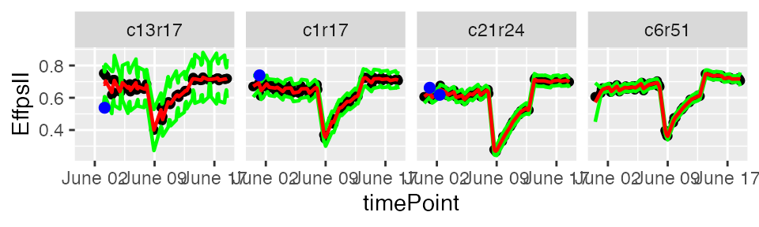

The annotated points can be replaced by NA for the studied trait using
the function
[`removeSingleOut()`](https://biometris.github.io/statgenHTP/index.html/reference/removeSingleOut.md).
It creates a new `TP` object.

``` r

phenoTPOut <- removeSingleOut(phenoTP,
                              resuVatorHTP)
```

## Correction for spatial trends

Phenotyping facilities display spatial heterogeneity. For example, the
spatial variability of incident light can go up to 100% between pots
within a greenhouse ([Cabrera-Bosquet et al. 2016](#ref-Cabrera2016)).
Taking into account these spatial trends is a prerequisite for precise
estimation of genetic and treatment effects. In the same way as in field
trials, platform experiments should obey standard principles for
experimental design and statistical modeling.

To get corrected values and genotypic predictions we want to accurately
separate the genetic effects from the spatial effects at each time
point. To do this, for each time point a spatial model is fitted for the
trait we are interested in. In `statgenHTP` spatial models can either be
fitted using *SpATS* ([Rodríguez-Álvarez et al. 2018](#ref-RodAlv2018))
and *ASReml* ([Butler et al. 2017](#ref-Gilmour2017)). This vignette
will focus on models fitted using SpATS. For models fitted using ASReml
see [this
vignette](https://biometris.github.io/statgenHTP/articles/vignettesSite/SpatialModel_HTP.html).

### Spatial model using SpATS

When SpATS is used for modeling, an extra spatial term is included in
the model. This spatial component is composed using the `PSANOVA`
function in the SpATS package which uses 2-dimensional smoothing with
P-splines as described in Lee et al. ([2013](#ref-Lee2013)) and in
Rodríguez-Álvarez et al. ([2018](#ref-RodAlv2018)).

In the example below the model is fitted for a few points.

``` r

## Fit a model for a few time points.
modPhenoSp <- fitModels(TP = phenoTPOut, 
                        trait = "EffpsII",
                        timePoints = c(1, 33, 36, 54, 73))
summary(modPhenoSp)
#> Models in modPhenoSp where fitted for experiment Phenovator.
#> 
#> It contains 5 time points.
#> The models were fitted using SpATS.
```

### Model plots

Several types of plots can be made for fitted models. A **spatial** plot
consists of spatial plots of the raw data, fitted values, residuals and
either BLUEs or BLUPs, and a histogram of the BLUEs or BLUPs. When SpATS
is used for modeling an extra plot with the fitted spatial trend is
included.

``` r

plot(modPhenoSp,
     timePoints = 36,
     plotType = "spatial",
     spaTrend = "percentage")
```

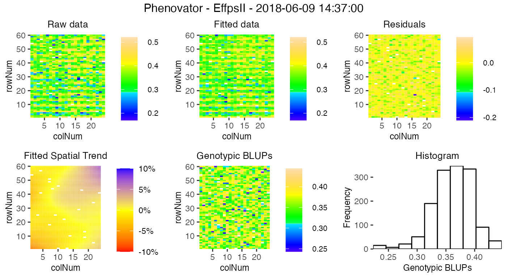

It is also possible to create a time lapse of the ratio of spatial
trends over time. The scale is the same as previously described. The
time lapse is always written to an output file.

``` r

plot(modPhenoSp, 
     plotType = "timeLapse",
     outFile = "TimeLapse_modPhenoSp.gif")
```

In the **rawPred** plot the raw data (colored dots, one color per
plotId) is plotted overlaid with the predicted values (black dots) from
the fitted model.

> Note: The model has been fitted on a limited number of time points,
> which is reflected in the plots. For plots using more time point see
> [this
> vignette](https://biometris.github.io/statgenHTP/articles/vignettesSite/SpatialModel_HTP.html).

``` r

plot(modPhenoSp, 
     plotType = "rawPred",
     genotypes = c("G007", "G058")) 
```

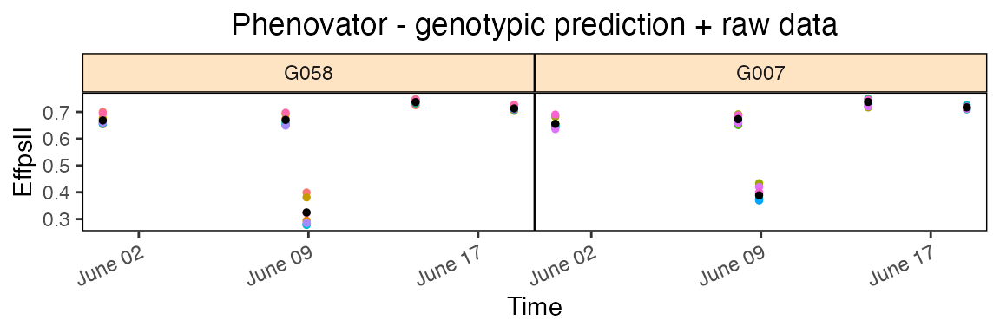

In the **corrPred** plot the corrected data (colored dots, one color per
plotId) is plotted overlaid with the predicted values (black dots) from
the fitted model.

``` r

plot(modPhenoSp, 
     plotType = "corrPred",
     genotypes = c("G007", "G058"))
```

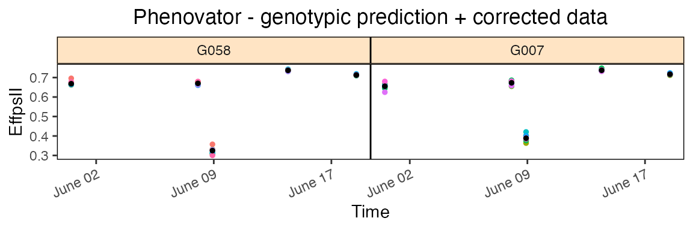

The last three types of plot display different model parameters over
time. Plot type **herit** plots the heritability over time.

``` r

plot(modPhenoSp, 
     plotType = "herit",
     yLim = c(0.5, 1))
```

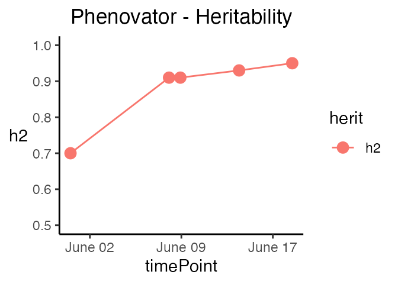

Plot type **variance** plots the residual, column and row variances over
time. These plots can serve as diagnostics of the experiment.

``` r

plot(modPhenoSp, 
     plotType = "variance")
```

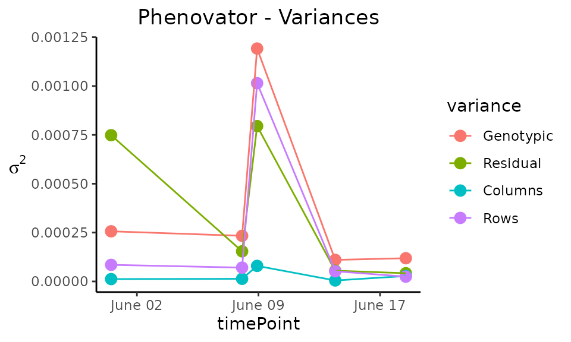

Plot type **effDim** plots the effective dimension from models fitted
using SpATS over time.

``` r

plot(modPhenoSp, 
     plotType = "effDim",
     whichED = c("colId", "rowId", "fColRow","colfRow", "surface"),
     EDType = "ratio")
```

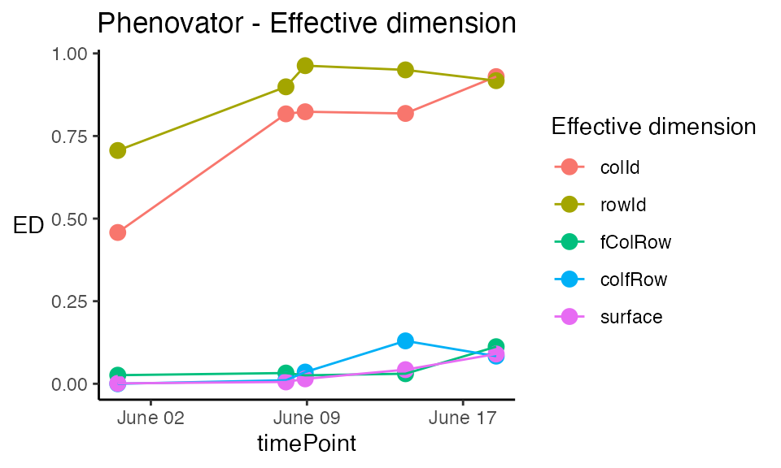

### Extracting model results

All results that can be extracted are shown in the table below. The
first column contains the function names. The second column contains a
short description of the result that will be extracted and, where
needed, states for which modeling engines it can be extracted.

| FUNCTION | DESCRIPTION |
|----|----|
| getGenoPred() | Best Linear Unbiased Predictions (BLUPS, genotype as random) or Estimators (BLUEs, genotype as fixed) |
| getCorrected() | Spatially corrected values at the experimental unit level |
| getVar() | Variance components |
| getHerit() | Generalized heritabilities - only when genotype is random |
| getEffDims() | Effective dimensions - only for SpATS engine |

``` r

## Extract the genotypic predictions for one time point: 
genoPredSp <- getGenoPred(modPhenoSp)
```

| timeNumber |      timePoint      | genotype | predicted.values | standard.errors |
|:----------:|:-------------------:|:--------:|:----------------:|:---------------:|
|     1      | 2018-05-31 16:37:00 |  check1  |    0.6708932     |    0.0050545    |
|     1      | 2018-05-31 16:37:00 |  check2  |    0.5811530     |    0.0068930    |
|     1      | 2018-05-31 16:37:00 |  check3  |    0.6432175     |    0.0067430    |
|     1      | 2018-05-31 16:37:00 |  check4  |    0.6808257     |    0.0049853    |
|     1      | 2018-05-31 16:37:00 |   G001   |    0.6706490     |    0.0089158    |
|     1      | 2018-05-31 16:37:00 |   G002   |    0.6640368     |    0.0089164    |

## Outlier detection for series of observations

After correcting the data for spatial trends, we can now check if the
data contains outliers for series of observations. We do this by
modeling each time course using a non-parametric smoothing spline with a
fixed number of knots. The estimates for the spline coefficients are
then extracted per time course (typically per plant) and correlations
between those coefficient vectors are calculated to identify outlying
time courses, *i.e.*, plants.

The function
[`fitSpline()`](https://biometris.github.io/statgenHTP/index.html/reference/fitSpline.md)
fits a P-spline per plant for the selected `trait`. The function output
contains the P-spline model coefficients and the values predicted on a
dense grid using the P-spline model coefficients.

``` r

data(spatCorrectedVator)  
# Fit P-splines using on a subset of genotypes.
subGenoVator <- c("G160", "G151")

fit.spline <- fitSpline(inDat = spatCorrectedVator,
                        trait = "EffpsII_corr",
                        genotypes = subGenoVator,
                        knots = 50,
                        useTimeNumber = TRUE,
                        timeNumber = "timeNumHour")
# Extracting the tables of predicted values and P-spline coefficients
predDat <- fit.spline$predDat
coefDat <- fit.spline$coefDat
```

We can then visualize the P-spline predictions and first derivatives for
a subset of genotypes or for a subset of plots.

``` r

plot(fit.spline,
     genotypes = "G160")
```

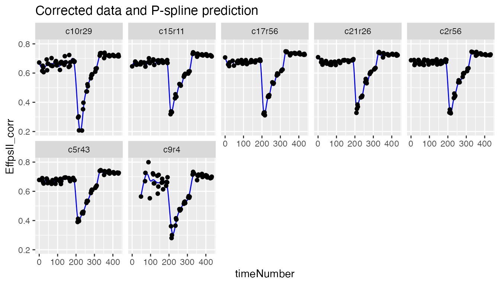

The coefficients are then used to tag suspect time courses with the
function
[`detectSerieOut()`](https://biometris.github.io/statgenHTP/index.html/reference/detectSerieOut.md).

``` r

outVator <- detectSerieOut(corrDat = spatCorrectedVator,
                           predDat = predDat,
                           coefDat = coefDat,
                           trait = "EffpsII_corr",
                           genotypes = subGenoVator,
                           thrCor = 0.9,
                           thrPca = 30)
```

| plotId | genotype |  reason   |   value    |
|:------:|:--------:|:---------:|:----------:|
| c21r25 |   G151   | mean corr | 0.7620638  |
| c21r25 |   G151   |   angle   | 39.8776276 |
| c21r25 |   G151   |   slope   | 0.5055244  |
|  c9r4  |   G160   | mean corr | 0.6778041  |
|  c9r4  |   G160   |   angle   | 47.3176970 |
|  c9r4  |   G160   |   slope   | 0.6046173  |

Visualizing the results we see that for genotype G151 plant c21r25 is
tagged as outlier:

``` r

plot(outVator, genotypes = "G151")
```

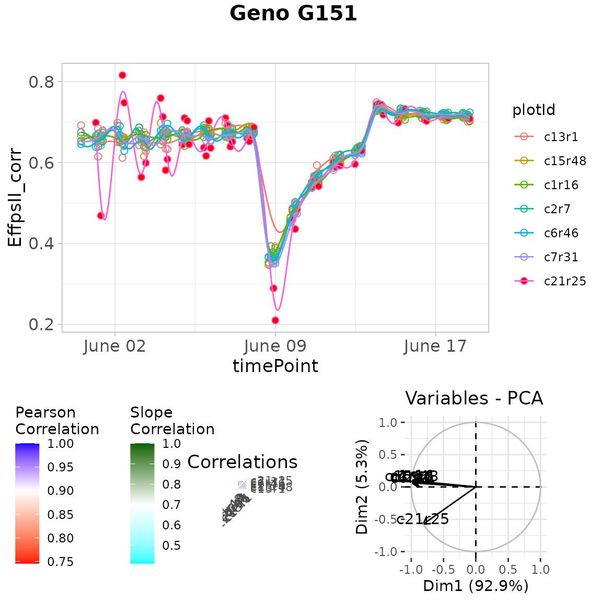

We can then remove the outlying plants from the data set or fitted
spline.

``` r

fit.splineOut <- removeSerieOut(fitSpline = fit.spline,
                                serieOut = outVator)
```

## Modeling the genetic signal

This section presents the second stage of the two-stage approach
proposed by Pérez-Valencia et al. ([2022](#ref-Perez2022)). The aim is
modeling the temporal evolution of the genetic signal after a spatial
correction is performed on a phenotypic trait. Data consist of
time-series (curves) of a (possibly) spatially corrected plant/plot
phenotype. We assume that data present a hierarchical structure with
plots nested in genotypes, and genotypes nested in “populations”. To
model this sample of curves an additive decomposition of the phenotypic
variation over time is considered, and a P-spline-based three-level
nested hierarchical data model (hereafter refer as **psHDM**) is used.

To illustrate the analysis, we use the Arabidopsis data corrected for
spatial trends, `spatCorrectedVator`. For simplicity, we will assume one
population (`pop`) and two genotypes (genotypes in `subGenoVator`). The
data structure and the new “population” variable are as follows

``` r

data(spatCorrectedVator)
spatCorrectedVator[["pop"]] <- as.factor(rep("Pop1", nrow(spatCorrectedVator)))
str(droplevels(spatCorrectedVator[spatCorrectedVator$genotype %in% subGenoVator,]))
#> 'data.frame':    995 obs. of  14 variables:
#>  $ timeNumber  : int  1 1 1 1 1 1 1 1 1 1 ...
#>  $ timePoint   : POSIXct, format: "2018-05-31 16:37:00" "2018-05-31 16:37:00" ...
#>  $ EffpsII_corr: num  0.666 0.654 0.646 0.692 0.675 ...
#>  $ EffpsII     : num  0.663 0.655 0.655 0.706 0.672 0.649 0.692 0.67 0.714 0.674 ...
#>  $ wt          : num  36 36 36 36 36 ...
#>  $ genotype    : Factor w/ 2 levels "G151","G160": 1 1 1 1 1 1 2 2 2 2 ...
#>  $ check       : Factor w/ 1 level "noCheck": 1 1 1 1 1 1 1 1 1 1 ...
#>  $ repId       : Factor w/ 7 levels "1","2","3","4",..: 7 2 4 6 1 3 7 4 5 2 ...
#>  $ Image_pos   : Factor w/ 9 levels "1a","1b","1c",..: 3 1 7 8 5 4 2 2 7 8 ...
#>  $ rowId       : Factor w/ 13 levels "1","4","7","11",..: 12 5 11 1 3 9 13 13 7 8 ...
#>  $ colId       : Factor w/ 11 levels "1","2","5","6",..: 9 1 4 8 2 5 10 2 11 7 ...
#>  $ plotId      : Factor w/ 14 levels "c10r29","c13r1",..: 4 6 11 2 9 12 5 8 7 1 ...
#>  $ timeNumHour : num  0 0 0 0 0 0 0 0 0 0 ...
#>  $ pop         : Factor w/ 1 level "Pop1": 1 1 1 1 1 1 1 1 1 1 ...
```

We will use the spatially corrected photosystem II efficiency
(`EffpsII_corr`) as response variable. We assume that plots (`plotId`,
$`M = 14`$) are nested in genotypes (`genotype`, $`L = 2`$), and
genotypes are nested in populations (`pop`, $`k = 1`$). Furthermore,
uncertainty is propagated from stage to stage using weights (`wt`).
Since we are in the context of longitudinal models, it is natural that
we use time as a covariate (i.e., the timepoints at which the phenotype
of interest was measured, `timeNumber = timeNumHour`)

### Model fitting

To fit the **psHDM** model, we use the
[`fitSplineHDM()`](https://biometris.github.io/statgenHTP/index.html/reference/fitSplineHDM.md)
function with cubic (`bdeg` $`= 3`$) B-spline basis functions with
`nseg` $`= 20`$ segments, and second order penalties (`pord`$`= 2`$) to
represent functions at the three levels of the hierarchy (population,
genotype and plot).

``` r

## Fit P-spline HDM.
fit.psHDM  <- fitSplineHDM(inDat = spatCorrectedVator,
                           genotypes = subGenoVator,
                           trait = "EffpsII_corr",
                           useTimeNumber = TRUE,
                           timeNumber = "timeNumHour",                           
                           pop = "pop",
                           genotype = "genotype",
                           plotId = "plotId",
                           weights = "wt",
                           difVar = list(geno = FALSE, plot = FALSE),
                           smoothPop = list(nseg = 20, bdeg = 3, pord = 2),
                           smoothGeno = list(nseg = 20, bdeg = 3, pord = 2),
                           smoothPlot = list(nseg = 20, bdeg = 3, pord = 2),
                           trace = FALSE)
```

The resulting object, in this case `fit.psHDM`, contains different
information about the data structure, the fitting process, and three
data frames with the estimated curves at each of the three-levels of the
hierarchy (explore `fit.psHDM$popLevel`, `fit.psHDM$genoLevel`, and
`fit.psHDM$plotLevel`). That is, it contains the estimated trajectories
and deviations, as well as their first and second-order derivatives. For
a detailed description of the returned values see
[`help(fitSplineHDM)`](https://biometris.github.io/statgenHTP/index.html/reference/fitSplineHDM.md).
All these curves can be used as input to extract time‐independent
parameters to characterise genotypes (as illustrated in the final
section of this vignette).

### Model prediction

The
[`predict.psHDM()`](https://biometris.github.io/statgenHTP/index.html/reference/predict.psHDM.md)
function can be used to obtain predictions from a fitted **psHDM** model
(obtained using the
[`fitSplineHDM()`](https://biometris.github.io/statgenHTP/index.html/reference/fitSplineHDM.md)
function; see above). In particular, this function allows obtaining
predictions (estimated curves at each level of the hierarchy) on a dense
grid of time points. Also, it allows the calculation of standard errors.
These standard errors can be used to construct (approximate) pointwise
confidence intervals for the estimated curves.

In the following code, we use the `fit.psHDM` object to make predictions
at the three levels of the hierarchy
(`pred = list(pop = TRUE, geno = TRUE, plot = TRUE)`), and to obtain
standard errors at the population and genotype levels
(`se = list(pop = TRUE, geno = TRUE, plot = FALSE)`). The original data
is measured at $`73`$ time points, but predictions are obtained at
$`100`$ time points in the same range than the original time points
(argument `newtimes`).

``` r

## Predict P-spline HDM.
pred.psHDM <- predict(object = fit.psHDM,
                      newtimes = seq(min(fit.psHDM$time[["timeNumber"]]),
                                     max(fit.psHDM$time[["timeNumber"]]),
                                     length.out = 100),
                      pred = list(pop = TRUE, geno = TRUE, plot = TRUE),
                      se = list(pop = TRUE, geno = TRUE, plot = FALSE),
                      trace = FALSE)
```

As result, three data frames with predictions (and standard errors) at
population (`pred.psHDM$popLevel`), genotype (`pred.psHDM$GenoLevel`)
and plot (`pred.psHDM$plotLevel`) levels are returned.

### Model plot

The
[`plot.psHDM()`](https://biometris.github.io/statgenHTP/index.html/reference/plot.psHDM.md)
function plots `psHDM` objects. We note that objects of class `psHDM`
can be obtained using both
[`fitSplineHDM()`](https://biometris.github.io/statgenHTP/index.html/reference/fitSplineHDM.md)
and
[`predict.psHDM()`](https://biometris.github.io/statgenHTP/index.html/reference/predict.psHDM.md)
functions. In both cases, the resulting object contains information
about estimated trajectories, deviations and first-order derivatives at
the three levels of the hierarchy. As such, plots of these curves can be
obtained. In addition, when plots are obtained from an object obtained
using the
[`predict.psHDM()`](https://biometris.github.io/statgenHTP/index.html/reference/predict.psHDM.md)
function, $`95\%`$ pointwise confidence intervals are also depicted.

To illustrate the usage of function
[`plot.psHDM()`](https://biometris.github.io/statgenHTP/index.html/reference/plot.psHDM.md),
we use here the object `pred.psHDM` obtained in the prediction section.

- If `plotType = "popTra"`, the estimated population trajectory
  ($`\hat{f}_p(t)`$) is depicted and its $`95\%`$ pointwise confidence
  intervals. Additionally, the grey lines represent the observed `trait`
  that is used in the `fitSplineHDM` function.

``` r

plot(pred.psHDM, plotType = "popTra", themeSizeHDM = 10)
```

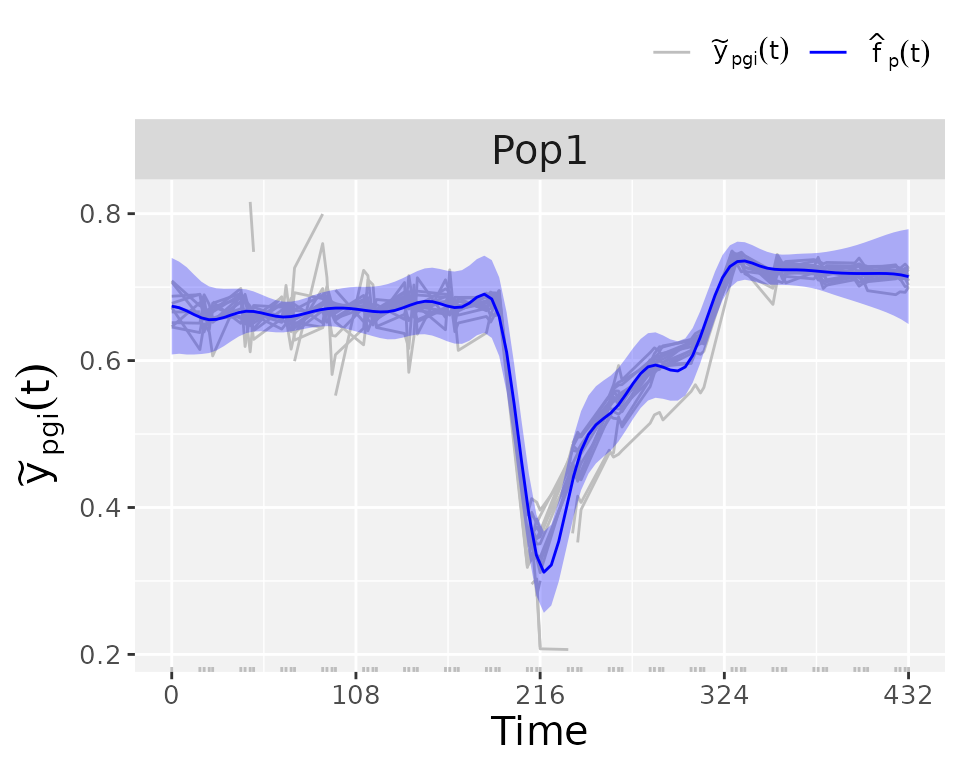

- If `plotType = "popGenoTra"`, estimated population ($`\hat{f}_p(t)`$)
  and genotype-especific ($`\hat{f}_p(t)+\hat{f}_{pg}(t)`$) trajectories
  are depicted for all genotypes. $`95\%`$ pointwise confidence
  intervals are depicted for the population trajectory. We let the user
  explore the plot for the first-order derivative of the estimated
  population and genotype trajectories (`plotType = "popGenoDeriv"`).

``` r

plot(pred.psHDM, plotType = "popGenoTra", themeSizeHDM = 10)
```

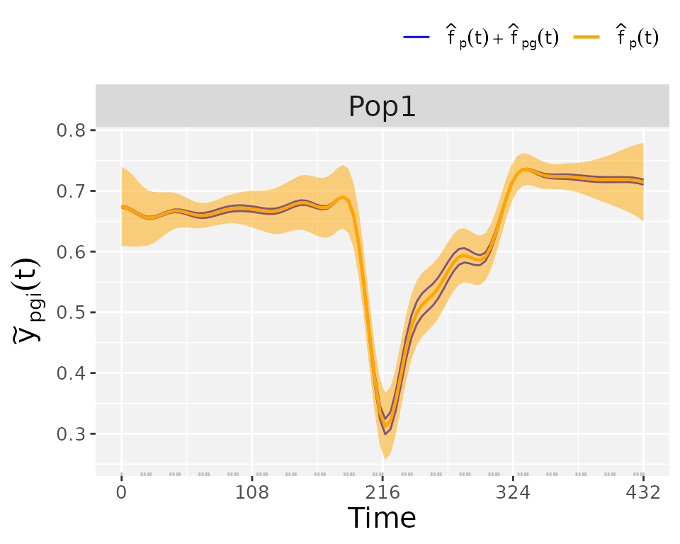

- If `plotType = "GenoDev"`, estimated genotype-specific deviations
  ($`\hat{f}_{pg}(t)`$) are depicted for all genotypes.

``` r

plot(pred.psHDM, plotType = "genoDev", themeSizeHDM = 10)
```

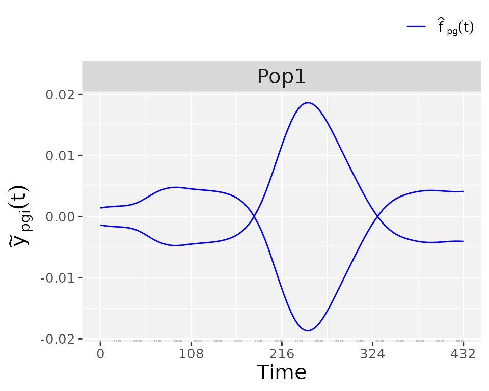

Finally, if we are interested in obtaining plots at the plot level, we
use `plotType = "genoPlotTra"`. Here, estimated genotype
($`\hat{f}_p(t)+\hat{f}_{pg}(t)`$) and plot-specific
($`\hat{f}_p(t)+\hat{f}_{pg}(t)+\hat{f}_{pgi}(t)`$) trajectories are
depicted for all plots separately for a selection of genotypes. Also,
$`95\%`$ pointwise confidence intervals are depicted for the estimated
genotype-specific trajectories.

``` r

plot(pred.psHDM, 
     plotType = "genoPlotTra", 
     themeSizeHDM = 10)
```

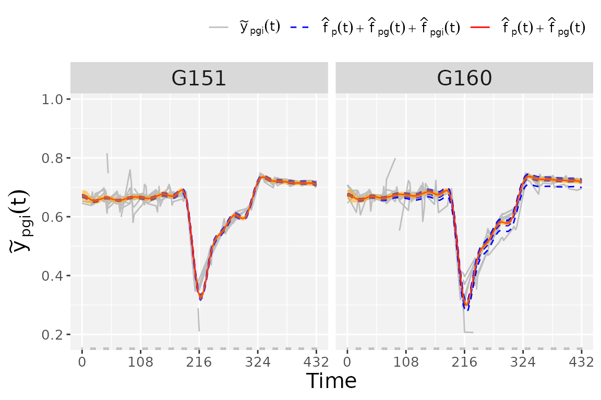

## Estimation of parameters from time courses

The final step in the HTP data analysis is extracting interesting
parameters from the modeled time courses. The parameters can then be
further analyzed, for example in a GxE analysis (see
[*statgenGxE*](https://biometris.github.io/statgenGxE/index.html)), or a
genetic analysis (see
[*statgenGWAS*](https://biometris.github.io/statgenGWAS/index.html)).
Note that **timeMin** and **timeMax** should be specified at the time
scale used when fitting the spline, in this case the time number scale.

``` r

paramVator1 <- estimateSplineParameters(x = fit.splineOut,
                                        estimate = "predictions",
                                        what = "AUC",
                                        timeMin = 330,
                                        timeMax = 432,
                                        genotypes = subGenoVator)

plot(paramVator1, plotType = "box")
```

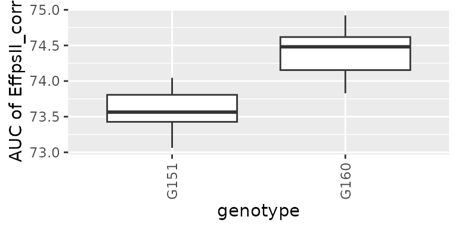

These parameters can also be obtained from estimated time courses after
the genetic signal is modeled with the **psHDM** model. For example, we
can extract the minimum spatially corrected photosystem II efficiency
(from previously estimated plot trajectories), for two genotypes (as
illustration).

``` r

paramVator2 <-
  estimateSplineParameters(x = pred.psHDM,
                           what = "min",
                           fitLevel = "plot",
                           estimate = "predictions")

plot(paramVator2, plotType = "box")
```

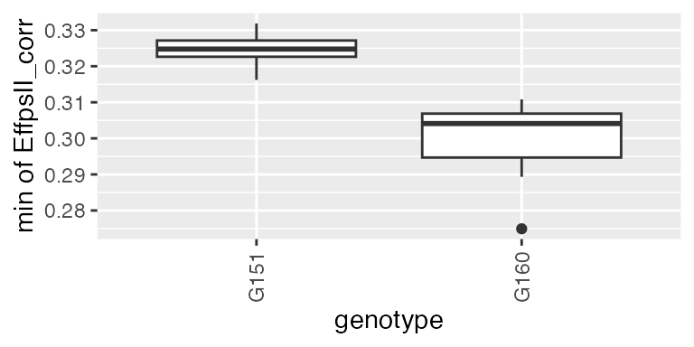

------------------------------------------------------------------------

### References

Butler, D. G., B. R. Cullis, A. R. Gilmour, B. G. Gogel, and R.
Thompson. 2017. *ASReml-r Reference Manual Version 4*.
<https://vsni.co.uk/>.

Cabrera-Bosquet, Llorenç, Christian Fournier, Nicolas Brichet, Claude
Welcker, Benoît Suard, and François Tardieu. 2016. “High-Throughput
Estimation of Incident Light, Light Interception and Radiation-Use
Efficiency of Thousands of Plants in a Phenotyping Platform.” *New
Phytologist* 212 (1): 269–81. <https://doi.org/10.1111/nph.14027>.

Eeuwijk, Fred A. van, Daniela Bustos-Korts, Emilie J. Millet, et al.
2019. “Modelling Strategies for Assessing and Increasing the
Effectiveness of New Phenotyping Techniques in Plant Breeding.” *Plant
Science* 282 (May): 23–39.
<https://doi.org/10.1016/j.plantsci.2018.06.018>.

Flood, Pádraic J., Willem Kruijer, Sabine K. Schnabel, et al. 2016.
“Phenomics for Photosynthesis, Growth and Reflectance in Arabidopsis
Thaliana Reveals Circadian and Long-Term Fluctuations in Heritability.”
*Plant Methods* 12 (1): 14. <https://doi.org/10.1186/s13007-016-0113-y>.

Lee, Dae-Jin, María Durbán, and Paul Eilers. 2013. “Efficient
Two-Dimensional Smoothing with p-Spline ANOVA Mixed Models and Nested
Bases.” *Computational Statistics & Data Analysis* 61 (May): 22–37.
<https://doi.org/10.1016/j.csda.2012.11.013>.

Pérez-Valencia, Diana M, María Xosé Rodríguez-Álvarez, Martin P Boer, et
al. 2022. “A Two-Stage Approach for the Spatio-Temporal Analysis of
High-Throughput Phenotyping Data.” *Scientific Reports* 12 (1): 1–16.
<https://doi.org/10.1038/s41598-022-06935-9>.

Rodríguez-Álvarez, María, Martin P. Boer, Fred van Eeuwijk, and Paul H.
C. Eilers. 2018. “Correcting for Spatial Heterogeneity in Plant Breeding
Experiments with p-Splines.” *Spatial Statistics* 23 (October): 52–71.
<https://doi.org/10.1016/j.spasta.2017.10.003>.

Rooijen, Roxanne van, Willem Kruijer, René Boesten, Fred A. van Eeuwijk,
Jeremy Harbinson, and Mark G. M. Aarts. 2017. “Natural Variation of
YELLOW SEEDLING1 Affects Photosynthetic Acclimation of Arabidopsis
Thaliana.” *Nature Communications* 8 (1).
<https://doi.org/10.1038/s41467-017-01576-3>.

Tardieu, François, Llorenç Cabrera-Bosquet, Tony Pridmore, and Malcolm
Bennett. 2017. “Plant Phenomics, From Sensors to Knowledge.” *Current
Biology* 27 (15): R770–83. <https://doi.org/10.1016/j.cub.2017.05.055>.
