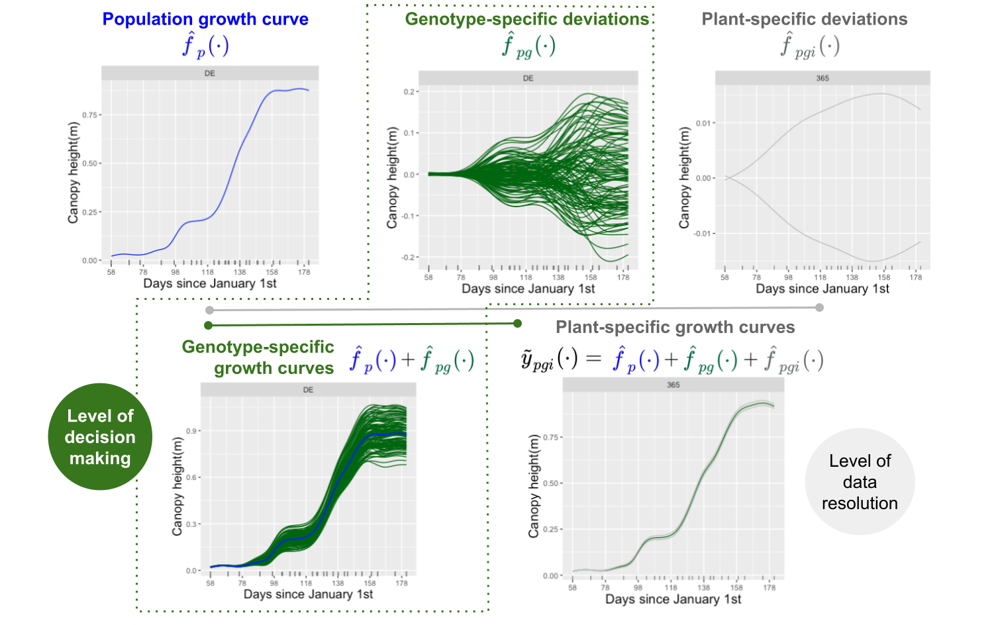
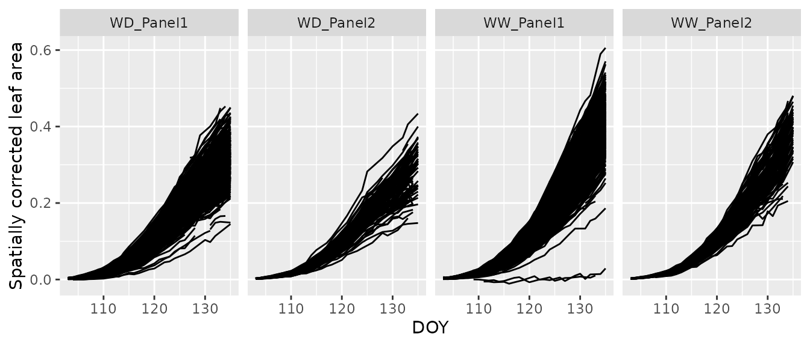
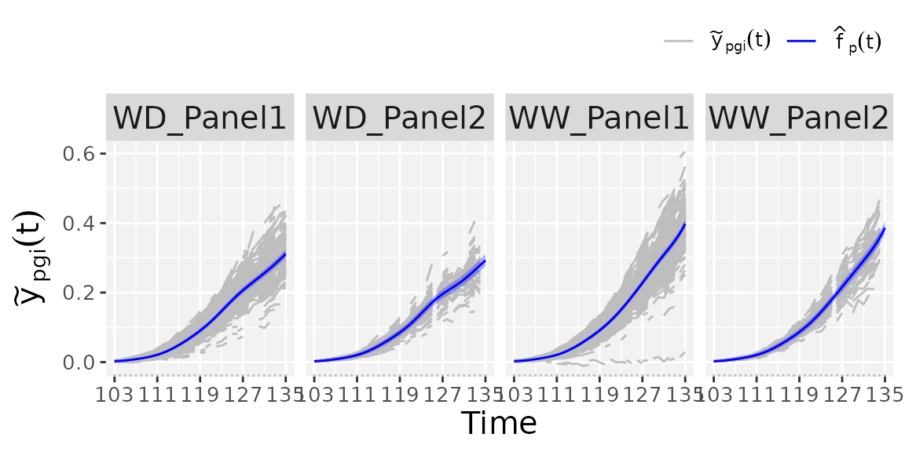
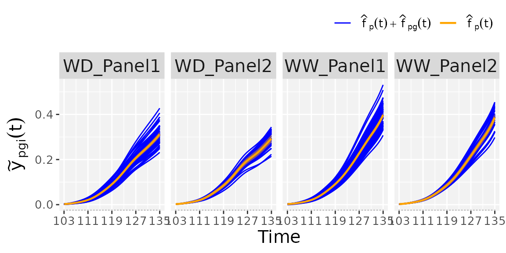
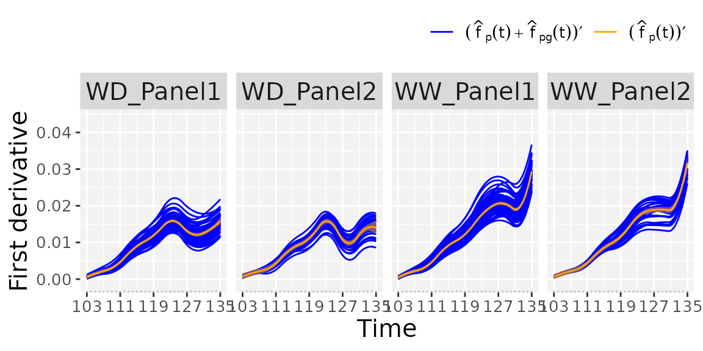
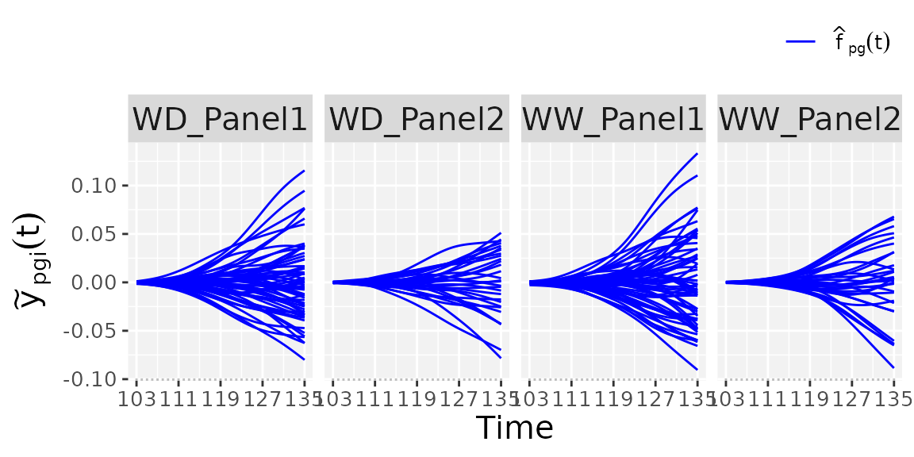
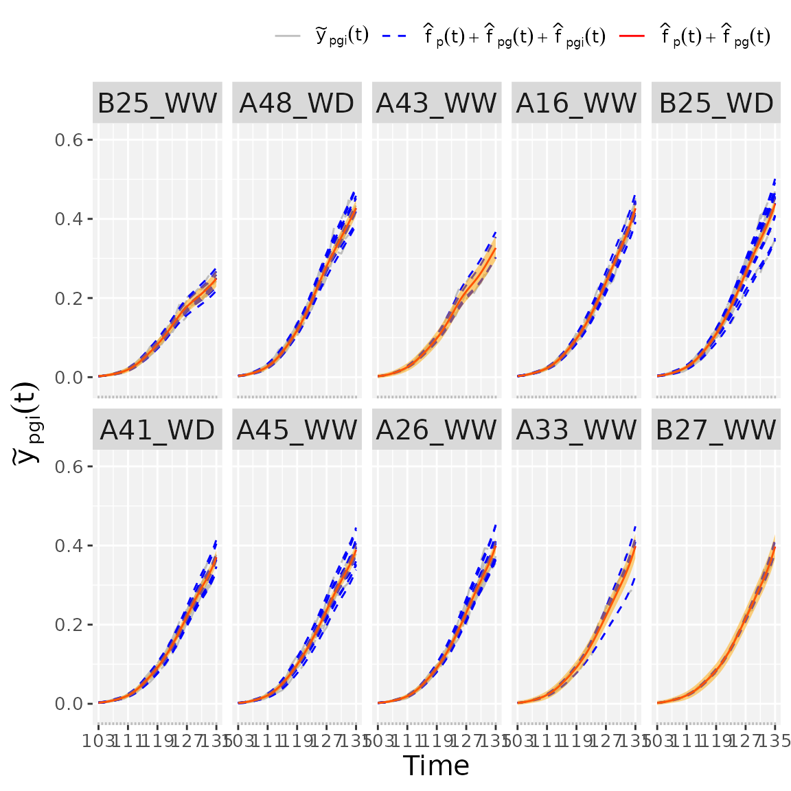

# statgenHTP tutorial: 5. Modelling the temporal evolution of the genetic signal

## Introduction

This document presents the second stage of the two-stage approach
proposed by Pérez-Valencia et al. ([2022](#ref-Perez2022)). The aim is
modeling the temporal evolution of the genetic signal after a spatial
correction is performed on a phenotypic trait (see [**statgenHTP
tutorial: 3. Correction for spatial
trends**](https://biometris.github.io/statgenHTP/index.html/articles/vignettesSite/SpatialModel_HTP.md)).

Data consist of time-series (curves) of a (possibly) spatially corrected
plant/plot phenotype. We assume that data present a hierarchical
structure with plots nested in genotypes, and genotypes nested in
“populations”. We denote as $`\tilde{y}_{pgi}(t)`$ the spatially
corrected phenotype for the $`i`$th plant ($`i = 1,\ldots,m_{pg}`$) of
the $`g`$th genotype $`g=1,\ldots,\ell_p`$ in the $`p`$th population
($`p= 1,\ldots, k`$) at time $`t`$. As such, there is a total of
$`M=\sum_{p=1}^k{\sum_{g=1}^{\ell_p}{m_{pg}}}`$ plots/plants,
$`L=\sum_{p=1}^k{\ell_p}`$ genotypes, and $`k`$ populations. To model
this sample of curves the following additive decomposition of the
phenotypic variation over time is considered, and a P-spline-based
three-level nested hierarchical data model (hereafter refer as
**psHDM**) is used

$`\tilde{y}_{pgi}(t) = f_{p}(t) + f_{pg}(t) + f_{pgi}(t) + \varepsilon_{pgi}(t),\;\;\varepsilon_{pgi}(t)\sim N\left(0, \sigma^{2}w_{pgi}(t)\right),`$

where

- $`f_{p}`$ is the $`p`$th population mean function.
- $`f_{pg}`$ is the genotype-specific deviation from $`f_p`$ for the
  $`g`$th genotype. Note that $`f_{p} + f_{pg}`$ represents the
  genotype-specific trajectory for the $`g`$th genotype.
- $`f_{pgi}`$ is the plot-specific deviation from $`f_{pg}`$ for the
  $`i`$th plot. In the same way than for the genotypes,
  $`f_{p} + f_{pg} + f_{pgi}`$ is the plot-specific trajectory for the
  $`i`$th plot.
- $`\varepsilon_{pgi}`$ is the random noise curve, and $`w_{pgi}`$ is
  the weight obtained from, e.g., the spatial correction.

An illustration of these curves follows



Before proceeding, we note that the functions described in this tutorial
can be applied to both spatially corrected data (see [**statgenHTP
tutorial: 3. Correction for spatial
trends**](https://biometris.github.io/statgenHTP/index.html/articles/vignettesSite/SpatialModel_HTP.md))
or raw data. These functions also allow estimating first- and
second-order derivative curves from trajectory and deviation curves at
the three levels of the hierarchy (populations, genotypes and
plots/plants). All these curves can be used as input to extract
time‐independent parameters to characterise genotypes (see [**statgenHTP
tutorial: 6. Estimation of parameters from time
courses**](https://biometris.github.io/statgenHTP/index.html/articles/vignettesSite/ParameterEstimation_HTP.md)).

To illustrate the analysis, we use the maize data corrected for spatial
trends, `spatCorrectedArch`. The data structure is as follows

``` r

data(spatCorrectedArch)
str(spatCorrectedArch)
#> 'data.frame':    40573 obs. of  10 variables:
#>  $ timeNumber   : int  1 1 1 1 1 1 1 1 1 1 ...
#>  $ timePoint    : POSIXct, format: "2017-04-13" "2017-04-13" ...
#>  $ LeafArea_corr: num  0.00256 0.0024 0.00321 0.00303 0.00269 ...
#>  $ LeafArea     : num  0.00287 0.00252 0.00338 0.00326 0.00249 ...
#>  $ wt           : num  2262 2262 2262 2262 2262 ...
#>  $ genotype     : Factor w/ 90 levels "GenoA01","GenoA02",..: 1 1 1 1 1 2 2 2 2 2 ...
#>  $ geno.decomp  : Factor w/ 4 levels "WD_Panel1","WD_Panel2",..: 1 1 1 1 1 1 1 1 1 1 ...
#>  $ rowId        : int  2 3 26 24 56 38 60 16 24 52 ...
#>  $ colId        : int  16 28 24 20 21 16 20 24 21 28 ...
#>  $ plotId       : Factor w/ 1673 levels "c10r1","c10r10",..: 368 1156 914 672 767 388 712 903 732 1181 ...
```

For this specific example we first need to specify the
genotype-by-treatment interaction (genotype-by-water regime). As is
explained in Pérez-Valencia et al. ([2022](#ref-Perez2022)), the actual
implementation of the **psHDM** model does not allow for crossed effect,
but only for nested effects. As such, to analyse this dataset with the
proposed model, we combine the genotype and the water regime information
as follows (i.e., $`180`$`genoTreat` = $`90`$`genotype`
$`\times`$$`2`$`treat`)

``` r

str(spatCorrectedArch[["geno.decomp"]])
#>  Factor w/ 4 levels "WD_Panel1","WD_Panel2",..: 1 1 1 1 1 1 1 1 1 1 ...
str(spatCorrectedArch[["genotype"]])
#>  Factor w/ 90 levels "GenoA01","GenoA02",..: 1 1 1 1 1 2 2 2 2 2 ...

## Extracting the treatment: water regime (WW, WD).
spatCorrectedArch[["treat"]] <- as.factor(substr(spatCorrectedArch[["geno.decomp"]],
                                                 start = 1, stop = 2))
str(spatCorrectedArch[["treat"]])
#>  Factor w/ 2 levels "WD","WW": 1 1 1 1 1 1 1 1 1 1 ...

## Specifying the genotype-by-treatment interaction.
spatCorrectedArch[["genoTreat"]] <-
  interaction(spatCorrectedArch[["genotype"]],
             spatCorrectedArch[["treat"]], sep = "_")

str(spatCorrectedArch[["genoTreat"]])
#>  Factor w/ 180 levels "GenoA01_WD","GenoA02_WD",..: 1 1 1 1 1 2 2 2 2 2 ...
```

We will use the spatially corrected leaf area (`LeafArea_corr`) as
response variable. We assume that plots (`plotId`, $`M = 1673`$) are
nested in genotype-by-water regime (`genoTreat`, $`L = 180`$), and
genotype-by-water regime are nested in populations/panel-by-water regime
(`geno.decomp`, $`k = 4`$). Furthermore, uncertainty is propagated from
stage to stage using weights (`wt`). Since we are in the context of
longitudinal models, it is natural that we use time as a covariate
(i.e., the timepoints at which the phenotype of interest was measured).
We note that the implemented function requires numerical times. If the
`timeNumber` column is used as it is returned by the
[`getCorrected()`](https://biometris.github.io/statgenHTP/index.html/reference/getCorrected.md)
function, the user has to be aware that it is a simple enumeration of
the timepoints. Care must be taken when dealing with non-equidistant
timepoints to keep the same time scale as in the original `timePoint`
column. The user can also specify any other numerical time
transformation. For instance, in this example, we first construct a new
column called `DOY` with time in days of the year

``` r

## Create a new timeNumber with days of the year (DOY)
spatCorrectedArch[["DOY"]] <- as.numeric(strftime(spatCorrectedArch$timePoint, format = "%j"))
```

The following code depicts the kind of curves that are modelled here (at
plant/plot level)

``` r

ggplot2::ggplot(data = spatCorrectedArch,
                ggplot2::aes(x= DOY, y = LeafArea_corr, group = plotId)) +
  ggplot2::geom_line(na.rm = TRUE) +
  ggplot2::facet_grid(~geno.decomp) +
  ggplot2::labs(y = "Spatially corrected leaf area")
```



------------------------------------------------------------------------

## Fit the P-spline Hierarchical Curve Data Model (psHDM)

To fit the **psHDM** model, we use the
[`fitSplineHDM()`](https://biometris.github.io/statgenHTP/index.html/reference/fitSplineHDM.md)
function (results of the fitting process are provided below)

``` r

## Fit P-Splines Hierarchical Curve Data Model for all genotypes.
fit.psHDM  <- fitSplineHDM(inDat = spatCorrectedArch,
                           trait = "LeafArea_corr",
                           useTimeNumber = TRUE,
                           timeNumber = "DOY",
                           pop = "geno.decomp",
                           genotype = "genoTreat",
                           plotId = "plotId",
                           weights = "wt",
                           difVar = list(geno = FALSE, plot = FALSE),
                           smoothPop = list(nseg = 7, bdeg = 3, pord = 2),
                           smoothGeno = list(nseg = 7, bdeg = 3, pord = 2),
                           smoothPlot = list(nseg = 7, bdeg = 3, pord = 2),
                           trace = TRUE)
```

In the example above, we use cubic ($`bdeg = 3`$) B-spline basis of
dimension $`b_{pop} = b_{gen} = b_{plot} = 10`$ and second order
penalties ($`pord = 2`$) to represent $`f_p`$, $`f_{pg}`$ and
$`f_{pgi}`$. We note that the
[`fitSplineHDM()`](https://biometris.github.io/statgenHTP/index.html/reference/fitSplineHDM.md)
function uses as argument the number of segments `nseg` instead of the
number of B-spline basis $`b`$ (`nseg` = $`b`$ - `bdeg`, that is, for
our example, if $`b = 10`$ then `nseg` = 7). We encourage the user to
try different values for `nseg` and compare the results. Under this
model configuration, the mixed model formulation of the **psHDM** model
has a total of 18570 regression coefficients (both fixed and random
$`4 \times 10 + 180 \times 10 + 1673 \times 10`$) and $`11`$ variance
components. The fitting can also be performed for a subset of genotypes
or plots. The user only needs to specify the desired vector of
`genotypes` and/or `plotIds`.

> Note: If the user prefers to use different penalty orders and/or
> B-spline degree values, the parameterisation proposed by Wood et al.
> ([2013](#ref-Wood2013)) is the one used by the `fitSplineHDM` function
> to obtain the design matrix for the fixed effects (i.e.,
> $`\boldsymbol{X}`$) in the mixed model formulation.

If `useTimeNumber = FALSE`, an internal numerical transformation of the
time points (`timePoint`) is made (and returned) using the first time
point as origin.

In this example we are using the weights obtained after a spatial
correction is performed in a previous stage (i.e., `weights = wt`, with
`wt` a column in `spatCorrectedArch`). However, if `weights = NULL`, the
weights are considered to be one. For instance, this could be the case
of modelling raw data.

With the `difVar` argument, the user can also specify if the genetic
variation varies across populations (`geno = TRUE`) and the plant
variation changes across genotypes (`plot = TRUE`). Consequently, the
number of variance components, `fit.psHDM$vc` (and effective dimension,
`fit.psHDM$ed`) will increase with the number of populations and/or
genotypes, while the number of coefficients will remain the same.

If `trace = TRUE` a report with changes in deviance and effective
dimension is printed by iteration. It is useful to understand the
importance of model components ([Rodríguez-Álvarez et al.
2018](#ref-RodAlv2018)), as well as to detect convergence problems.

``` r

## Fit P-Splines Hierarchical Curve Data Model for all genotypes.
fit.psHDM  <- fitSplineHDM(inDat = spatCorrectedArch,
                           trait = "LeafArea_corr",
                           useTimeNumber = TRUE,
                           timeNumber = "DOY",
                           pop = "geno.decomp",
                           genotype = "genoTreat",
                           plotId = "plotId",
                           weights = "wt",
                           difVar = list(geno = FALSE, plot = FALSE),
                           smoothPop = list(nseg = 7, bdeg = 3, pord = 2),
                           smoothGeno = list(nseg = 7, bdeg = 3, pord = 2),
                           smoothPlot = list(nseg = 7, bdeg = 3, pord = 2),
                           trace = TRUE)
#> Effective dimensions
#> -------------------------
#> It.     Deviance        p1        p2        p3        p4     g.int     g.slp  g.smooth     i.int     i.slp  i.smooth
#>   1 -124003.216245     7.808     7.457     7.822     7.447   153.841   155.047  1086.529  1469.062  1513.633  8713.310
#>   2 -409208.877371     7.889     7.770     7.975     7.897   150.423   159.550   892.712  1236.532  1456.125  7041.664
#>   3 -412800.467660     7.910     7.787     7.983     7.925   157.527   162.575   803.841  1237.270  1465.159  5894.104
#>   4 -413841.057202     7.913     7.786     7.985     7.922   159.272   163.089   787.598  1286.468  1471.329  5195.497
#>   5 -414152.439567     7.914     7.783     7.985     7.918   159.443   163.042   790.487  1315.662  1474.828  4806.468
#>   6 -414237.155491     7.913     7.782     7.985     7.916   159.428   162.976   795.234  1328.862  1476.488  4604.336
#>   7 -414258.638613     7.913     7.780     7.985     7.914   159.431   162.949   798.454  1334.470  1477.223  4503.289
#>   8 -414263.887260     7.913     7.780     7.985     7.913   159.445   162.942   800.254  1336.873  1477.549  4453.660
#>   9 -414265.145823     7.913     7.779     7.985     7.913   159.458   162.941   801.189  1337.934  1477.696  4429.464
#>  10 -414265.444801     7.913     7.779     7.985     7.913   159.466   162.942   801.658  1338.419  1477.764  4417.702
#>  11 -414265.515495     7.913     7.779     7.985     7.913   159.470   162.942   801.890  1338.646  1477.796  4411.991
#>  12 -414265.532172     7.913     7.779     7.985     7.913   159.473   162.943   802.003  1338.754  1477.812  4409.220
#>  13 -414265.536102     7.913     7.779     7.985     7.913   159.474   162.943   802.058  1338.805  1477.819  4407.875
#>  14 -414265.537027     7.913     7.779     7.985     7.913   159.474   162.943   802.085  1338.830  1477.823  4407.222
```

The resulting object, in this case `fit.psHDM`, contains different
information about the data structure, the fitting process, and three
data frames with the estimated curves at each of the three-levels of the
hierarchy (population, genotypes and plots). That is, it contains the
estimated trajectories and deviations, as well as their first and
second-order derivatives. For a detailed description of the returned
values see
[`help(fitSplineHDM)`](https://biometris.github.io/statgenHTP/index.html/reference/fitSplineHDM.md).

``` r

names(fit.psHDM)
#>  [1] "y"           "time"        "popLevs"     "genoLevs"    "plotLevs"   
#>  [6] "nPlotPop"    "nGenoPop"    "nPlotGeno"   "MM"          "ed"         
#> [11] "vc"          "phi"         "coeff"       "deviance"    "convergence"
#> [16] "dim"         "family"      "cholHn"      "smooth"      "popLevel"   
#> [21] "genoLevel"   "plotLevel"
```

An example of the estimated curves structure follows. `popLevel`
contains, for each population (`pop`), the estimated population
trajectories ($`\hat{f}_p`$, `fPop`) as well as their first
($`\hat{f}'_p`$, `fPopDeriv1`) and second-order ($`\hat{f}''_p`$,
`fPopDeriv2`) derivatives

``` r

names(fit.psHDM$popLevel)
#> [1] "timeNumber" "timePoint"  "pop"        "fPop"       "fPopDeriv1"
#> [6] "fPopDeriv2"
```

| timeNumber | timePoint  |    pop    |   fPop    | fPopDeriv1 | fPopDeriv2 |
|:----------:|:----------:|:---------:|:---------:|:----------:|:----------:|
|    103     | 2017-04-13 | WD_Panel1 | 0.0025168 | 0.0006026  | 0.0004741  |
|    104     | 2017-04-14 | WD_Panel1 | 0.0033505 | 0.0010588  | 0.0004382  |
|    105     | 2017-04-15 | WD_Panel1 | 0.0046224 | 0.0014789  | 0.0004022  |
|    106     | 2017-04-16 | WD_Panel1 | 0.0062964 | 0.0018631  | 0.0003662  |
|    107     | 2017-04-17 | WD_Panel1 | 0.0083366 | 0.0022113  | 0.0003302  |
|    108     | 2017-04-18 | WD_Panel1 | 0.0107102 | 0.0025459  | 0.0003986  |

Estimated curves at population level {.table}

Further, `genoLevel` contains, for each genotype (`genotype`) in a
population (`pop`)

- Estimated genotype deviations ($`\hat{f}_{pg}`$, `fGeno`) as well as
  their first ($`\hat{f}'_{pg}`$, `fGenoDeriv1`) and second-order
  ($`\hat{f}''_{pg}`$, `fGenoDeriv2`) derivatives.

- Estimated genotype trajectories ($`\hat{f}_{p} +\hat{f}_{pg}`$,
  `fGenoDev`) as well as their first ($`\hat{f}'_{p} +\hat{f}'_{pg}`$,
  `fGenoDevDeriv1`) and second-order ($`\hat{f}''_{p} +\hat{f}''_{pg}`$,
  `fGenoDevDeriv2`) derivatives.

``` r

names(fit.psHDM$genoLevel)
#>  [1] "timeNumber"     "timePoint"      "pop"            "genotype"      
#>  [5] "fGeno"          "fGenoDeriv1"    "fGenoDeriv2"    "fGenoDev"      
#>  [9] "fGenoDevDeriv1" "fGenoDevDeriv2"
```

| timeNumber | timePoint | pop | genotype | fGeno | fGenoDeriv1 | fGenoDeriv2 | fGenoDev | fGenoDevDeriv1 | fGenoDevDeriv2 |
|:--:|:--:|:--:|:--:|:--:|:--:|:--:|:--:|:--:|:--:|
| 103 | 2017-04-13 | WD_Panel1 | GenoA01_WD | 0.0026216 | 0.0005841 | 0.0004948 | 0.0001048 | -0.0000185 | 2.06e-05 |
| 104 | 2017-04-14 | WD_Panel1 | GenoA01_WD | 0.0034437 | 0.0010507 | 0.0004385 | 0.0000932 | -0.0000080 | 3.00e-07 |
| 105 | 2017-04-15 | WD_Panel1 | GenoA01_WD | 0.0047043 | 0.0014611 | 0.0003822 | 0.0000819 | -0.0000179 | -2.00e-05 |
| 106 | 2017-04-16 | WD_Panel1 | GenoA01_WD | 0.0063471 | 0.0018152 | 0.0003259 | 0.0000507 | -0.0000480 | -4.03e-05 |
| 107 | 2017-04-17 | WD_Panel1 | GenoA01_WD | 0.0083158 | 0.0021129 | 0.0002696 | -0.0000208 | -0.0000984 | -6.06e-05 |
| 108 | 2017-04-18 | WD_Panel1 | GenoA01_WD | 0.0105575 | 0.0023776 | 0.0003217 | -0.0001527 | -0.0001682 | -7.68e-05 |

Estimated curves at genotype level {.table}

Finally, `plotLevel` contains, for each plot (`plotId`) in a genotype
(`genotype`) in a population (`pop`)

- Estimated plot deviations ($`\hat{f}_{pgi}`$, `fPlot`) as well as
  their first ($`\hat{f}'_{pgi}`$, `fPlotDeriv1`) and second-order
  ($`\hat{f}''_{pgi}`$, `fPlotDeriv2`) derivatives.

- Estimated plot trajectories
  ($`\hat{f}_{p} +\hat{f}_{pg}+\hat{f}_{pgi}`$, `fPlotDev`) as well as
  their first ($`\hat{f}'_{p} +\hat{f}'_{pg}+\hat{f}'_{pgi}`$,
  `fPlotDevDeriv1`) and second-order
  ($`\hat{f}''_{p} +\hat{f}''_{pg}+\hat{f}''_{pgi}`$, `fPlotDevDeriv2`)
  derivatives.

- The original `trait` values ($`\tilde{y}_{pgi}`$, `ObsPlot`).

``` r

names(fit.psHDM$plotLevel)
#>  [1] "timeNumber"     "timePoint"      "pop"            "genotype"      
#>  [5] "plotId"         "fPlot"          "fPlotDeriv1"    "fPlotDeriv2"   
#>  [9] "fPlotDev"       "fPlotDevDeriv1" "fPlotDevDeriv2" "obsPlot"
```

| timeNumber | timePoint | pop | genotype | plotId | fPlot | fPlotDeriv1 | fPlotDeriv2 | fPlotDev | fPlotDevDeriv1 | fPlotDevDeriv2 | obsPlot |
|:--:|:--:|:--:|:--:|:--:|:--:|:--:|:--:|:--:|:--:|:--:|:--:|
| 103 | 2017-04-13 | WD_Panel1 | GenoA01_WD | c12r20 | 0.0028737 | 0.0002559 | 0.0005414 | 0.0002521 | -0.0003282 | 4.66e-05 | NA |
| 104 | 2017-04-14 | WD_Panel1 | GenoA01_WD | c12r20 | 0.0033886 | 0.0007624 | 0.0004717 | -0.0000550 | -0.0002883 | 3.32e-05 | 0.0032766 |
| 105 | 2017-04-15 | WD_Panel1 | GenoA01_WD | c12r20 | 0.0043753 | 0.0011992 | 0.0004020 | -0.0003290 | -0.0002619 | 1.98e-05 | 0.0041821 |
| 106 | 2017-04-16 | WD_Panel1 | GenoA01_WD | c12r20 | 0.0057639 | 0.0015664 | 0.0003323 | -0.0005832 | -0.0002488 | 6.40e-06 | 0.0056382 |
| 107 | 2017-04-17 | WD_Panel1 | GenoA01_WD | c12r20 | 0.0074848 | 0.0018638 | 0.0002626 | -0.0008311 | -0.0002491 | -7.00e-06 | 0.0085059 |
| 108 | 2017-04-18 | WD_Panel1 | GenoA01_WD | c12r20 | 0.0094719 | 0.0021169 | 0.0003114 | -0.0010856 | -0.0002607 | -1.04e-05 | 0.0095675 |

Estimated curves at plot level {.table style="width:100%;"}

------------------------------------------------------------------------

## Predict the P-spline Hierarchical Curve Data Model

The
[`predict.psHDM()`](https://biometris.github.io/statgenHTP/index.html/reference/predict.psHDM.md)
function can be used to obtain predictions from a fitted **psHDM** model
(obtained using the
[`fitSplineHDM()`](https://biometris.github.io/statgenHTP/index.html/reference/fitSplineHDM.md)
function; see above). In particular, this function allows obtaining
predictions (estimated curves at each level of the hierarchy) on a dense
grid of time points. Also, it allows the calculation of standard errors.
These standard errors can be used to construct (approximate) pointwise
confidence intervals for the estimated curves.

``` r

## Predict the P-Splines Hierarchical Curve Data Model on a dense grid
## with standard errors at the population and genotype levels
pred.psHDM <- predict(object = fit.psHDM,
                      newtimes = seq(min(fit.psHDM$time[["timeNumber"]]),
                                     max(fit.psHDM$time[["timeNumber"]]),
                                     length.out = 100),
                      pred = list(pop = TRUE, geno = TRUE, plot = TRUE),
                      se = list(pop = TRUE, geno = TRUE, plot = FALSE),
                      trace = FALSE)
```

> Note 1: If `newtimes` are not especified, the original time points are
> used.

> Note 2: As a hierarchical model is assumed, predictions at inner
> levels (genotypes and plots) require predictions at outer levels
> (populations and genotypes). That is, if the user only wants
> predictions (argument `pred`) at genotype level (`geno = TRUE`), then
> predictions at population level (`pop = TRUE`) should be calculated as
> well.

> Note 3: Standard errors (argument `se`) at the plot level demand large
> computing memory and time. For this example, if we use the original
> time points, estimation take approximately 20 minutes in a (64-bit)
> 4.2.1 and a 1.60GHz Dual-Core i5 processor computer with 16GB of RAM
> and macOS Monterrey Version 12.5. As such, if it is not strictly
> necessary, we suggest the user to set the standard errors at the
> `plot` level as `FALSE`. For comparison, if `plot = FALSE` for the
> standard errors argument, the computation time for the same example is
> 4 seconds approximately.

In the code above, we use the `fit.psHDM` object to make predictions at
the three levels of the hierarchy
(`pred = list(pop = TRUE, geno = TRUE, plot = TRUE)`), and to obtain
standard errors at the population and genotype levels
(`se = list(pop = TRUE, geno = TRUE, plot = FALSE)`). The original data
is measured at 33 time points, but predictions are obtained at 100 time
points in the same range than the original time points (argument
`newtimes`). As result, three data frames with predictions (and standard
errors) at population (`popLevel`), genotype (`GenoLevel`) and plot
(`plotLevel`) levels are returned

``` r

names(pred.psHDM)
#> [1] "newtimes"  "popLevel"  "genoLevel" "plotLevel" "plotObs"
names(pred.psHDM$popLevel)
#> [1] "timeNumber"  "timePoint"   "pop"         "fPop"        "fPopDeriv1" 
#> [6] "fPopDeriv2"  "sePop"       "sePopDeriv1" "sePopDeriv2"
names(pred.psHDM$GenoLevel)
#> NULL
names(pred.psHDM$plotLevel)
#>  [1] "timeNumber"     "timePoint"      "pop"            "genotype"      
#>  [5] "plotId"         "fPlot"          "fPlotDeriv1"    "fPlotDeriv2"   
#>  [9] "fPlotDev"       "fPlotDevDeriv1" "fPlotDevDeriv2"
```

> Note 4: If the original time points are used for predictions, the data
> frame at plot level (`plotLevel`) will have an additional column
> (`obsPlot`) with the raw data. Otherwise, an additional data frame
> (`plotObs`) with the raw data will be returned.

| timeNumber | timePoint | pop | fPop | fPopDeriv1 | fPopDeriv2 | sePop | sePopDeriv1 | sePopDeriv2 |
|:--:|:--:|:--:|:--:|:--:|:--:|:--:|:--:|:--:|
| 103.0000 | 2017-04-13 00:00:00 | WD_Panel1 | 0.0025168 | 0.0006026 | 0.0004741 | 0.0010397 | 0.0002835 | 5.17e-05 |
| 103.3232 | 2017-04-13 07:45:27 | WD_Panel1 | 0.0027362 | 0.0007540 | 0.0004625 | 0.0010198 | 0.0002789 | 4.74e-05 |
| 103.6465 | 2017-04-13 15:30:54 | WD_Panel1 | 0.0030038 | 0.0009016 | 0.0004509 | 0.0010074 | 0.0002752 | 4.32e-05 |
| 103.9697 | 2017-04-13 23:16:21 | WD_Panel1 | 0.0033186 | 0.0010455 | 0.0004392 | 0.0010025 | 0.0002720 | 3.93e-05 |
| 104.2929 | 2017-04-14 07:01:49 | WD_Panel1 | 0.0036793 | 0.0011856 | 0.0004276 | 0.0010048 | 0.0002692 | 3.56e-05 |
| 104.6162 | 2017-04-14 14:47:16 | WD_Panel1 | 0.0040847 | 0.0013219 | 0.0004160 | 0.0010143 | 0.0002667 | 3.23e-05 |

Predicted curves and standard errors at population level {.table}

| timeNumber | timePoint | pop | genotype | fGeno | fGenoDeriv1 | fGenoDeriv2 | fGenoDev | fGenoDevDeriv1 | fGenoDevDeriv2 | seGeno | seGenoDeriv1 | seGenoDeriv2 | seGenoDev | seGenoDevDeriv1 | seGenoDevDeriv2 |
|:--:|:--:|:--:|:--:|:--:|:--:|:--:|:--:|:--:|:--:|:--:|:--:|:--:|:--:|:--:|:--:|
| 103.0000 | 2017-04-13 00:00:00 | WD_Panel1 | GenoA01_WD | 0.0026216 | 0.0005841 | 0.0004948 | 0.0001048 | -1.85e-05 | 2.06e-05 | 0.0018419 | 0.0005717 | 0.0001888 | 0.0020863 | 0.0006259 | 0.0001870 |
| 103.3232 | 2017-04-13 07:45:27 | WD_Panel1 | GenoA01_WD | 0.0028359 | 0.0007411 | 0.0004766 | 0.0000997 | -1.29e-05 | 1.41e-05 | 0.0017929 | 0.0005450 | 0.0001722 | 0.0020349 | 0.0006016 | 0.0001706 |
| 103.6465 | 2017-04-13 15:30:54 | WD_Panel1 | GenoA01_WD | 0.0031000 | 0.0008922 | 0.0004584 | 0.0000962 | -9.40e-06 | 7.50e-06 | 0.0017605 | 0.0005243 | 0.0001557 | 0.0020013 | 0.0005827 | 0.0001545 |
| 103.9697 | 2017-04-13 23:16:21 | WD_Panel1 | GenoA01_WD | 0.0034120 | 0.0010374 | 0.0004402 | 0.0000934 | -8.10e-06 | 1.00e-06 | 0.0017436 | 0.0005088 | 0.0001396 | 0.0019845 | 0.0005684 | 0.0001388 |
| 104.2929 | 2017-04-14 07:01:49 | WD_Panel1 | GenoA01_WD | 0.0037700 | 0.0011768 | 0.0004220 | 0.0000907 | -8.80e-06 | -5.60e-06 | 0.0017415 | 0.0004974 | 0.0001239 | 0.0019839 | 0.0005576 | 0.0001235 |
| 104.6162 | 2017-04-14 14:47:16 | WD_Panel1 | GenoA01_WD | 0.0041721 | 0.0013102 | 0.0004038 | 0.0000875 | -1.17e-05 | -1.22e-05 | 0.0017531 | 0.0004891 | 0.0001088 | 0.0019985 | 0.0005494 | 0.0001090 |

Predicted curves and standard errors at genotype level {.table}

| timeNumber | timePoint | pop | genotype | plotId | fPlot | fPlotDeriv1 | fPlotDeriv2 | fPlotDev | fPlotDevDeriv1 | fPlotDevDeriv2 |
|:--:|:--:|:--:|:--:|:--:|:--:|:--:|:--:|:--:|:--:|:--:|
| 103.0000 | 2017-04-13 00:00:00 | WD_Panel1 | GenoA01_WD | c12r20 | 0.0028737 | 0.0002559 | 0.0005414 | 0.0002521 | -0.0003282 | 4.66e-05 |
| 103.3232 | 2017-04-13 07:45:27 | WD_Panel1 | GenoA01_WD | c12r20 | 0.0029843 | 0.0004272 | 0.0005188 | 0.0001484 | -0.0003138 | 4.22e-05 |
| 103.6465 | 2017-04-13 15:30:54 | WD_Panel1 | GenoA01_WD | c12r20 | 0.0031491 | 0.0005913 | 0.0004963 | 0.0000491 | -0.0003009 | 3.79e-05 |
| 103.9697 | 2017-04-13 23:16:21 | WD_Panel1 | GenoA01_WD | c12r20 | 0.0033658 | 0.0007481 | 0.0004738 | -0.0000463 | -0.0002893 | 3.36e-05 |
| 104.2929 | 2017-04-14 07:01:49 | WD_Panel1 | GenoA01_WD | c12r20 | 0.0036319 | 0.0008976 | 0.0004513 | -0.0001381 | -0.0002792 | 2.92e-05 |
| 104.6162 | 2017-04-14 14:47:16 | WD_Panel1 | GenoA01_WD | c12r20 | 0.0039452 | 0.0010398 | 0.0004287 | -0.0002269 | -0.0002704 | 2.49e-05 |

Predicted curves and standard errors at plot level {.table}

------------------------------------------------------------------------

## Plot the P-spline Hierarchical Curve Data Model

The
[`plot.psHDM()`](https://biometris.github.io/statgenHTP/index.html/reference/plot.psHDM.md)
function plots `psHDM` objects. We note that objects of class `psHDM`
can be obtained using both
[`fitSplineHDM()`](https://biometris.github.io/statgenHTP/index.html/reference/fitSplineHDM.md)
and
[`predict.psHDM()`](https://biometris.github.io/statgenHTP/index.html/reference/predict.psHDM.md)
functions. In both cases, the resulting object contains information
about estimated trajectories, deviations and first-order derivatives at
the three levels of the hierarchy. As such, plots of these curves can be
obtained. In addition, when plots are obtained from an object obtained
using the
[`predict.psHDM()`](https://biometris.github.io/statgenHTP/index.html/reference/predict.psHDM.md)
function, $`95\%`$ pointwise confidence intervals are also depicted.

To illustrate the usage of function
[`plot.psHDM()`](https://biometris.github.io/statgenHTP/index.html/reference/plot.psHDM.md),
we use here the object `pred.psHDM` obtained in the prediction section.

### Plots at population level

If `plotType = "popTra"`, estimated population-specific trajectories are
depicted ($`\hat{f}_p(t)`$) separately for each population, and their
$`95\%`$ pointwise confidence intervals. Additionally, the grey lines
represent the observed `trait` that is used in the `fitSplineHDM`
function (i.e., $`\tilde{y}_{pgi}`$).

``` r

## Population-specific trajectories.
plot(pred.psHDM, plotType = "popTra", themeSizeHDM = 10)
```



### Plots at genotype level

At genotype level we can visualise three plots:

- If `plotType = "popGenoTra"`, estimated population ($`\hat{f}_p(t)`$)
  and genotype-specific ($`\hat{f}_p(t)+\hat{f}_{pg}(t)`$) trajectories
  are depicted for all genotypes separately for each population.
  $`95\%`$ pointwise confidence intervals are depicted for the estimated
  population trajectories.

``` r

  ## Population and genotype-specific trajectories.
  plot(pred.psHDM, plotType = "popGenoTra", themeSizeHDM = 10)
```



- If `plotType = "popGenoDeriv"`, first-order derivative of the
  estimated population ($`\hat{f}'_p(t)`$) and genotype-specific
  ($`\hat{f}'_p(t)+\hat{f}'_{pg}(t)`$) trajectories are depicted for all
  genotypes separately for each population. $`95\%`$ pointwise
  confidence intervals are depicted for estimated trajectories at the
  population level.

``` r

  ## First-order derivative of the population- and genotype-specific trajectories.
  plot(pred.psHDM, plotType = "popGenoDeriv", themeSizeHDM = 10)
```



- Finally, if `plotType = "GenoDev"`, estimated genotype-specific
  deviations ($`\hat{f}_{pg}(t)`$) are depicted for all genotypes
  separately for each population.  

``` r

  ## Genotype-specific deviations.
  plot(pred.psHDM, plotType = "genoDev", themeSizeHDM = 10)
```



### Plots at plot level

Finally, if we are interested in obtaining plots at the plot level, we
use `plotType = "genoPlotTra"`. Here, estimated genotype
($`\hat{f}_p(t)+\hat{f}_{pg}(t)`$) and plot-specific
($`\hat{f}_p(t)+\hat{f}_{pg}(t)+\hat{f}_{pgi}(t)`$) trajectories are
depicted for all plots separately for a selection of genotypes. Also,
$`95\%`$ pointwise confidence intervals are depicted for the estimated
genotype-specific trajectories. For this `plotType`, the user has the
option to change names (`genotypeNames`) and/or order (`genotypeOrder`)
of the selected genotypes.

``` r

## As an example we used ten randomly selected genotypes 
set.seed(1)
plot.genos  <- sample(pred.psHDM$genoLevel$genotype,10, replace = FALSE)
names.genos <- substring(plot.genos, first = 5)
names.genos
#>  [1] "B25_WW" "A48_WD" "A43_WW" "A16_WW" "B25_WD" "A41_WD" "A45_WW" "A26_WW"
#>  [9] "A33_WW" "B27_WW"

## Genotype- and plot-specific trajectories.
plot(pred.psHDM, 
     plotType = "genoPlotTra", 
     genotypes = plot.genos, genotypeNames = names.genos,
     themeSizeHDM = 10)
```



------------------------------------------------------------------------

### References

Pérez-Valencia, Diana M, María Xosé Rodríguez-Álvarez, Martin P Boer, et
al. 2022. “A Two-Stage Approach for the Spatio-Temporal Analysis of
High-Throughput Phenotyping Data.” *Scientific Reports* 12 (1): 1–16.
<https://doi.org/10.1038/s41598-022-06935-9>.

Rodríguez-Álvarez, María, Martin P. Boer, Fred van Eeuwijk, and Paul H.
C. Eilers. 2018. “Correcting for Spatial Heterogeneity in Plant Breeding
Experiments with p-Splines.” *Spatial Statistics* 23 (October): 52–71.
<https://doi.org/10.1016/j.spasta.2017.10.003>.

Wood, Simon N, Fabian Scheipl, and Julian J Faraway. 2013.
“Straightforward Intermediate Rank Tensor Product Smoothing in Mixed
Models.” *Statistics and Computing* 23 (3): 341–60.
<https://doi.org/10.1007/s11222-012-9314-z>.
