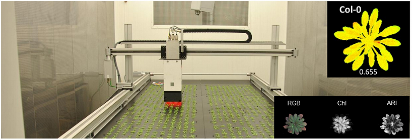
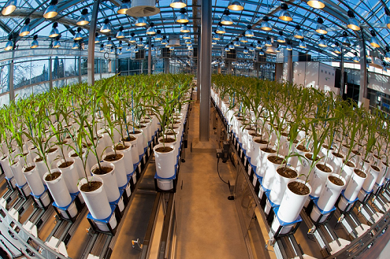
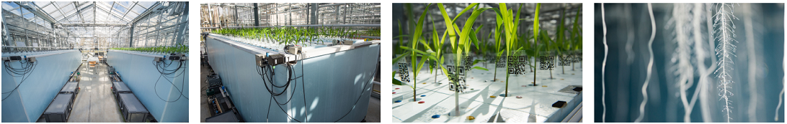
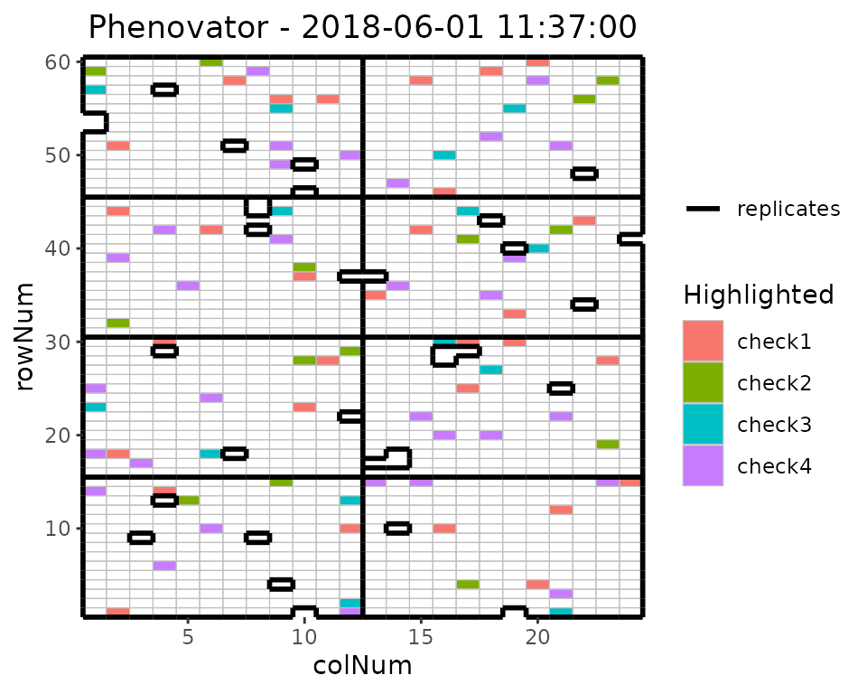
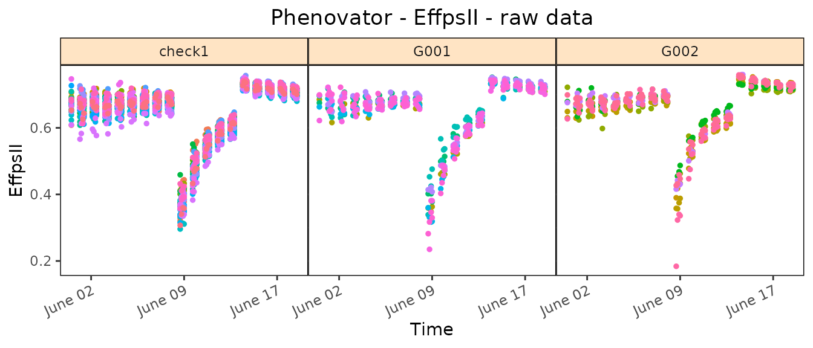
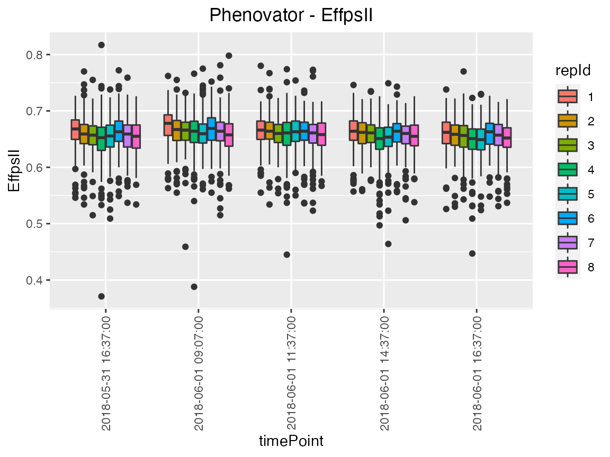
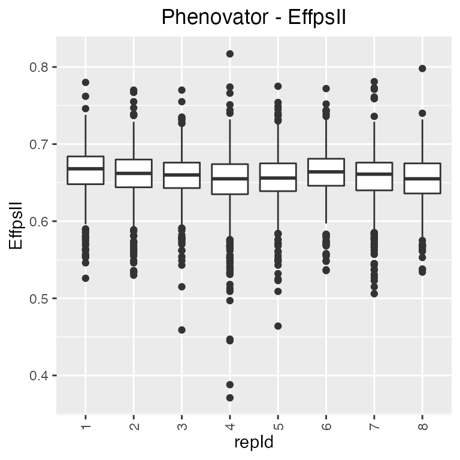
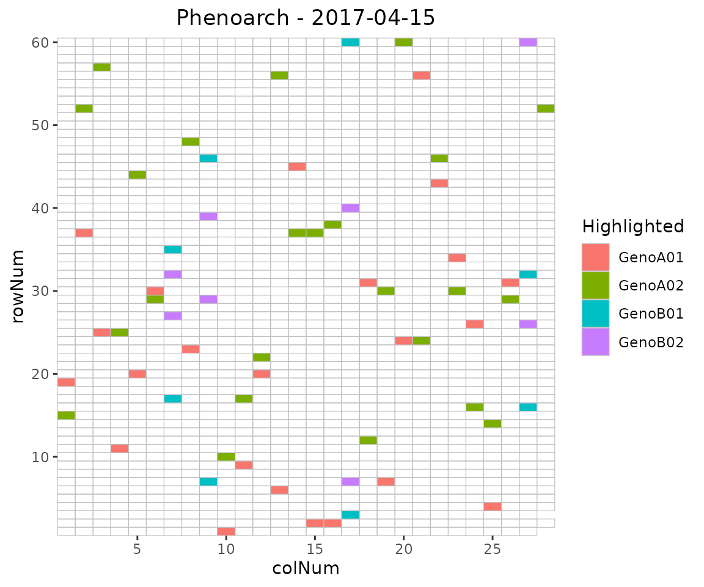
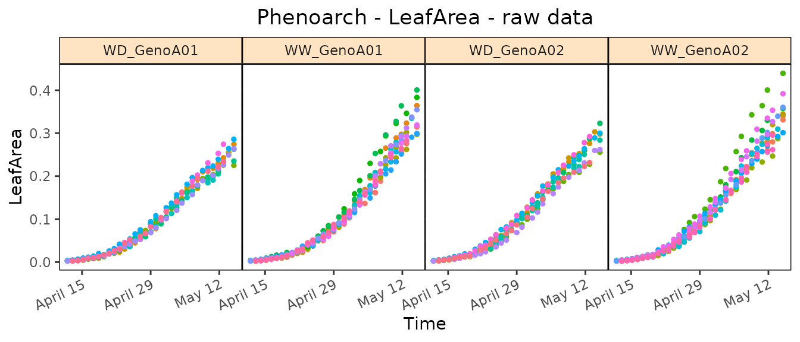
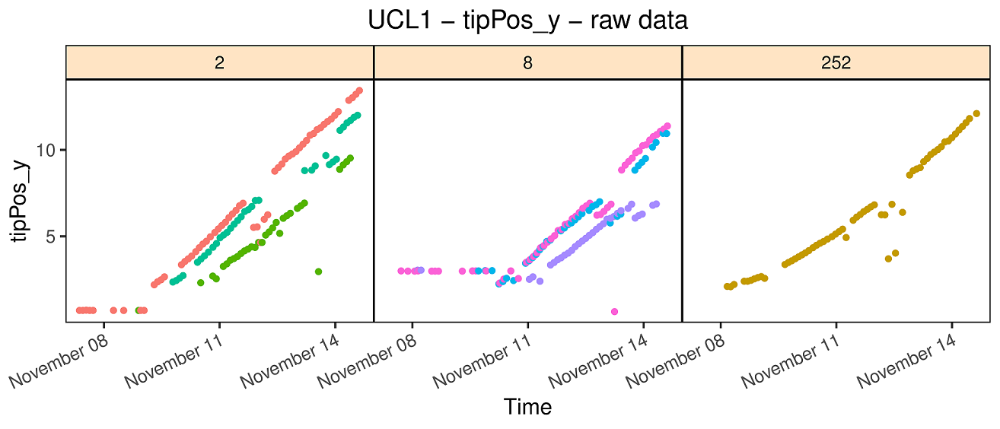

# statgenHTP tutorial: 1. Introduction, data description and preparation

## The statgenHTP Package

The statgenHTP package is developed as an easy-to-use package for
analyzing data coming from high throughput phenotyping (HTP) platform
experiments. The package provides many options for plotting and
exporting the results of the analyses. It was developed within the
[EPPN²⁰²⁰project](https://cordis.europa.eu/project/id/731013) to meet
the needs for automated analyses of HTP data.

New phenotyping techniques enable measuring traits at high throughput,
with traits being measured at multiple time points for hundreds or
thousands of plants. This requires automatic modeling of the data
([Tardieu et al. 2017](#ref-Tardieu2017)) with a model that is robust,
flexible and has easy selection steps.

The aim of this package is to provide a suit of functions to (1) detect
outliers at the time point or at the plant levels, (2) accurately
separate the genetic effects from the spatial effects at each time point
and (3) estimate relevant parameters from a modeled time course. It will
provide the user with either genotypic values or corrected values that
can be used for further modeling, e.g. extract responses to environment
([Eeuwijk et al. 2019](#ref-vanEeuw2019)).

**Structure of the package**

The overall structure of the package is in 6 main parts:

1.  Data description and preparation - *statgenHTP tutorial: 1.
    Introduction, data description and preparation*
2.  Outlier detection: single observations - [*statgenHTP tutorial: 2.
    Outlier detection for single
    observations*](https://biometris.github.io/statgenHTP/index.html/articles/vignettesSite/OutlierSingleObs_HTP.md)
3.  Correction for spatial trends - [*statgenHTP tutorial: 3. Correction
    for spatial
    trends*](https://biometris.github.io/statgenHTP/index.html/articles/vignettesSite/SpatialModel_HTP.md)
4.  Outlier detection: series of observations - [*statgenHTP
    tutorial: 4. Outlier detection for series of
    observations*](https://biometris.github.io/statgenHTP/index.html/articles/vignettesSite/OutlierSerieObs_HTP.md)
5.  Modeling genetic signal - [*statgenHTP tutorial: 5. Modelling the
    temporal evolution of the genetic
    signal*](https://biometris.github.io/statgenHTP/index.html/articles/vignettesSite/HierarchicalDataModel_HTP.md)
6.  Parameter estimation - [*statgenHTP tutorial: 6. Estimation of
    parameters for time
    courses*](https://biometris.github.io/statgenHTP/index.html/articles/vignettesSite/ParameterEstimation_HTP.md)

This document describes in detail the three data sets used to exemplify
the functions. It also contains descriptions on how to prepare the data
for analysis and how to visualize them.

------------------------------------------------------------------------

## Data description

### Example 1: photosystem efficiency in Arabidopsis

The first example used in this package contains data from an experiment
in the Phenovator platform (WUR, Netherlands, ([Flood et al.
2016](#ref-Flood2016))) with Arabidopsis plants. It consists of one
experiment with 1440 plants grown in a growth chamber with different
light intensity. The data set called “PhenovatorDat1” is included in the
package.



The number of tested genotypes (`Genotype`) is 192 with 6-7 replicates
per genotype (`Replicate`). Four reference genotypes were also tested
with 15 or 30 replicates. The studied trait is the photosystem II
efficiency (`EffpsII`) extracted from the pictures over time ([Rooijen
et al. 2017](#ref-vanRooi2017)). The unique ID of the plant is recorded
(`pos`), together with the pot position in row (`x`) and in column
(`y`). The data set also includes factors from the design: the position
of the camera (`Image_pos`) and the pots table (`Basin`).

``` r

data("PhenovatorDat1")
```

| Genotype | Basin | Image_pos | Replicate | x | y | Sowing_Position | timepoints | EffpsII | pos |
|:--:|:--:|:--:|:--:|:--:|:--:|:--:|:--:|:--:|:--:|
| G001 | 2 | 1b | 8 | 14 | 32 | 8R02 | 2018-05-31 16:37:00 | 0.685 | c14r32 |
| G001 | 2 | 1b | 8 | 14 | 32 | 8R02 | 2018-06-01 09:07:00 | 0.688 | c14r32 |
| G001 | 2 | 1b | 8 | 14 | 32 | 8R02 | 2018-06-01 11:37:00 | 0.652 | c14r32 |
| G001 | 2 | 1b | 8 | 14 | 32 | 8R02 | 2018-06-01 14:37:00 | 0.671 | c14r32 |
| G001 | 2 | 1b | 8 | 14 | 32 | 8R02 | 2018-06-01 16:37:00 | 0.616 | c14r32 |
| G001 | 2 | 1b | 8 | 14 | 32 | 8R02 | 2018-06-02 09:07:00 | 0.678 | c14r32 |

### Example 2: maize leaf growth in greenhouse

The second example used in this tutorial contains data from an
experiment in the [Phenoarch
platform](https://www6.montpellier.inrae.fr/lepse/M3P/Plateformes/PHENOARCH)
with maize plants (INRAE, France, ([Cabrera-Bosquet et al.
2016](#ref-Cabrera2016))). It consists of a greenhouse containing a
conveyor belt structure of 28 lanes carrying 60 carts with one pot each
(i.e. 1680 pots).



In this dataset, there are two genotypic panels (`population`) and two
water scenarios (`Scenario`), well-watered (WW) and water deficit (WD).
The first population contains 60 genotypes (`geno`) with 14 replicates:
7 in WW and 7 in WD. The second population contains 30 genotypes with 8
replicates, 4 in WW and 4 in WD.

``` r

data("PhenoarchDat1")
```

The leaf area and the biomass of individual plants are estimated from
images taken in 13 directions. Briefly, pixels extracted from RGB images
are converted into biomass and leaf area (([Brichet et al.
2017](#ref-Brichet2017))). Time courses for biomass (`Biomass`) and leaf
area (`LeafArea`) are expressed as a function of thermal time (`TT`).
The height of each plants (`PlantHeight`) is also estimated from the
pictures. The number of visible leaves (`LeafCount`) is counted at least
once a week on each plant. To prevent errors in leaf counting, leaves 5
and 10 of each plant are marked soon after appearance. The `phyllocron`
is calculated as the slope of the linear regression of number of leaves
on thermal time before the beginning of the water deficit.

The unique ID of the plant is recorded (`pos`), together with the pot
position in row (`Row`) and in column (`Col`).

|    Date    |  pos  | Genotype | Scenario | population | Row | Col |  Biomass  |
|:----------:|:-----:|:--------:|:--------:|:----------:|:---:|:---:|:---------:|
| 2017-04-18 | c15r1 | GenoA50  |    WW    |   Panel1   |  1  | 15  | 0.7984986 |
| 2017-04-20 | c15r1 | GenoA50  |    WW    |   Panel1   |  1  | 15  | 4.6488698 |
| 2017-04-21 | c15r1 | GenoA50  |    WW    |   Panel1   |  1  | 15  | 7.9376467 |
| 2017-04-18 | c16r1 | GenoA15  |    WD    |   Panel1   |  1  | 16  |    NA     |
| 2017-04-20 | c16r1 | GenoA15  |    WD    |   Panel1   |  1  | 16  | 4.4885912 |
| 2017-04-21 | c16r1 | GenoA15  |    WD    |   Panel1   |  1  | 16  | 9.3175224 |

### Example 3: Tip root data set

The tip root data set was obtained during an experiment performed at the
[RootPhAir
platform](https://uclouvain.be/en/research-institutes/eli/elia/rootphair.html)
(Louvain-La-Neuve University). This platform consists of two aeroponic
tanks of 495 plants located in the same greenhouse. Plants are held on a
strip containing 5 plants, with 99 strips per tank. Sprinklers are
placed in the bottom of the tanks and spray a nutrient solution. Strips
move constantly and plants are pictured when the strip passes in front
of the camera. Plants are pictured every two hours. The root system is
described in two dimensions, with the root tip position in depth and
width (tipPos_y and tipPos_x respectively) deduced from image analysis.



For each genotype (`Genotype`), the tip position (`tipPos_x` and
`tipPos_y`) of the main root was tracked over time (`Time`) for each
plant (`plantId`). Plant coordinates are defined using the strip number
(`Strip`) and the position on the strip (`Pos`), from 1 to 5.

``` r

data("RootDat1")
```

| Exp | thermalTime | Genotype | plantId | Tank | Strip | Pos | tipPos_x | tipPos_y | Time |
|:--:|:--:|:--:|:--:|:--:|:--:|:--:|:--:|:--:|:--:|
| 1 | 116.0433 | 116 | A_01_2 | A | 1 | 2 | 1.4857143 | 3.042857 | 2016-11-07 13:15:41 |
| 1 | 124.3465 | 116 | A_01_2 | A | 1 | 2 | 0.0535714 | 2.385714 | 2016-11-08 00:26:39 |
| 1 | 126.3715 | 116 | A_01_2 | A | 1 | 2 | -0.0785714 | 2.014286 | 2016-11-08 02:41:01 |
| 1 | 128.2498 | 116 | A_01_2 | A | 1 | 2 | -0.2357143 | 2.042857 | 2016-11-08 04:55:31 |
| 1 | 137.7153 | 116 | A_01_2 | A | 1 | 2 | 1.4892857 | 3.042857 | 2016-11-08 18:20:01 |
| 1 | 141.3060 | 116 | A_01_2 | A | 1 | 2 | -0.1071429 | 2.314286 | 2016-11-08 22:48:26 |

> *NOTE: In this platform, plants are constantly moving therefore
> observations at any particular time will always include only a limited
> number of plants. As a consequence, it is not possible to perform a
> spatial analysis per time point, but the other functions for outliers
> detection and longitudinal modeling are available and illustrated in
> various tutorials. Estimates for dynamical parameters can be submitted
> to spatial analysis in the [statgenSTA
> package](https://biometris.github.io/statgenSTA/index.html).*

## Data preparation

The first step when modeling platform experiment data with the
statgenHTP package is creating an object of class `TP` (Time Points). In
this object, the time points are split into single `data.frames`. It is
then used throughout the statgenHTP package as input for analyses.

> *NOTE: It is possible to use the functions in this package with a
> phenotype measured at one time point only. In that case, the user has
> to create a column with time point containing the unique measurement
> time.*

A `TP` object can be created from a `data.frame` with the function
`createTimePoints`. This function does a number of things:

- Quality control on the input data. For example, warnings will be given
  when more than 50% of observations are missing for a plant.
- Rename columns to default column names used by the functions in the
  statgenHTP package. For example, the column in the data containing
  variety/accession/genotype is renamed to “genotype”. Original column
  names are stored as an attribute of the individual `data.frames` in
  the `TP` object.
- Convert column types to the default column types. For example, the
  column “genotype” is converted to a factor and “rowNum” to a numeric
  column.
- Convert the column containing time into time format. If needed, the
  time format can be provided in `timeFormat`. For example, with a
  date/time input of the form “day/month/year hour:minute”, use %d/%m/%Y
  %H:%M. For a full list of abbreviations see the R package strptime.
  *NOTE:* when the input time is just a numeric, the function will
  convert it to time from 01-01-1970 (origin time of the package
  lubridate).
- Add columns `check` and `checkGenotypes` when `addCheck=TRUE`.
- Split the data into separate data.frames by time points. A `TP` object
  is a `list` of `data.frames` where each `data.frame` contains the data
  for a single time point. If there is only one time point the output
  will be a `list` with only one item.
- Add a `data.frame` with columns `timeNumber` and `timePoint` as
  attribute “timePoints” to the `TP` object. This data.frame can be used
  for referencing time points by a unique number.

> *NOTE: It is possible to transform a TP object back into a data.frame
> with the
> [`as.data.frame()`](https://rdrr.io/r/base/as.data.frame.html)
> function.*

### Example 1

For the first data set (see section [3.1](#ex1)), a `TP` object is
firstly created containing all the time points.

``` r

## Create a TP object containing the data from the Phenovator.
phenoTP <- createTimePoints(dat = PhenovatorDat1,
                            experimentName = "Phenovator",
                            genotype = "Genotype",
                            timePoint = "timepoints",
                            repId = "Replicate",
                            plotId = "pos",
                            rowNum = "y", colNum = "x",
                            addCheck = TRUE,
                            checkGenotypes = c("check1", "check2", "check3", "check4"))
#> Warning: The following plotIds have observations for less than 50% of the time points:
#> c24r41, c7r18, c7r49
summary(phenoTP)
#> phenoTP contains data for experiment Phenovator.
#> 
#> It contains 73 time points.
#> First time point: 2018-05-31 16:37:00 
#> Last time point: 2018-06-18 16:37:00 
#> 
#> The following genotypes are defined as check genotypes: check1, check2, check3, check4.
```

In this data set, 3 plants contain less than 50% of the 73 time points.
The user may choose to check the data for these plants and eventually to
remove them from the data set.

The function `getTimePoints` allows to generate a `data.frame`
containing the time points and their numbers in the `TP` object. Below
is an example with the first 6 time points of the `phenoTP`:

``` r

## Extract the time points table.
timepoint <- getTimePoints(phenoTP)
```

| timeNumber |      timePoint      |
|:----------:|:-------------------:|
|     1      | 2018-05-31 16:37:00 |
|     2      | 2018-06-01 09:07:00 |
|     3      | 2018-06-01 11:37:00 |
|     4      | 2018-06-01 14:37:00 |
|     5      | 2018-06-01 16:37:00 |
|     6      | 2018-06-02 09:07:00 |

The `TP` object just created is a `list` with 73 items, one for each
time point in the original `data.frame` (called “PhenovatorDat1”). The
option `experimentName` is used for identifying the data set and is a
requirement. The column “Genotype” in the original data is renamed to
“genotype” and converted to a factor. The columns “Replicate” and “pos”
are renamed and converted likewise. The option `repId` is used when
replication blocks were defined in the design (i.e. one block contains
one full replicate of all the genotypes). In that case, the column
containing the replicate block should be specified here. The newly
created column “plotId” needs to be a unique identifier for a plot or a
plant. The columns “y” and “x” are renamed to “rowNum” and “colNum”
respectively. Simultaneously, two columns “rowId” and “colId” are
created containing the same information converted to a factor. This
seemingly duplicate information is needed for spatial analysis. The
information about which columns have been renamed when creating a `TP`
object is stored as an attribute of each individual `data.frame` in the
object. The option `addCheck` is set as `TRUE` to specify that the
genotypes listed in `checkGenotypes` are reference genotypes (or
checks). This option will create a column “check” with a value “noCheck”
for the genotypes that are not in `checkGenotypes` and the name of the
genotype for the `checkGenotypes`. Also a column “genoCheck” is added
with the names of the genotypes that are not in `checkGenotypes` and
`NA` for the `checkGenotypes` (see [**statgenHTP tutorial: 3. Correction
for spatial
trends**](https://biometris.github.io/statgenHTP/index.html/articles/vignettesSite/SpatialModel_HTP.md)).
These columns are necessary for fitting models on data of an augmented
design ([Piepho and Williams 2016](#ref-Piepho2016)).

## Data visualization

Several plots can be made to further investigate the content of a `TP`
object.

### Layout plot

The first type of plot displays the layout of the experiment as a grid
using the row and column coordinates. The default option creates plots
of all time points in the `TP` object. This can be restricted to a
selection of time points using their number in the option `timePoints`.
If `repId` was specified when creating the `TP` object, replicate blocks
are delineated by a black line. Missing plots are indicated in white
enclosed with a bold black line. This type of plot allows checking the
design of the experiment.

``` r

## Plot the layout for the third time point.
plot(phenoTP, 
     plotType = "layout",
     timePoints = 3)
```


Here, the third time point is displayed which corresponds to the 1^(st)
of June 2018 at 11:37. Note that the title can be manually changed using
the `title` option. This plot can be extended by highlighting
interesting genotypes in the layout. Hereafter the check genotypes are
highlighted:

``` r

## Plot the layout for the third time point with the check genotypes highlighted.
plot(phenoTP, 
     plotType = "layout",
     timePoints = 3,  
     highlight = c("check1", "check2", "check3", "check4"))
```



It is possible to add the labels of the genotypes to the layout.

``` r

## Plot the layout for the third time point.
plot(phenoTP, 
     plotType = "layout",
     timePoints = 3,  
     highlight = c("check1", "check2", "check3", "check4"),
     showGeno = TRUE)
```


We can visualize the raw data of a given trait on the layout, as a
heatmap. This type of plot gives a first indication of the spatial
variability at a given time point. This can be further investigated with
the spatial modeling (see [*statgenHTP tutorial: 3. Correction for
spatial
trends*](https://biometris.github.io/statgenHTP/index.html/articles/vignettesSite/SpatialModel_HTP.md)).

``` r

## Plot the layout for the third time point.
plot(phenoTP, 
     plotType = "layout",
     timePoints = 3,  
     traits = "EffpsII")
```


### Raw data plot

Raw data can be displayed per genotype with one color per plotId. By
default all genotypes are used but this can be restricted to a subset of
genotypes using the parameter `genotypes`. By default, data is plotted
as dots but this can be changed to lines by setting `plotLine = TRUE`.

> NOTE: the color of the plotId is the same whether point or lines are
> used. However, the color might change between vignettes. The color is
> not assigned per plotId but generated using a color shade depending on
> the total number of plotIds that are visualized.

The plot of the raw data per genotype gives a first indication of the
plant-to-plant variability and may already help visualizing strange
points or plants for a genotype. This will have to be confirmed with the
detection of (i) individually outlying observations (see [*statgenHTP
tutorial: 2. Outlier detection for single
observations*](https://biometris.github.io/statgenHTP/index.html/articles/vignettesSite/OutlierSingleObs_HTP.md))
and (ii) outlying series of observations (see [*statgenHTP tutorial: 4.
Outlier detection for series of
observations*](https://biometris.github.io/statgenHTP/index.html/articles/vignettesSite/OutlierSerieObs_HTP.md))

``` r

## Create the raw data time courses for three genotypes.
plot(phenoTP, 
     traits = "EffpsII",
     plotType = "raw",
     genotypes = c("G001", "G002", "check1"))
```



### Boxplot

Boxplots can be made to visually assess the variability of the trait(s)
in the `TP` object. By default a box is plotted per time point for the
specified trait using all time points. For example, in the Phenovator
data, the variability is larger at the beginning of the experiment
(before the change in light) and is reduced at the end (after the change
of light intensity).

``` r

## Create a boxplot for "EffpsII" using the default all time points.
plot(phenoTP, 
     plotType = "box",
     traits = "EffpsII") 
```


Colors can be applied to further investigate the variability of a factor
within time points using the option `colorBy`. For example here, we
investigate the variability between replicates within time point 1 to 5,
with one box per replicate per time point.

``` r

## Create a boxplot for "EffpsII" with 5 time points and boxes colored by "repId" within
## time point.
plot(phenoTP, 
     plotType = "box",
     traits = "EffpsII", 
     timePoints = 1:5,
     colorBy = "repId")
```



The option `groupBy` allows assessing the variability of a factor
combining multiple time points. For example, we investigate the
replicate variability of grouped time points 1 to 5, with one box per
replicate.

``` r

## Create a boxplot for "EffpsII" with 5 time points and boxes grouped by "repId".
plot(phenoTP, 
     plotType = "box",
     traits = "EffpsII", 
     timePoints = 1:5,
     groupBy = "repId")
```



The boxes for the can be ordered using `orderBy`. Boxes can be ordered
alphabetically (“alphabetic”) or by the group mean (“ascending”,
“descending”).

### Correlation plot

Finally, a plot of the correlations between the observations in time for
a specified trait can be made. The order of the plot is chronological
and by default all time points are used.

``` r

## Create a correlation plot for "EffpsII" for a selection of time points.
plot(phenoTP, 
     plotType = "cor",
     traits = "EffpsII",
     timePoints = seq(from = 1, to = 73, by = 5))
```


> *NOTE: Each plot can be exported to a pdf document by using the
> `outFile` option containing the name of the document.*

------------------------------------------------------------------------

## Examples

### Example 2

A second `TP` object is created containing all the observations in time:

``` r

phenoTParch <- createTimePoints(dat = PhenoarchDat1,
                                experimentName = "Phenoarch",
                                genotype = "Genotype",
                                timePoint = "Date",
                                plotId = "pos",
                                rowNum = "Row",
                                colNum = "Col")
summary(phenoTParch)
#> phenoTParch contains data for experiment Phenoarch.
#> 
#> It contains 33 time points.
#> First time point: 2017-04-13 
#> Last time point: 2017-05-15 
#> 
#> No check genotypes are defined.
```

The “phenoTParch” object just created is a `list` with 33 items, one for
each time point in the original `data.frame` (called “PhenoarchDat1”,
see section [3.2](#ex2)). We can visualize the layout and the raw data
the same way as for the Phenovator data.



Note that for the raw data, we can use the `geno.decomp` option to split
the genotypes using the water scenario. Doing so, we can visualize the
difference between the irrigation levels for two genotypes: the leaf
area in WW is larger than in WD and the slope of the leaf area
progression also seems to be larger:

``` r

plot(phenoTParch, 
     traits = "LeafArea",
     plotType = "raw",
     genotypes = c("GenoA01", "GenoA02"),
     geno.decomp = "Scenario")
```



### Example 3

A third `TP` object is created containing all the time points:

``` r

rootTP <- createTimePoints(dat = RootDat1,
                           experimentName = "UCL1",
                           genotype = "Genotype",
                           timePoint = "Time",
                           plotId = "plantId",
                           rowNum = "Strip",
                           colNum = "Pos")
summary(rootTP)
#> rootTP contains data for experiment UCL1.
#> 
#> It contains 16275 time points.
#> First time point: 2016-11-06 12:58:47 
#> Last time point: 2016-11-15 01:32:08 
#> 
#> No check genotypes are defined.
```

As explained in section [3.3](#ex3), there is no common time point for
all the plants, i.e. no date at which all plants were pictured. Instead,
plants are constantly moving and pictures are taken every 20 minutes.
Hence, each row of the `data.frame` contains a unique time point. As a
consequence, the “rootTP” object just created is a `list` with 16,275
items, one for each time point in the original `data.frame` (called
“RootDat1”).

``` r

plot(rootTP, 
     traits = "tipPos_y",
     plotType = "raw",
     genotypes = c("2", "8", "252"))
```



------------------------------------------------------------------------

### References

Brichet, Nicolas, Christian Fournier, Olivier Turc, et al. 2017. “A
Robot-Assisted Imaging Pipeline for Tracking the Growths of Maize Ear
and Silks in a High-Throughput Phenotyping Platform.” *Plant Methods* 13
(1): 96. <https://doi.org/10.1186/s13007-017-0246-7>.

Cabrera-Bosquet, Llorenç, Christian Fournier, Nicolas Brichet, Claude
Welcker, Benoît Suard, and François Tardieu. 2016. “High-Throughput
Estimation of Incident Light, Light Interception and Radiation-Use
Efficiency of Thousands of Plants in a Phenotyping Platform.” *New
Phytologist* 212 (1): 269–81. <https://doi.org/10.1111/nph.14027>.

Eeuwijk, Fred A. van, Daniela Bustos-Korts, Emilie J. Millet, et al.
2019. “Modelling Strategies for Assessing and Increasing the
Effectiveness of New Phenotyping Techniques in Plant Breeding.” *Plant
Science* 282 (May): 23–39.
<https://doi.org/10.1016/j.plantsci.2018.06.018>.

Flood, Pádraic J., Willem Kruijer, Sabine K. Schnabel, et al. 2016.
“Phenomics for Photosynthesis, Growth and Reflectance in Arabidopsis
Thaliana Reveals Circadian and Long-Term Fluctuations in Heritability.”
*Plant Methods* 12 (1): 14. <https://doi.org/10.1186/s13007-016-0113-y>.

Piepho, Hans-Peter, and Emlyn R. Williams. 2016. “Augmented Row–Column
Designs for a Small Number of Checks.” *Agronomy Journal* 108 (6): 2256.
<https://doi.org/10.2134/agronj2016.06.0325>.

Rooijen, Roxanne van, Willem Kruijer, René Boesten, Fred A. van Eeuwijk,
Jeremy Harbinson, and Mark G. M. Aarts. 2017. “Natural Variation of
YELLOW SEEDLING1 Affects Photosynthetic Acclimation of Arabidopsis
Thaliana.” *Nature Communications* 8 (1).
<https://doi.org/10.1038/s41467-017-01576-3>.

Tardieu, François, Llorenç Cabrera-Bosquet, Tony Pridmore, and Malcolm
Bennett. 2017. “Plant Phenomics, From Sensors to Knowledge.” *Current
Biology* 27 (15): R770–83. <https://doi.org/10.1016/j.cub.2017.05.055>.
