# statgenHTP tutorial: 4. Outlier detection for series of observations

## Introduction

This document describes a protocol to detect outlying time courses,
observed on a single plant or plot, with examples from various
platforms. Traits may be measured directly or indirectly (through image
analysis for example). The protocol considers time series on single
traits. The protocol is applicable to raw data or data that were
corrected spatially before (see [**statgenHTP tutorial: 3. Correction
for spatial
trends**](https://biometris.github.io/statgenHTP/index.html/articles/vignettesSite/SpatialModel_HTP.md))
or on raw data.

### A nonparametric smoothing associated with a PCA

Each time course is modeled by a non-parametric smoothing spline with a
fixed number of knots. This is a piecewise cubic polynomial (([Eubank
1999](#ref-Eubank1999)), ([Eilers et al. 2015](#ref-Eilers2015))) fitted
as a mixed model (([Currie and Durban 2002](#ref-Currie2002))).

![P-spline smoothing with 20 knots and a low penalty, from
\[@Hugelier2016\]. The individual B-splines (with the correct
coefficients) are shown (colored lines), as well as their sum
representing the fit (thick black line).](figures/pspline.png)

P-spline smoothing with 20 knots and a low penalty, from ([Hugelier et
al. 2016](#ref-Hugelier2016)). The individual B-splines (with the
correct coefficients) are shown (colored lines), as well as their sum
representing the fit (thick black line).

The estimates for the spline coefficients are then extracted per time
course (typically per plant) and correlations between those coefficient
vectors are calculated to identify outlying time courses, *i.e.*,
plants. An outlying time course will have low correlation to the
majority of time courses. To support the analysis by correlations, a
principal component analysis can be done on the plant (time course) by
spline coefficient matrix. A PCA plot of the plant scores will show the
outlying plants.

For P-splines in a mixed model, the smoothing coefficient is optimized
by restricted maximum likelihood but the number of knots is chosen by
the user.

------------------------------------------------------------------------

## Principal component analysis on smoothed time series to identify outlying series.

The function
[`fitSpline()`](https://biometris.github.io/statgenHTP/index.html/reference/fitSpline.md)
fits a P-spline per plant for the selected `trait`. The penalty
(i.e. the amount of smoothing) will be chosen by REML and the number of
knots can be determined by the user using `knots`. In P-spline, the
knots are equally spaced and their number can be large. The user should
also chose an appropriate minimum number of time points that should be
in the data set per plant `minNoTP`. When a plant has less time points
than the minimum, it will be skipped from the analysis.

The functions are illustrated with the three example data sets. For more
information about the data, see [**statgenHTP tutorial: 1.
Introduction**](https://biometris.github.io/statgenHTP/index.html/articles/vignettesSite/Intro_HTP.md).

### Example 1

The data from the Phenovator platform have been corrected for spatial
trends and time points outliers have been removed (see [**statgenHTP
tutorial: 2. Outlier detection for single
observations**](https://biometris.github.io/statgenHTP/index.html/articles/vignettesSite/OutlierSingleObs_HTP.md)
and [**statgenHTP tutorial: 3. Correction for spatial
trends**](https://biometris.github.io/statgenHTP/index.html/articles/vignettesSite/SpatialModel_HTP.md)).
At this stage, the cleaned and corrected data are used:

``` r

data(spatCorrectedVator)  
# Fit P-splines using on a subset of genotypes.
subGenoVator <- c("G070", "G160", "G151", "G179", "G175", "G004", "G055")

fit.spline <- fitSpline(inDat = spatCorrectedVator,
                        trait = "EffpsII_corr",
                        genotypes = subGenoVator,
                        knots = 50)
# Extracting the tables of predicted values and P-spline coefficients
predDat <- fit.spline$predDat
coefDat <- fit.spline$coefDat
```

The object `fit.spline` contains the P-spline model coefficients
(`coefDat`) and the predicted value (`pred.value` in the table below),
i.e the values predicted using the P-spline model coefficients.
Predictions are made on a denser grid of time points: the time points
for prediction are calculated as the smallest gap between two time
points divided by 9, so dividing the smallest gap in 10 segments. The
object `fit.spline` also contains the first and second derivatives
(`deriv` and `deriv2` in the table below, see also [**statgenHTP
tutorial: 6. Estimation of parameters from time
courses**](https://biometris.github.io/statgenHTP/index.html/articles/vignettesSite/ParameterEstimation_HTP.md)).

| timeNumber |      timePoint      | pred.value | deriv  | deriv2 | plotId | genotype |
|:----------:|:-------------------:|:----------:|:------:|:------:|:------:|:--------:|
|     0      | 2018-05-31 16:37:00 | 0.6687993  | -8e-07 |   0    | c10r29 |   G160   |
|    800     | 2018-05-31 16:50:20 | 0.6681258  | -8e-07 |   0    | c10r29 |   G160   |
|    1600    | 2018-05-31 17:03:40 | 0.6674536  | -8e-07 |   0    | c10r29 |   G160   |
|    2400    | 2018-05-31 17:17:00 | 0.6667829  | -8e-07 |   0    | c10r29 |   G160   |
|    3200    | 2018-05-31 17:30:20 | 0.6661139  | -8e-07 |   0    | c10r29 |   G160   |
|    4000    | 2018-05-31 17:43:40 | 0.6654466  | -8e-07 |   0    | c10r29 |   G160   |

Conversion to numerical time is required to fit P-splines. To keep the
same time scale as in the original `timePoint` column, a numerical
transformation of the time points is made using the first time point as
origin (column `timeNumber` in the table above).  
The numerical time can also be provided by the user using the option
`useTimeNumber = TRUE`. It allows using thermal time or any other manual
conversion. In this example, we provide a new column specified in
`timeNumber` with time in hours since first measurement.

``` r

fit.splineNum <- fitSpline(inDat = spatCorrectedVator,
                           trait = "EffpsII_corr",
                           genotypes = subGenoVator,
                           knots = 50,
                           useTimeNumber = TRUE,
                           timeNumber = "timeNumHour")
```

We can then visualize the P-spline predictions and first derivatives for
a subset of genotypes or for a subset of plots.

``` r

plot(fit.spline,
     genotypes = "G160")
```

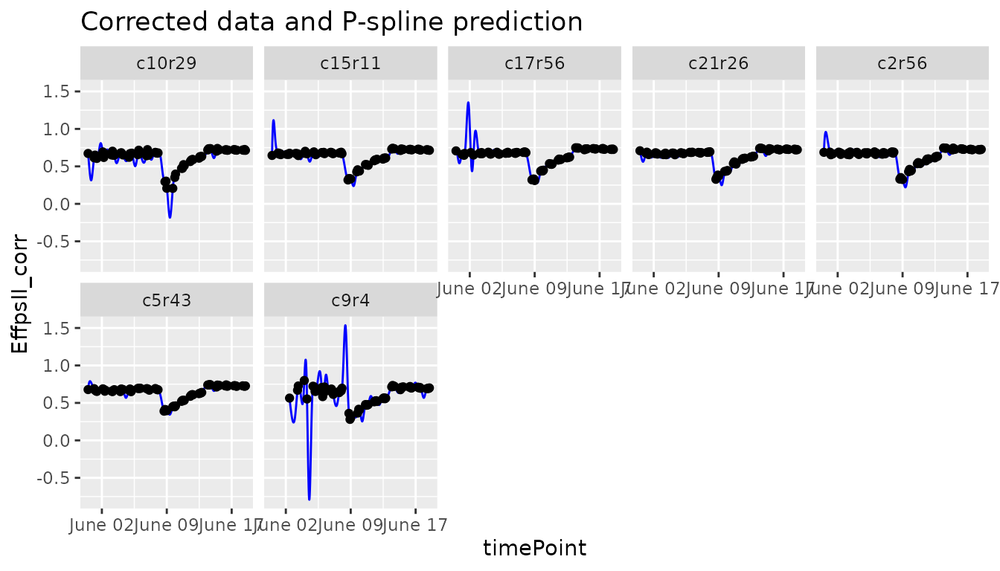

``` r

plot(fit.spline,
     plotIds = "c10r29",
     plotType = "predictions")
```

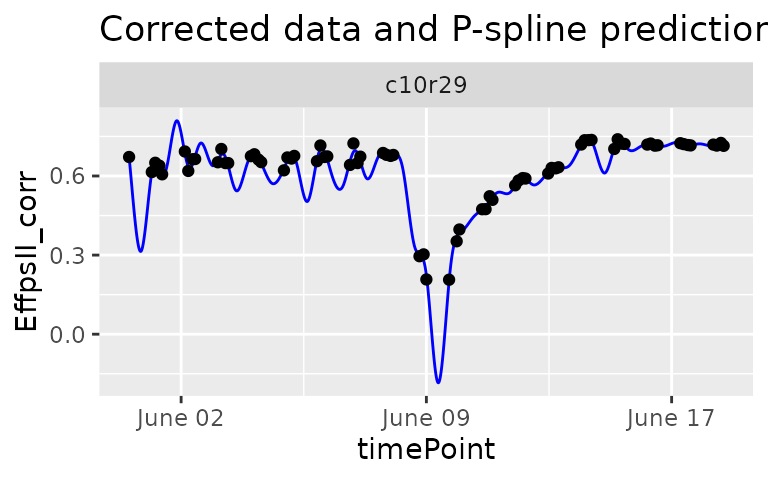

``` r

plot(fit.spline,
     plotIds = "c10r29",
     plotType = "derivatives")
```

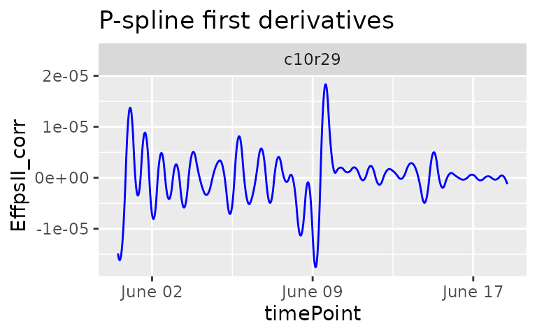

The object `fit.spline` also contains the values of the P-splines
coefficients:

| obj.coefficients | plotId |    type     | genotype |
|:----------------:|:------:|:-----------:|:--------:|
|    0.6965965     | c10r29 | timeNumber1 |   G160   |
|    0.6685027     | c10r29 | timeNumber2 |   G160   |
|    0.6421887     | c10r29 | timeNumber3 |   G160   |
|    0.6265465     | c10r29 | timeNumber4 |   G160   |
|    0.6263577     | c10r29 | timeNumber5 |   G160   |
|    0.6420706     | c10r29 | timeNumber6 |   G160   |

The coefficients are then used to tag suspect time courses with the
function
[`detectSerieOut()`](https://biometris.github.io/statgenHTP/index.html/reference/detectSerieOut.md).
This function performs a PCA on the coefficients (from data.frame
`coefDat`) per `genotype` and calculates the pairwise angle between the
plants in the PCA plot. Plants are tagged when the mean angle is above
threshold (`thrPca)`, see the lines `reason = angle` in the table below.
The function also calculates the pairwise-correlation of the
coefficients per genotype. Plants are tagged when the correlation is
below a given threshold (`thrCor`), see the lines `reason = mean corr`
in the table below. Finally the pairwise-ratios of the slopes of a
linear model fitted through the spline coefficients are computed. Plants
are tagged when the average pairwise-ratio is lower the a given
threshold (`thrSlope`), see the lines `reasion = slope` in the table
below.

For obvious reasons, the detection will only work when there are at
least three replicates per genotype. Genotypes with less than three
replicates will be skipped.

``` r

outVator <- detectSerieOut(corrDat = spatCorrectedVator,
                           predDat = predDat,
                           coefDat = coefDat,
                           trait = "EffpsII_corr",
                           genotypes = subGenoVator,
                           thrCor = 0.9,
                           thrPca = 30,
                           thrSlope = 0.7)
```

| plotId | genotype |  reason   |   value    |
|:------:|:--------:|:---------:|:----------:|
|  c9r4  |   G160   | mean corr | 0.6775630  |
|  c9r4  |   G160   |   angle   | 47.4954954 |
|  c9r4  |   G160   |   slope   | 0.6058944  |
| c3r43  |   G055   | mean corr | 0.8921578  |

For this subset of genotypes, 2 plants were tagged as outliers:

- c3r43 and c9r4 had both low correlations. In addition c9r4 also had
  high angles and a low average ratio for the slope.

The `outVator` can be visualized by selecting genotypes. Here genotype
G160 which has plant c9r4 tagged as outlier:

``` r

plot(outVator, genotypes = "G160")
```

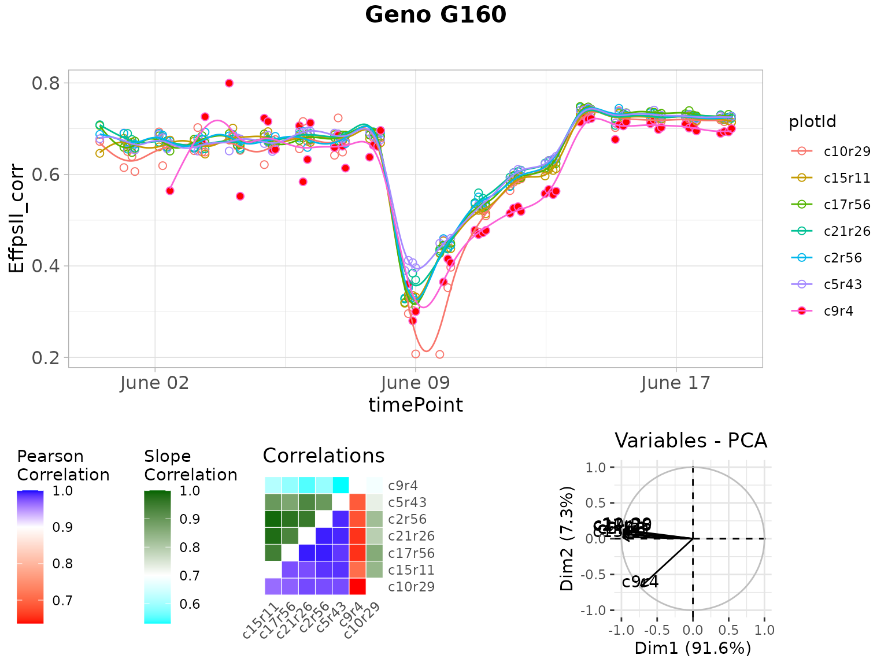

The figure above contains:

- (top) A scatter plot of the trait value on the y-axis and time on the
  x-axis. Points are the raw or corrected data and lines are the
  P-spline predictions, with one color per plant (in legend). Filled
  dots represent outlying plants, open dots non-outlying plants.
- (bottom left) A matrix with in the bottom right the correlations of
  the plant scores as a heatmap. The scale is centered on 0.9 (the
  correlation threshold) to see at a glance the outlying plants with low
  correlations (usually correlation is high between plants). The top
  left of the matrix shows the average slopes as a heatmap. The scale is
  centered on 0.7 (the slope threshold) to see at a glance the outlying
  plants with low average slope (usually average slopes are high between
  plants).
- (bottom right) A PCA plot of the plant scores. Usually, all plants are
  grouped and the first axis explains most of the variation. When a
  plant is outlying, it will be located apart from the other plants on
  the second axis.

It is possible to visualize only the plants tagged for one or two
reasons instead of all three. This can be done by specifying
e.g. `reason = slope` for only visualizing plants tagged because of a
low average slope. When doing so only the relevant plots will be shown.
So in this case only the upper left part of the correlation plot and no
PCA plot.

``` r

plot(outVator, 
     genotypes = "G160", 
     reason = "slope")
```

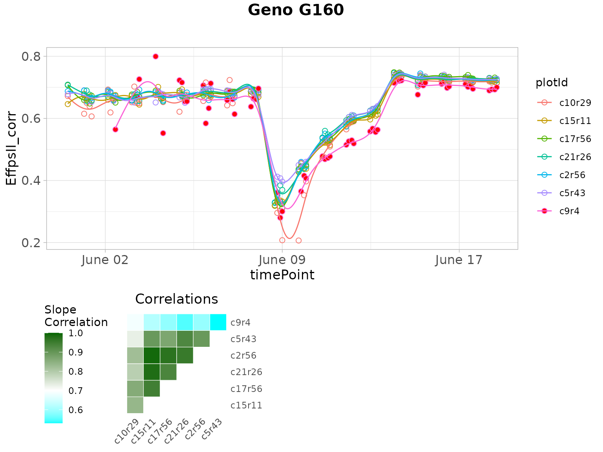

When numerical time was used to fit the splines, it can be used also to
plot the outliers using the option `useTimeNumber = TRUE` and providing
the column name in `timeNumber`.

``` r

plot(outVator, 
     genotypes = "G160",  
     useTimeNumber = TRUE, 
     timeNumber = "timeNumHour")
```

Finally, the outlying plants can be removed from the data set…

``` r

spatCorrectedVatorOut <- removeSerieOut(dat = spatCorrectedVator,
                                        serieOut = outVator)
# Check for time series outliers in data from which individual outlying 
# observations were already removed and to which a spatial adjustment has been applied
head(spatCorrectedVator[spatCorrectedVator$plotId == "c9r4",
                        c("EffpsII_corr", "EffpsII")])
#>       EffpsII_corr EffpsII
#> 12377    0.5643125   0.559
#> 16648    0.6693775   0.669
#> 18073    0.7261539   0.727
#> 19502    0.7994927   0.799
#> 20933           NA      NA
#> 22361           NA      NA
# Check the same value in the new corrected data.frame
head(spatCorrectedVatorOut[spatCorrectedVatorOut$plotId == "c9r4",
                           c("EffpsII_corr", "EffpsII")])
#>       EffpsII_corr EffpsII
#> 12377           NA   0.559
#> 16648           NA   0.669
#> 18073           NA   0.727
#> 19502           NA   0.799
#> 20933           NA      NA
#> 22361           NA      NA
```

… and from the predictions.

``` r

fit.splineOut <- removeSerieOut(fitSpline = fit.spline,
                                serieOut = outVator)
fit.splineNumOut <- removeSerieOut(fitSpline = fit.splineNum,
                                   serieOut = outVator)
```

It is possible to remove only the plants tagged for one or two reasons
instead of all three. This can be done by specifying
e.g. `reason = slope` for only removing plants tagged because of a low
average slope.

``` r

spatCorrectedVatorOut <- removeSerieOut(dat = spatCorrectedVator,
                                        serieOut = outVator,
                                        reason = "slope")
```

#### Impact of the number of knots on the smoothing

For one plant of the same data set, we fit the P-spline with 10 or 50
knots and visualize the predictions to compare the smoothness. We advise
the user to perform tests of the number of knots on a subset of plants
before running the function on all plants.

*With 10 knots:*

``` r

sp10k <- fitSpline(inDat = spatCorrectedVator,
                   trait = "EffpsII_corr",
                   plotIds = "c10r29",
                   knots = 10)
plot(sp10k)
```

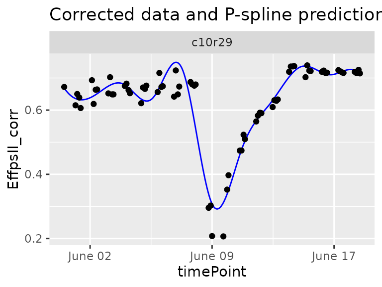

The predicted curve is very smooth and, in this case, it is not
following precisely the real data curve shape. When comparing the plants
of a same genotype with this curve shape we might not identify the
outlying plant.

*With 50 knots:*

``` r

sp50k <- fitSpline(inDat = spatCorrectedVator,
                   trait = "EffpsII_corr",
                   plotIds = "c10r29",
                   knots = 50)
plot(sp50k)
```

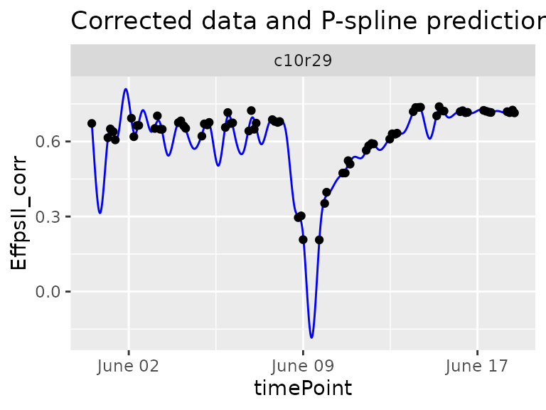

The predicted curve is less smooth and follows the actual curve shape.
This seems to be a good setting to detect strange curve shape among the
replicates of a genotype.

### Example 2

The data from the PhenoArch platform have been corrected for spatial
trends and individually outlying observations have been removed (see
[**statgenHTP tutorial: 2. Outlier detection for single
observations**](https://biometris.github.io/statgenHTP/index.html/articles/vignettesSite/OutlierSingleObs_HTP.md)
and [**statgenHTP tutorial: 3. Correction for spatial
trends**](https://biometris.github.io/statgenHTP/index.html/articles/vignettesSite/SpatialModel_HTP.md)).

``` r

data(spatCorrectedArch)  
subGenoArch <- c("GenoA01", "GenoA02", "GenoA34", "GenoA04", "GenoB01", "GenoB02", "GenoB07")

fit.splineArch <- fitSpline(inDat = spatCorrectedArch, 
                            trait = "LeafArea_corr",
                            genotypes = subGenoArch,
                            knots = 30,
                            minNoTP = 18)

predDatArch <- fit.splineArch$predDat
coefDatArch <- fit.splineArch$coefDat
```

``` r

plot(fit.splineArch,
     plotIds = "c11r9",
     plotType =  "predictions")
```

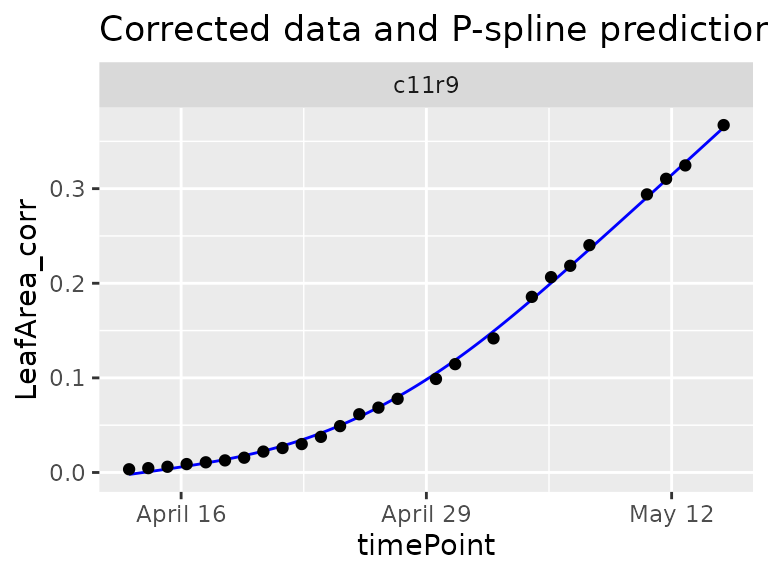

``` r

plot(fit.splineArch,
     plotIds = "c11r9",
     plotType =  "derivatives")
```

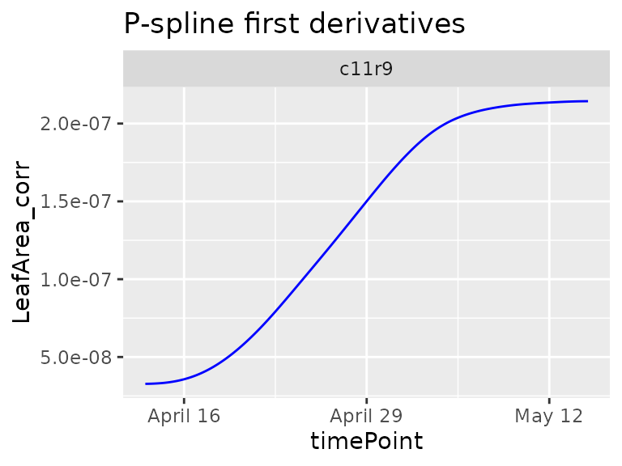

Here, the `geno.decomp` option is also to split the plants of each
genotype those under well watered and water deficit conditions. The
outlier detection is run per treatment with a narrow angle threshold

``` r

outArch <- detectSerieOut(corrDat = spatCorrectedArch,
                          predDat = predDatArch,
                          coefDat = coefDatArch,
                          trait = "LeafArea_corr",
                          genotypes = subGenoArch,
                          thrCor = 0.9,
                          thrPca = 10,
                          thrSlope = 0.8,
                          geno.decomp = "geno.decomp")
```

| plotId | genotype | geno.decomp |  reason   |   value   |
|:------:|:--------:|:-----------:|:---------:|:---------:|
| c13r6  | GenoA01  |  WD_Panel1  | mean corr | 0.893585  |
| c13r6  | GenoA01  |  WD_Panel1  |   angle   | 14.472282 |
| c16r2  | GenoA01  |  WD_Panel1  |   angle   | 13.054901 |
| c20r24 | GenoA01  |  WD_Panel1  |   angle   | 12.805672 |
| c21r56 | GenoA01  |  WD_Panel1  |   angle   | 10.462828 |
| c24r26 | GenoA01  |  WD_Panel1  |   angle   | 13.075548 |

``` r

plot(outArch, genotypes = "GenoA01", geno.decomp = "WD_Panel1")
```

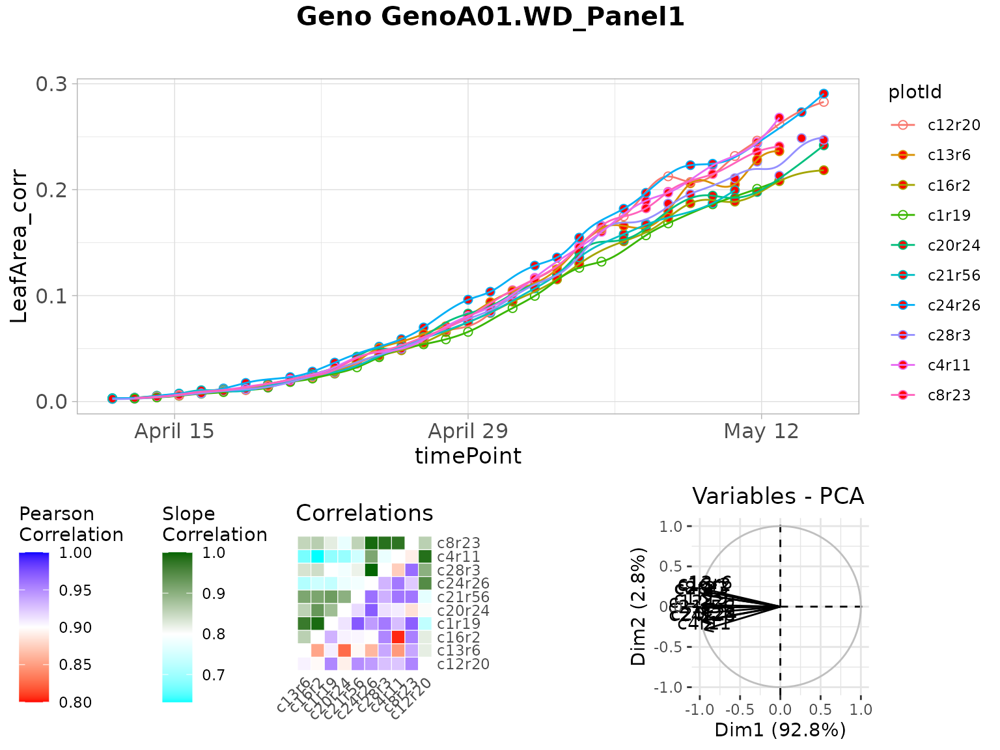

``` r

spatCorrectedArchOut <- removeSerieOut(dat = spatCorrectedArch,
                                       serieOut = outArch)
# Check for time series outliers in data from which individual outlying 
# observations were already removed and to which a spatial adjustment has been applied
head(spatCorrectedArch[spatCorrectedArch$plotId == "c16r2",
                       c("LeafArea_corr", "LeafArea")])
#>       LeafArea_corr    LeafArea
#> 1       0.002564006 0.002871676
#> 2173    0.004164635 0.004066799
#> 3843    0.005768308 0.005690233
#> 5509    0.008211606 0.008043967
#> 7180    0.009454458 0.010399790
#> 10049   0.015047478 0.015390857
# Check the same value in the new corrected data.frame
head(spatCorrectedArchOut[spatCorrectedArchOut$plotId == "c16r2",
                          c("LeafArea_corr", "LeafArea")])
#>       LeafArea_corr    LeafArea
#> 1                NA 0.002871676
#> 2173             NA 0.004066799
#> 3843             NA 0.005690233
#> 5509             NA 0.008043967
#> 7180             NA 0.010399790
#> 10049            NA 0.015390857
```

### Example 3

The data from the RootPhAir platform have not been corrected for spatial
trends but individually outlying observations have been removed (see
[**statgenHTP tutorial: 2. Outlier detection for single
observations**](https://biometris.github.io/statgenHTP/index.html/articles/vignettesSite/OutlierSingleObs_HTP.md)).

``` r

subGenoRoot <- c( "2", "6", "8", "9", "10", "520", "522")
fit.splineRoot <- fitSpline(inDat = noCorrectedRoot,
                            trait = "tipPos_y",
                            knots = 10,
                            genotypes = subGenoRoot,
                            minNoTP = 0,
                            useTimeNumber = TRUE,
                            timeNumber = "thermalTime")

predDatRoot <- fit.splineRoot$predDat
coefDatRoot <- fit.splineRoot$coefDat
row.names(coefDatRoot) <- 1:nrow(coefDatRoot)
```

``` r

plot(fit.splineRoot,
     genotypes = "2")
```

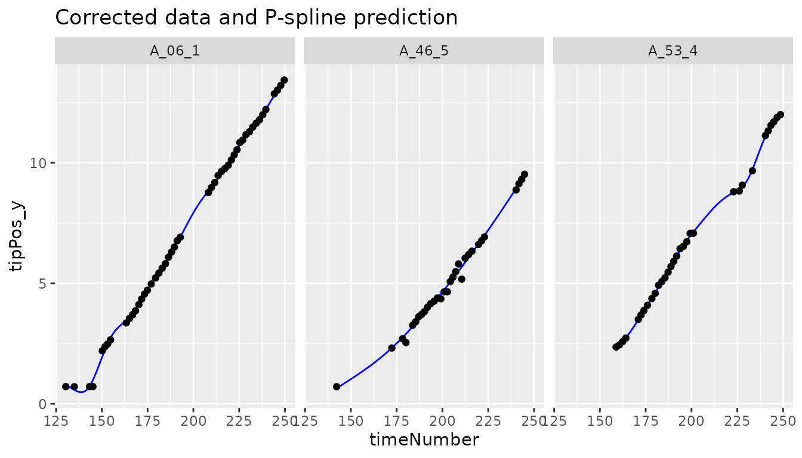

``` r

outRoot <- detectSerieOut(corrDat = noCorrectedRoot,
                          predDat = predDatRoot,
                          coefDat = coefDatRoot,
                          trait = "tipPos_y",
                          genotypes = subGenoRoot,
                          thrCor = 0.9,
                          thrPca = 20,
                          thrSlope = 0.7)
```

``` r

plot(outRoot,
     genotypes = "6")
```

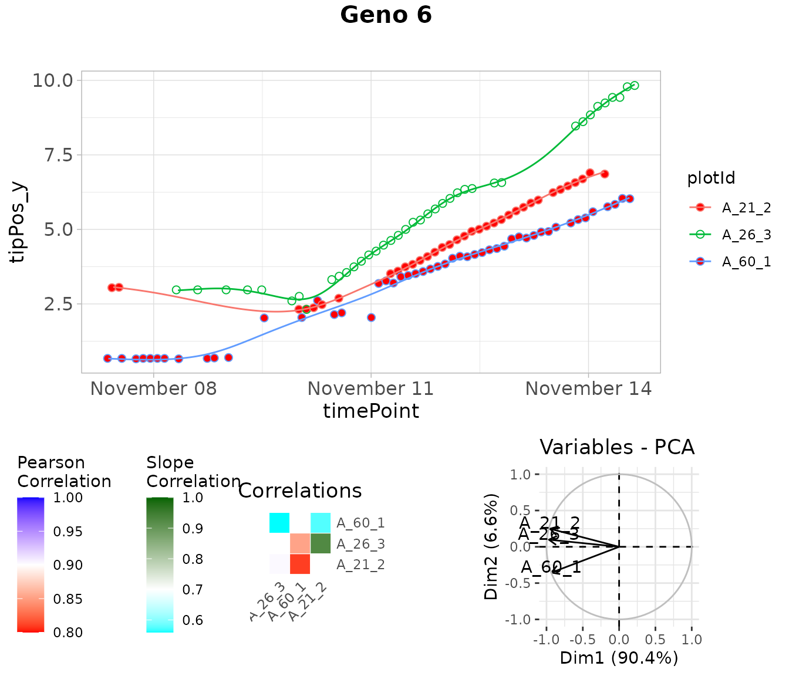

``` r

noCorrectedRootOut <- removeSerieOut(dat = noCorrectedRoot,
                                     serieOut = outRoot)
# Check one value annotated as outlier in the original corrected data.frame
head(noCorrectedRoot[noCorrectedRoot$plotId == "A_21_2", "tipPos_y"])
#> [1] 3.042857 3.057143       NA 2.317857 2.325000 2.371429
# Check the same value in the new corrected data.frame
head(noCorrectedRootOut[noCorrectedRootOut$plotId == "A_21_2", "tipPos_y"])
#> [1] NA NA NA NA NA NA
```

------------------------------------------------------------------------

## Detection of outlier plants on a multi-criteria basis, with expert rules

An outlier plant is defined as a biological replicate deviating from the
overall distribution of plants on a multi-criteria basis, regardless of
the quality of measurements. Detecting outlier plants can be done by
monitoring a single criterion, such as plant height or biomass. In this
case, a procedure for detecting outlying series of observations should
be used, as discussed in the previous sections. But taking into account
only one criterion can sometimes be restrictive in deciding whether a
plant is outlier or not. A multi-criteria approach will then be more
relevant. A multi-criteria method considers several traits jointly, with
rules set by experts depending on the species. We describe below the
approach followed on a maize experiment, see ([Alvarez Prado et al.
2019](#ref-AlvarezPrado2019)).

### Rules in the case of maize

We consider two categories of potentially outlier plants, namely
apparently **too small** or **too large** plants. For the detection of
unexpectedly small plants with likely physiological disorders, the
progression of leaf stages was considered in addition to the time course
of shoot biomass. Indeed, leaf appearance rate carries a non-redundant
information compared with biomass (confirmed by standard correlation
calculations). It usually presents a low plant-to-plant variability
except in case of severe disorders, and is relatively insensitive to
environmental cues other than temperature. For the detection of
unexpectedly large plants, potentially associated with wrong genotype
identification, combining plant height and biomass can result in an
efficient identification.

### Statistical modelling: a mixed model at a given time (defined by the expert)

Each of the selected traits was measured (or estimated) at a specific
time (for example 24 d20°C for the PhenoArch data set), time just before
the beginning of the differentiation of the two watering treatments.
This allows to have more replicates per genotype. It also reduces the
dimensionality of the time courses to only one point, which will
simplify the statistical models to be implemented later.


Schematic representation of a multi-trait approach for detection of
outlier plants (case of maize), from Alvarez Prado et al.
([2019](#ref-AlvarezPrado2019)).

As shown above, traits are modeled with a mixed model that considers
fixed experiment (Env) effect and random genotypic (G), replicate (R)
and spatial (C) effects. The model can be fitted with the SpATS
R-package, (Rodríguez-Álvarez et al. ([2018](#ref-RodAlv2018))).
Residuals (deviations) can be directly computed from the fitting, with a
confidence interval. Plants, whose deviations for the criteria of leaf
appearance rate and biomass are less than the lower bound of this
interval, are considered as **outlier small plants**. Plants, whose
deviations for the criteria of plant height and biomass are greater than
the upper bound of the confidence interval, are considered as **outlier
large plants**.

### Implementation in statgenHTP

Mixed models are fitted with the R-package SpATS through the use of the
`detectSingleOutMaize` function, which was developed specifically for
the maize data, as described above. This function fits a mixed model for
each parameter, and tests whether the residual deviations are lower (for
the criteria considered for small plants) or higher (for the criteria
considered for big plants) than a specified threshold.

``` r

phenoTParch <- createTimePoints(dat = PhenoarchDat1,
                                experimentName = "Phenoarch",
                                genotype = "Genotype",
                                timePoint = "Date",
                                plotId = "pos",
                                rowNum = "Row",
                                colNum = "Col")

test2 <- detectSingleOutMaize(phenoTParch, 
                              timeBeforeTrt = "2017-04-27",
                              trait1 = "Biomass",
                              trait2 = "PlantHeight",
                              trait3 = "phyllocron")
```

The `detectSingleOutMaize` returns a list of 3 elements :

- modDat: a data.frame with the used data set, the fitted values and
  residuals calculated by the models, and the plants flagged as outlier
- smallPlants: a data.frame of the “small” plants detected as outliers
- bigPlants: a data.frame of the “big” plants detected as outliers

The table below shows the smallPlants data.frame.

|       | timePoint  | plotId | genotype | Scenario | population |
|:------|:----------:|:------:|:--------:|:--------:|:----------:|
| 5811  | 2017-04-27 |  c5r3  | GenoA06  |    WW    |   Panel1   |
| 8476  | 2017-04-27 | c6r57  | GenoA57  |    WW    |   Panel1   |
| 8594  | 2017-04-27 |  c7r2  | GenoB07  |    WD    |   Panel2   |
| 8986  | 2017-04-27 | c7r18  | GenoB11  |    WD    |   Panel2   |
| 17106 | 2017-04-27 | c12r50 | GenoA30  |    WD    |   Panel1   |
| 18085 | 2017-04-27 | c13r28 | GenoA27  |    WD    |   Panel1   |

------------------------------------------------------------------------

### References

Alvarez Prado, Santiago, Isabelle Sanchez, Llorenç Cabrera-Bosquet, et
al. 2019. “To Clean or Not to Clean Phenotypic Datasets for Outlier
Plants in Genetic Analyses?” *Journal of Experimental Botany* 70 (15):
3693–98. <https://doi.org/10.1093/jxb/erz191>.

Currie, I D, and M Durban. 2002. “Flexible Smoothing with P-Splines: A
Unified Approach.” *Statistical Modelling* 2 (4): 333–49.
<https://doi.org/10.1191/1471082x02st039ob>.

Eilers, Paul H. C., Brian D. Marx, and Maria Durbán. 2015. “Twenty Years
of p-Splines.” *Statistics and Operations Research Transactions* 39 (2):
149–86.

Eubank, Randall L. 1999. *Nonparametric Regression and Spline
Smoothing*. Statistics: A Series of Textbooks and Monographs. CRC Press.

Hugelier, S., O. Devos, and C. Ruckebusch. 2016. “Chapter 14 - a
Smoothness Constraint in Multivariate Curve Resolution-Alternating Least
Squares of Spectroscopy Data.” In *Resolving Spectral Mixtures*, edited
by Cyril Ruckebusch, vol. 30. Data Handling in Science and Technology.
Elsevier. <https://doi.org/10.1016/B978-0-444-63638-6.00014-0>.

Rodríguez-Álvarez, María, Martin P. Boer, Fred van Eeuwijk, and Paul H.
C. Eilers. 2018. “Correcting for Spatial Heterogeneity in Plant Breeding
Experiments with p-Splines.” *Spatial Statistics* 23 (October): 52–71.
<https://doi.org/10.1016/j.spasta.2017.10.003>.
