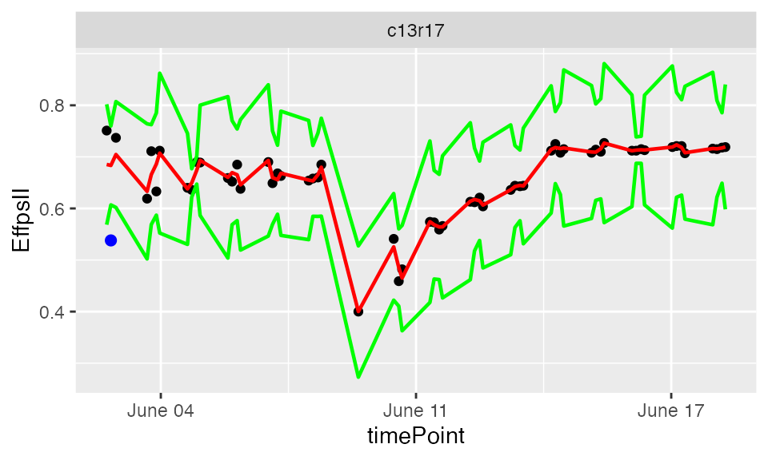
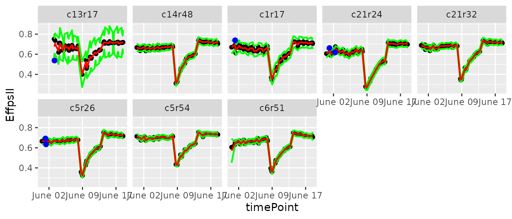
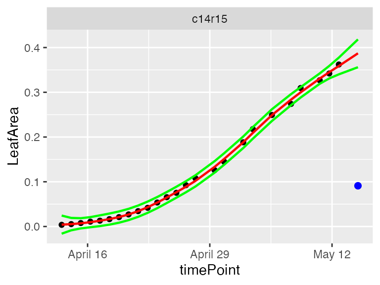
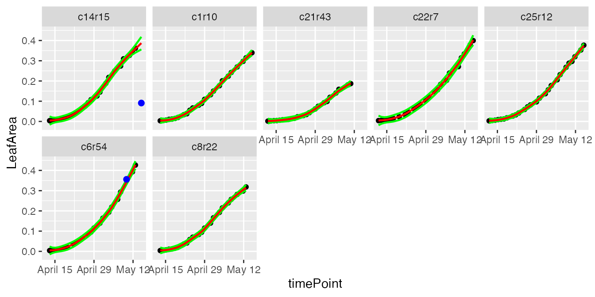
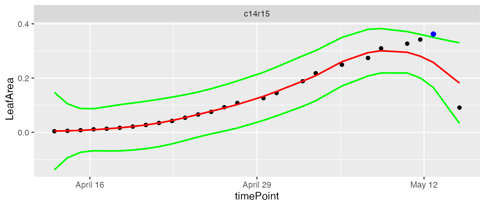
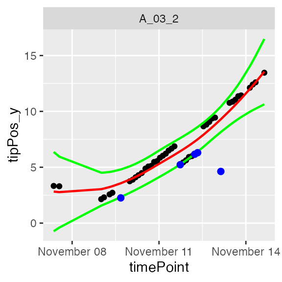
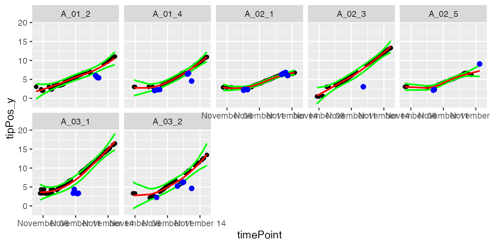

# statgenHTP tutorial: 2. Outlier detection for single observations

## Introduction

An outlier is usually defined as an observation that appears to be
inconsistent with the remainder of the data set ([Barnett and Lewis
1994](#ref-BarnettLewis1994)). Observations may be single time points
([Grubbs 1950](#ref-Grubbs1950)) or whole time courses of one or more
variables ([Hubert et al. 2015](#ref-Hubert2015)). An illustration is
given below, where we see the difficulty of deciding whether a biomass
time course (red curve at the bottom left) is atypical in a set of time
courses from plants of the same genotype, or whether this slow growth is
due to the plant’s position in the platform.

![Heatmap of the biomass estimated at a specific time point (with a
color gradient) of each plant according to its location in the platform
(line, position). Well-watered (WW) treatment on the left, water deficit
(WD) on the right. The plots show the biomass time courses for a given
genotype (3 repetitions in each treatment). The question is whether the
red growth curve on the left corresponds to an outlier plant (e.g. a
seed problem) or whether this slow growth is due to the plant's location
in the platform (PhenoArch Platform, INRAE). \*Courtesy: Llorenç
Cabrera-Bosquet and Santiago Alvarez Prado.\*](figures/heatmap.png)

Heatmap of the biomass estimated at a specific time point (with a color
gradient) of each plant according to its location in the platform (line,
position). Well-watered (WW) treatment on the left, water deficit (WD)
on the right. The plots show the biomass time courses for a given
genotype (3 repetitions in each treatment). The question is whether the
red growth curve on the left corresponds to an outlier plant (e.g. a
seed problem) or whether this slow growth is due to the plant’s location
in the platform (PhenoArch Platform, INRAE). *Courtesy: Llorenç
Cabrera-Bosquet and Santiago Alvarez Prado.*

The concept of outlier can be extended to “outlier plants”, defined here
as biological replicates deviating from the overall distribution of
plants on a multi-criteria basis, regardless of the quality of
measurements ([Alvarez Prado et al. 2019](#ref-AlvarezPrado2019)).

This documents describes the procedures to detect outlying single
observations in a time course with examples on experimental data
measured directly on the plants or indirectly via image analysis for
example.

------------------------------------------------------------------------

## Definition of outlying single observation

Time courses of phenotypic data are viewed as continuous time-related
functions. The first cleaning step consists of roughly checking the
consistency of each point with its neighbors within a time course.
Outlying single observations are measurements that do not follow the
expected behavior at a given time. The detection of outlying
observations is done “one time course after the other”. Identifying and
removing these points will facilitate the outlier detection of series of
observations or plants, as proposed in [**statgenHTP tutorial: 4.
Outlier detection for series of
observations**](https://biometris.github.io/statgenHTP/index.html/articles/vignettesSite/OutlierSerieObs_HTP.md).

The detection requires fitting a model from the data, as a function of
time. Two types of models can be used, one based on nonlinear parametric
regression (Gompertz Model or sigmoidal function for example) and the
other on non-parametric regression. Data annotation is based on the
comparison of the experimental data with its estimated value from the
model. If they differ significantly, the data will be annotated as
suspect.

> *NOTE: We only consider non-parametric regression in this package
> because of its flexibility to fit any type of curve.*

## Illustration of the non-parametric function

Local regression is a well known smoothing technique which locally
approximates an unknown function by parametric functions. It is a
two-step procedure included in the `detectSingleOut` function: the
`locfit()` [function](https://CRAN.R-project.org/package=locfit) fits a
local regression at a set of points, then, the
[`predict()`](https://rdrr.io/r/stats/predict.html) function is used to
interpolate this fit to other points. A confidence interval can then be
calculated. Points outside this interval will be annotated as outliers.

The user can set:

- the smoothing parameter `nnLocfit`. This is the parameter `nn` from
  the locfit package (Nearest neighbor component of the smoothing
  parameter). This parameter values range from 0 to 1, with the higher
  the value, the smoother the curve.

- the level at which the confidence interval `confIntSize` is
  calculated. A large value calculates a wide interval and fewer
  outliers are annotated.

- the parameter `checkEdges`. By setting this parameter to `TRUE` (the
  default), before the local regression a check is done to determine if
  the first and last time point in the time series for a plot are
  outliers. The `locfit` function sometimes has problems determining
  these outliers. The use of this parameter is demonstrated in example
  2.

The functions are illustrated with the three example data sets. For more
information about the data, see [**statgenHTP tutorial: 1. Introduction,
data description and
preparation**](https://biometris.github.io/statgenHTP/index.html/articles/vignettesSite/Intro_HTP.md).

### Example 1

First a `TP` object is created containing all the time points.

``` r

PhenovatorDat1 <- PhenovatorDat1[!PhenovatorDat1$pos %in% c("c24r41", "c7r18", "c7r49"), ]
## Create a TP object containing the data from the Phenovator.
phenoTP <- createTimePoints(dat = PhenovatorDat1,
                            experimentName = "Phenovator",
                            genotype = "Genotype",
                            timePoint = "timepoints",
                            repId = "Replicate",
                            plotId = "pos",
                            rowNum = "y", colNum = "x",
                            addCheck = TRUE,
                            checkGenotypes = c("check1", "check2", "check3", "check4"))
```

We then run the function on a subset of plants to set the parameters,
using the `plotIds` option. The smoothing parameter `nnLocfit` is set at
0.1. The curves are atypical and to detect only the very strange points,
fitted curves cannot be too smooth. The confidence interval size
`confIntSize` is set at 3 which is a relatively narrow interval.

``` r

# First select a subset of plants, for example here 8 plants.
plantSel <- c("c1r17","c13r17","c6r51","c21r24","c5r54","c21r32","c14r48","c5r26") 
# Then run on the subset
resuVatorHTP <- detectSingleOut(TP = phenoTP,
                                trait = "EffpsII",
                                plotIds = plantSel,
                                confIntSize = 3,
                                nnLocfit = 0.1)
```

| plotId | timePoint | EffpsII | yPred | sd_yPred | lwr | upr | outlier |
|:--:|:--:|:--:|:--:|:--:|:--:|:--:|:--:|
| c13r17 | 2018-06-03 09:07:00 | 0.751 | 0.6852574 | 0.0389194 | 0.5684992 | 0.8020156 | 0 |
| c13r17 | 2018-06-03 11:37:00 | 0.538 | 0.6833963 | 0.0255016 | 0.6068916 | 0.7599011 | 1 |
| c13r17 | 2018-06-03 14:37:00 | 0.737 | 0.7045487 | 0.0342136 | 0.6019078 | 0.8071896 | 0 |
| c13r17 | 2018-06-04 09:07:00 | 0.619 | 0.6330957 | 0.0436610 | 0.5021126 | 0.7640788 | 0 |
| c13r17 | 2018-06-04 11:37:00 | 0.711 | 0.6655915 | 0.0322765 | 0.5687620 | 0.7624211 | 0 |
| c13r17 | 2018-06-04 14:37:00 | 0.633 | 0.6861254 | 0.0330415 | 0.5870010 | 0.7852499 | 0 |

The function output is a `data.frame` containing for each plant at each
time point: the predicted value, `yPred`, the standard deviation of the
prediction, `sd_yPred`, the limits of the confidence interval, `lwr` and
`upr`, and the `outlier` status. When a point is annotated as outlying,
the value of the outlier column is 1, it is 0 otherwise.

The predicted values can be visualized to adjust the smoothing parameter
and the confidence interval using the `plot` function. The option
`outOnly`, default value `TRUE`, enables visualizing only plants with
annotated outliers. Here, we are visualizing one plant and then all the
selected plants to check the prediction.

``` r

plot(resuVatorHTP,
     plotIds = "c13r17",
     outOnly = FALSE)
```



``` r

plot(resuVatorHTP,
     plotIds = plantSel,
     outOnly = FALSE)
```



In the plots, the black dots are the raw data, the red line is the
predicted curve, the green lines are the lower and upper limits of the
confidence interval. Outlying points are highlighted in blue.

The annotated points can be replaced by NA for the studied trait using
the function `removeSingleOut`. It creates a new `TP` object.

``` r

phenoTPOut <- removeSingleOut(phenoTP,
                              resuVatorHTP)
# Check one value annotated as outlier in the original TP object
phenoTP[[16]][phenoTP[[16]]$plotId=="c14r32", c("plotId", "EffpsII")]
#>    plotId EffpsII
#> 16 c14r32    0.63
# Check the same value in the new TP object
phenoTPOut[[16]][phenoTPOut[[16]]$plotId=="c14r32", c("plotId", "EffpsII")]
#>    plotId EffpsII
#> 16 c14r32    0.63
```

### Example 2

First a `TP` object is created containing all the time points.

``` r

phenoTParch <- createTimePoints(dat = PhenoarchDat1,
                                experimentName = "Phenoarch",
                                genotype = "Genotype",
                                timePoint = "Date",
                                plotId = "pos",
                                rowNum = "Row",
                                colNum = "Col")
```

We then run the function on a subset of plants to set the parameters,
using the `plotIds` option. The smoothing parameter `nnLocfit` is set at
0.5. The curves are linear and medium smooth is enough. The confidence
interval size `confIntSize` is set at 5 which is a medium interval.

``` r

# First select a subset of plants, for example here 7 plants 
plantSelArch <- c("c22r7", "c8r22", "c1r10", "c21r43", "c14r15", "c25r12", "c6r54")
# Then run on the subset
resuArchHTP <- detectSingleOut(TP = phenoTParch,
                               trait = "LeafArea",
                               plotIds = plantSelArch,
                               confIntSize = 5,
                               nnLocfit = 0.5)
```

|     | plotId | timePoint  | LeafArea  |   yPred   | sd_yPred  |    lwr    |    upr    | outlier |
|:----|:------:|:----------:|:---------:|:---------:|:---------:|:---------:|:---------:|:-------:|
| 22  | c14r15 | 2017-05-09 | 0.3095688 | 0.2998288 | 0.0023225 | 0.2882164 | 0.3114412 |    0    |
| 23  | c14r15 | 2017-05-11 | 0.3268933 | 0.3305959 | 0.0023188 | 0.3190019 | 0.3421899 |    0    |
| 24  | c14r15 | 2017-05-12 | 0.3420478 | 0.3450079 | 0.0028001 | 0.3310072 | 0.3590086 |    0    |
| 25  | c14r15 | 2017-05-13 | 0.3621102 | 0.3587838 | 0.0037381 | 0.3400936 | 0.3774741 |    0    |
| 26  | c14r15 | 2017-05-15 | 0.0910594 | 0.3871152 | 0.0062159 | 0.3560358 | 0.4181947 |    1    |

The prediction values can be visualized to adjust the smoothing
parameter and the confidence interval using the `plot` function.

``` r

plot(resuArchHTP,
     plotIds = "c14r15",
     outOnly = FALSE)
```



``` r

plot(resuArchHTP,
     plotIds = plantSelArch,
     outOnly = FALSE)
```



In the plots, the black dots are the raw data, the red line is the
predicted curve, the green lines are the lower and upper limits of the
confidence interval. Outlying points are highlighted in blue.

It is possible to run the outlier detection without first checking if
the first and last time point are outlying. Doing this could be useful
is some cases, but might give undesired results as well as the example
below shows.

``` r

# Detect outliers without first checking edges.
resuArchHTPNoEdges <- detectSingleOut(TP = phenoTParch,
                                      trait = "LeafArea",
                                      plotIds = "c14r15",
                                      checkEdges = FALSE,
                                      confIntSize = 5,
                                      nnLocfit = 0.5)
```

``` r

plot(resuArchHTPNoEdges)
```



The annotated points can be replaced by NA for the studied trait using
the function `removeSingleOut`. It creates a new `TP` object.

``` r

phenoTParchOut <- removeSingleOut(phenoTParch,
                                  resuArchHTP)
# Check one value annotated as outlier in the original TP object
phenoTParch[[30]][phenoTParch[[30]]$plotId == "c12r31", c("plotId", "LeafArea")]
#>       plotId  LeafArea
#> 16655 c12r31 0.2447164
# Check the same value in the new TP object
phenoTParchOut[[30]][phenoTParchOut[[30]]$plotId == "c12r31", c("plotId", "LeafArea")]
#>       plotId  LeafArea
#> 16655 c12r31 0.2447164
```

### Example 3

First a `TP` object is created containing all the time points.

``` r

rootTP <- createTimePoints(dat = RootDat1,
                           experimentName = "UCL1",
                           genotype = "Genotype",
                           timePoint = "Time",
                           plotId = "plantId",
                           rowNum = "Strip",
                           colNum = "Pos")
```

We then run the function on a subset of plants to set the parameters,
using the `plotIds` option. The smoothing parameter `nnLocfit` is set
at 1. The curves are almost linear and a strong smooth is enough to get
an accurate curve shape (line). The confidence interval size
`confIntSize` is set at 5 which is a medium interval.

``` r

# First select a subset of plants, for example here 7 plants 
plantSelRoot <- unique(RootDat1$plantId)[1:7]
# Then run on the subset
resuRootHTP <- detectSingleOut(TP = rootTP,
                               trait = "tipPos_y",
                               plotIds = plantSelRoot,
                               confIntSize = 5,
                               nnLocfit = 1)
```

|  | plotId | timePoint | tipPos_y | yPred | sd_yPred | lwr | upr | outlier |
|:---|:--:|:--:|:--:|:--:|:--:|:--:|:--:|:--:|
| 38 | A_01_2 | 2016-11-12 03:21:58 | 6.775000 | 6.355150 | 0.1571693 | 5.569304 | 7.140996 | 0 |
| 39 | A_01_2 | 2016-11-12 05:41:17 | 6.760714 | 6.451046 | 0.1570347 | 5.665872 | 7.236219 | 0 |
| 40 | A_01_2 | 2016-11-12 14:57:43 | 6.775000 | 6.856314 | 0.1555333 | 6.078648 | 7.633981 | 0 |
| 41 | A_01_2 | 2016-11-12 17:16:51 | 6.921429 | 6.965262 | 0.1550652 | 6.189936 | 7.740588 | 0 |
| 42 | A_01_2 | 2016-11-13 04:52:57 | 6.014286 | 7.576345 | 0.1541887 | 6.805402 | 8.347288 | 1 |
| 43 | A_01_2 | 2016-11-13 07:12:14 | 5.728571 | 7.711560 | 0.1549867 | 6.936627 | 8.486493 | 1 |

The prediction values can be visualized to adjust the smoothing
parameter and the confidence interval using the `plot` function.

``` r

plot(resuRootHTP,
     plotIds = "A_03_2",
     outOnly = FALSE)
```



``` r

plot(resuRootHTP,
     plotIds = plantSelRoot,
     outOnly = FALSE)
```



In the plots, the black dots are the raw data, the red line is the
predicted curve, the green lines are the lower and upper limits of the
confidence interval. Outlying points are highlighted in blue.

The annotated points can be replaced by NA for the studied trait using
the function `removeSingleOut`. It creates an new `TP` object.

``` r

rootTPOut <- removeSingleOut(rootTP,
                             resuRootHTP)
# Check one value annotated as outlier in the original TP object
rootTP[[11127]][rootTP[[11127]]$plotId == "A_01_2", c("plotId", "tipPos_y")]
#>    plotId tipPos_y
#> 42 A_01_2 6.014286
# Check the same value in the new TP object
rootTPOut[[11127]][rootTPOut[[11127]]$plotId == "A_01_2", c("plotId", "tipPos_y")]
#>    plotId tipPos_y
#> 42 A_01_2       NA
```

------------------------------------------------------------------------

### References

Alvarez Prado, Santiago, Isabelle Sanchez, Llorenç Cabrera-Bosquet, et
al. 2019. “To Clean or Not to Clean Phenotypic Datasets for Outlier
Plants in Genetic Analyses?” *Journal of Experimental Botany* 70 (15):
3693–98. <https://doi.org/10.1093/jxb/erz191>.

Barnett, Vic, and Tobby Lewis. 1994. *Outliers in Statistical Data*.
Wiley Series in Probability and Statistics. Wiley.
<https://books.google.nl/books?id=B44QAQAAIAAJ>.

Grubbs, Frank E. 1950. “Sample Criteria for Testing Outlying
Observations.” *Ann. Math. Statist.* 21 (1): 27–58.
<https://doi.org/10.1214/aoms/1177729885>.

Hubert, Mia, Peter J. Rousseeuw, and Pieter Segaert. 2015. “Multivariate
Functional Outlier Detection.” *Statistical Methods & Applications* 24
(2): 177–202. <https://doi.org/10.1007/s10260-015-0297-8>.
