# statgenHTP tutorial: 6. Estimation of parameters from time courses

## Introduction

This document presents the final step of the HTP data analysis:
extracting interesting parameters from the modeled time courses ([Brien
et al. 2020](#ref-Brien2020)). For example, in the second data set from
the PhenoArch platform, the maximum leaf area (from the P-splines) or
the maximum leaf growth rate (from the first derivatives) are relevant
parameters (see figure below). We could assess their variability in the
genotypes and the difference between treatments, *e.g.* has the water
scenario decreased the maximum leaf area?

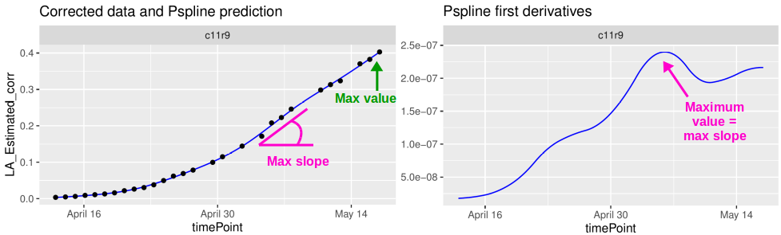

It is also possible to specify a period for the parameter estimation.
For example, in the first data set from the Phenovator platform, we can
select the period with the high light intensity (see figure below) and
estimate the maximum slope during that period (from the first
derivatives). This could be interpreted as a recovery rate of the
photosystem II efficiency.

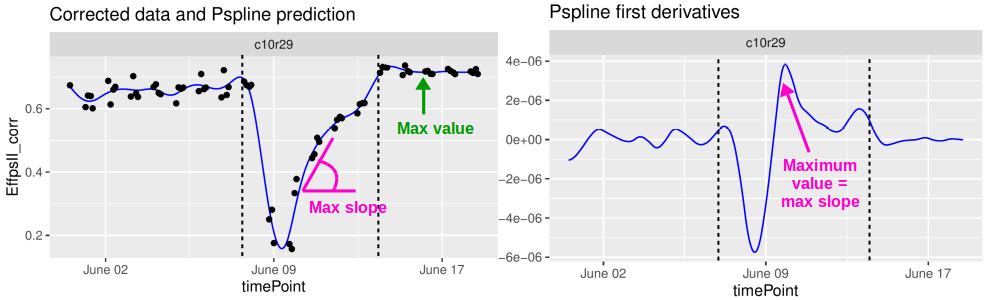

These parameters could then be further analyzed, for example in a GxE
analysis (see
[*statgenGxE*](https://biometris.github.io/statgenGxE/index.html)), or a
genetic analysis (see
[*statgenGWAS*](https://biometris.github.io/statgenGWAS/index.html)).

The functions described in this tutorial can be applied to corrected
data, genotypic means (BLUEs or BLUPS) (see [**statgenHTP tutorial: 3.
Correction for spatial
trends**](https://biometris.github.io/statgenHTP/index.html/articles/vignettesSite/SpatialModel_HTP.md)),
curves obtained from the P-splines hierarchical data model (see
[**statgenHTP tutorial: 5. Modelling the temporal evolution of the
genetic
signal**](https://biometris.github.io/statgenHTP/index.html/articles/vignettesSite/HierarchicalDataModel_HTP.md)),
or on raw data. It allows estimating maximum, minimum, mean, area under
the curve (auc) or percentile using predicted values, first or second
derivative, during a given period or for the whole time course.

------------------------------------------------------------------------

## Estimation of parameters from curves

### Example 1

We will use the `fit.splineNumOut` previously created (see [**statgenHTP
tutorial: 4. Outlier detection for series of
observations**](https://biometris.github.io/statgenHTP/index.html/articles/vignettesSite/OutlierSerieObs_HTP.md)).
It contains the P-spline prediction on a subset of plants without the
time course outliers. We will estimate the area under the curve of the
trait. Note that **timeMin** and **timeMax** should be specified at the
time scale used when fitting the spline, in this case the time number
scale.

``` r

subGenoVator <- c("G070", "G160", "G151", "G179", "G175", "G004", "G055")
paramVator1 <- 
  estimateSplineParameters(x = fit.splineNumOut,
                           estimate = "predictions",
                           what = "AUC",
                           timeMin = 330,
                           timeMax = 432,
                           genotypes = subGenoVator)

plot(paramVator1, plotType = "box")
```

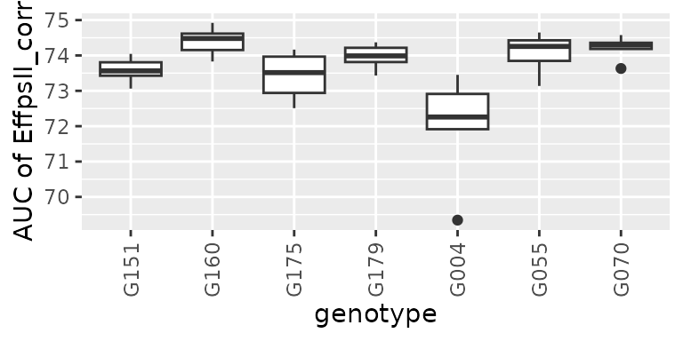

For this subset of genotypes, there is a variability in AUC of the psII
efficiency. This could be used in genetic analysis and maybe to perform
a GWAS.

Another example is using the derivative during the recovery period (at
the end of the time course, so after the light change) to get the
maximum slope, or the maximum rate of the psII per time unit during this
period.

``` r

paramVator2 <-
  estimateSplineParameters(x = fit.splineNumOut,
                           estimate = "derivatives",
                           what = "max",
                           timeMin = 210,
                           timeMax = 312,
                           genotypes = subGenoVator)

plot(paramVator2, plotType = "box")
```

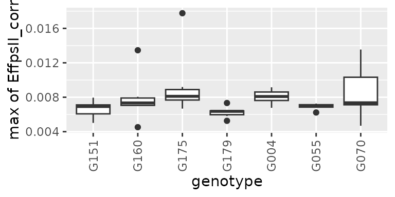

> Note: when “min” or “max” is selected, the output also contains the
> parameter occurence time point, as numerical `timeNumber` and date
> `timePoint`. See in the table below:

| genotype | plotId | max_derivatives | max_timeNumber |    max_timePoint    |
|:--------:|:------:|:---------------:|:--------------:|:-------------------:|
|   G004   | c11r55 |    0.0067723    |    227.7778    | 2018-06-10 04:23:40 |
|   G004   | c13r20 |    0.0084969    |    226.0000    | 2018-06-10 02:37:00 |
|   G004   | c19r15 |    0.0073183    |    232.0000    | 2018-06-10 08:37:00 |
|   G004   | c21r45 |    0.0091547    |    223.3333    | 2018-06-09 23:57:00 |
|   G004   | c24r48 |    0.0080870    |    224.2222    | 2018-06-10 00:50:20 |
|   G004   | c2r15  |    0.0079295    |    226.0000    | 2018-06-10 02:37:00 |

### Example 2

For this example, we will use the genotypic prediction (BLUPs, see
[**statgenHTP tutorial: 3. Correction for spatial
trends**](https://biometris.github.io/statgenHTP/index.html/articles/vignettesSite/SpatialModel_HTP.md))
available in the `spatPredArch` data set. We will fit P-splines at the
genotypic level using the `geno.decomp` levels defined in the spatial
model.

``` r

data(spatPredArch)  
fit.splineGenoArch <- fitSpline(inDat = spatPredArch, 
                                trait = "predicted.values",
                                knots = 15,
                                minNoTP = 18)

plot(fit.splineGenoArch, 
     genotypes = "GenoA36")
```

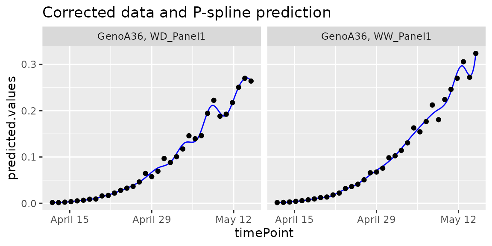

We can estimate the maximum value of the leaf area from the predicted
P-splines:

``` r

paramArch1 <-
  estimateSplineParameters(x = fit.splineGenoArch,
                           estimate = "predictions",
                           what = "max")
```

``` r

plot(paramArch1, plotType = "hist")
```

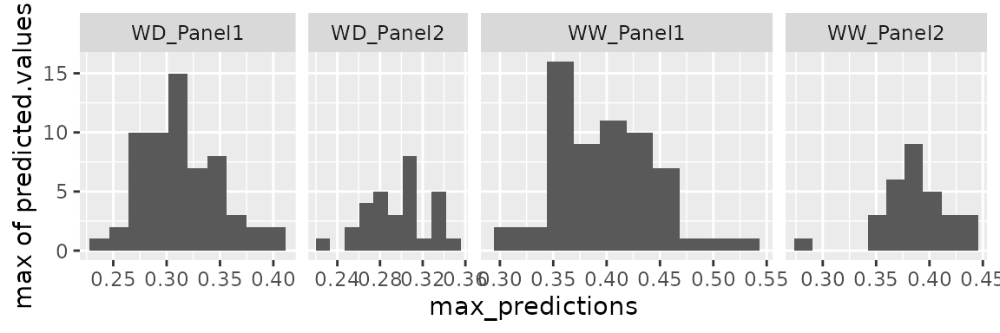

### Example 3

For this example, we will use curves obtained from the P-splines
hierarchical data model (see [**statgenHTP tutorial: 5. Modelling the
temporal evolution of the genetic
signal**](https://biometris.github.io/statgenHTP/index.html/articles/vignettesSite/HierarchicalDataModel_HTP.md)).
We can use `psHDM` objects (that is, objects obtained from
[`fitSplineHDM()`](https://biometris.github.io/statgenHTP/index.html/reference/fitSplineHDM.md)
(fitted curves) or
[`predict.psHDM()`](https://biometris.github.io/statgenHTP/index.html/reference/predict.psHDM.md)
(predicted curves)). For this example, we will use predicted curves.

``` r

## The data from the Phenovator platform have been corrected for spatial
## trends and outliers for single observations have been removed.

## We need to specify the genotype-by-treatment interaction.
## Treatment: water regime (WW, WD).
spatCorrectedArch[["treat"]] <- substr(spatCorrectedArch[["geno.decomp"]],
                                      start = 1, stop = 2)
spatCorrectedArch[["genoTreat"]] <-
  interaction(spatCorrectedArch[["genotype"]],
             spatCorrectedArch[["treat"]], sep = "_")

## Fit P-Splines Hierarchical Curve Data Model for all genotypes.
fit.psHDM  <- fitSplineHDM(inDat = spatCorrectedArch,
                           trait = "LeafArea_corr",
                           pop = "geno.decomp",
                           genotype = "genoTreat",
                           plotId = "plotId",
                           difVar = list(geno = FALSE, plot = FALSE),
                           smoothPop = list(nseg = 5, bdeg = 3, pord = 2),
                           smoothGeno = list(nseg = 5, bdeg = 3, pord = 2),
                           smoothPlot = list(nseg = 5, bdeg = 3, pord = 2),
                           weights = "wt",
                           trace = FALSE,
                           useTimeNumber = FALSE)

## Predict the P-Splines Hierarchical Curve Data Model on a dense grid
## Only predictions (and standard errors) are obtained  
## at the population and genotype levels
pred.psHDM <- predict(object = fit.psHDM,
                      newtimes = seq(min(fit.psHDM$time[["timeNumber"]]),
                                     max(fit.psHDM$time[["timeNumber"]]),
                                     length.out = 100),
                      pred = list(pop = TRUE, geno = TRUE, plot = TRUE),
                      se = list(pop = TRUE, geno = TRUE, plot = FALSE),
                      trace = FALSE)
```

Although we have available information at population, genotype and plot
levels, this function only extracts information at genotype and plot
levels. Nevertheless, we are generally interested in the genotype level.
For example, in the paper by Pérez-Valencia et al.
([2022](#ref-Perez2022)), they extracted three features:

- The maximum spatially corrected leaf area (from estimated
  genotype-specific trajectories)

``` r

##  From estimated genotype-specific trajectories
plot(pred.psHDM, plotType = "popGenoTra", themeSizeHDM = 4)
```

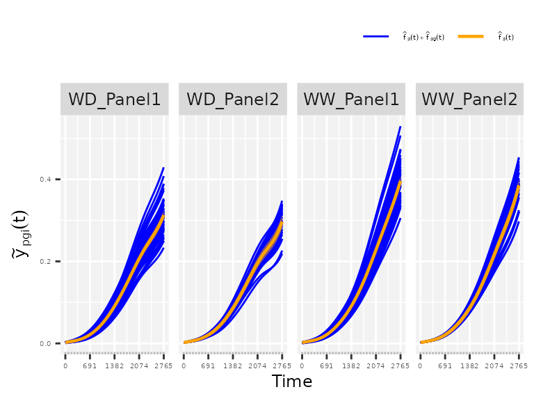

``` r

## Estimate maximum spatially corrected leaf area.
paramArch1 <- estimateSplineParameters(x = pred.psHDM,
                                     what = "max",
                                     fitLevel = "geno",
                                     estimate = "predictions")

## Create a boxplot of the estimates.
plot(paramArch1, plotType = "box")
```

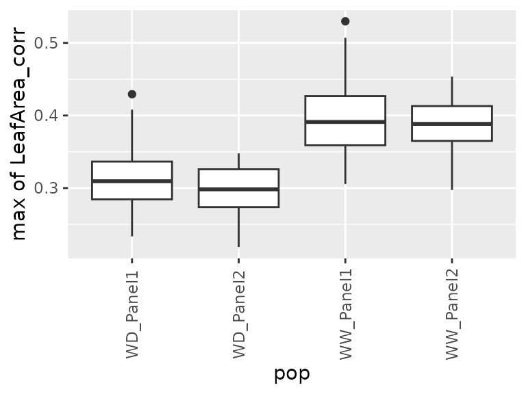

- The maximum speed rate (from the first derivative of the estimated
  genotype-specific trajectories)

``` r

## From the first derivative of the estimated genotype-specific trajectories
plot(pred.psHDM, plotType = "popGenoDeriv", themeSizeHDM = 4)
```

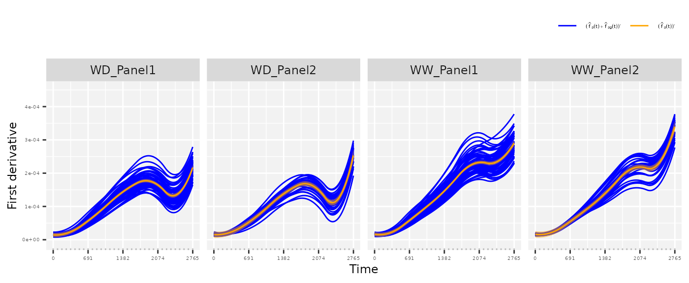

``` r

## Estimate maximum speed rate 
## We are interested on a local maximum (before timeNumber 2500)
paramArch2 <- estimateSplineParameters(x = pred.psHDM,
                                     what = "max",
                                     fitLevel = "geno",
                                     estimate = "derivatives",
                                     timeMax = 2500)

## Create a boxplot of the estimates.
plot(paramArch2, plotType = "box")
```

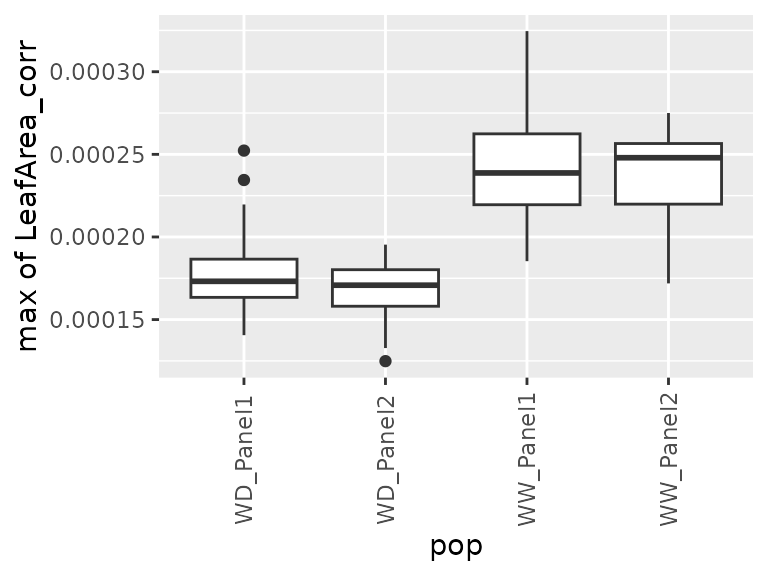

- The area under the estimated genotype-specific deviations, as follows

``` r

## From the estimated genotype-specific deviations
plot(pred.psHDM, plotType = "genoDev", themeSizeHDM = 4)
```

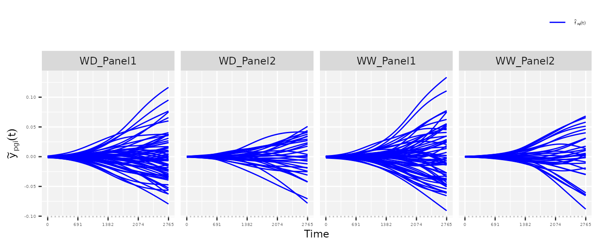

``` r

## Estimate area under the curve (AUC).
paramArch3 <- estimateSplineParameters(x = pred.psHDM,
                                     what = "AUC",
                                     fitLevel = "genoDev",
                                     estimate = "predictions")

## Create a boxplot of the estimates.
plot(paramArch3, plotType = "box")
```

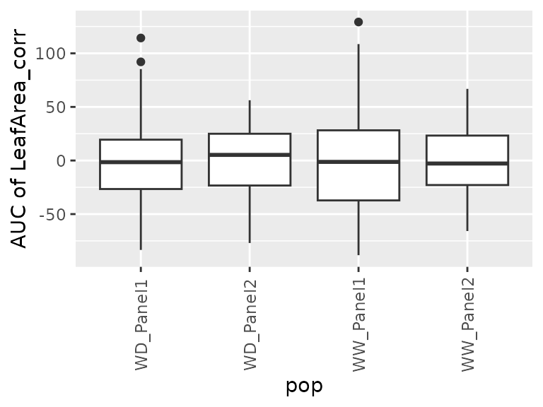

### Example 4

For this example, we will use the raw data from the RootPhAir, corrected
for individually outlying observations (see [**statgenHTP tutorial: 2.
Outlier detection for single
observations**](https://biometris.github.io/statgenHTP/index.html/articles/vignettesSite/OutlierSingleObs_HTP.md))
and time course outliers (see [**statgenHTP tutorial: 4. Outlier
detection Time
course**](https://biometris.github.io/statgenHTP/index.html/articles/vignettesSite/OutlierSerieObs_HTP.md)).
We will fit P-splines at the plant level on a subset of genotypes.

``` r

subGenoRoot <- c( "2","6","8","9","10","520","522")
fit.splineRootOut <- fitSpline(inDat = noCorrectedRootOut,
                               trait = "tipPos_y",
                               knots = 10,
                               genotypes = subGenoRoot,
                               minNoTP = 0,
                               useTimeNumber = TRUE,
                               timeNumber = "thermalTime")
```

We will then estimate the mean growth rate using `what = "mean"` for the
subset of genotypes:

``` r

paramRoot1 <-
  estimateSplineParameters(x = fit.splineRootOut,
                           estimate = "derivatives",
                           what = "mean")

plot(paramRoot1, plotType = "box")
```

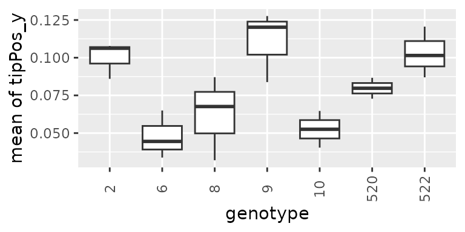

------------------------------------------------------------------------

### References

Brien, Chris, Nathaniel Jewell, Stephanie J. Watts-Williams, Trevor
Garnett, and Bettina Berger. 2020. “Smoothing and Extraction of Traits
in the Growth Analysis of Noninvasive Phenotypic Data.” *Plant Methods*
16 (1): 36. <https://doi.org/10.1186/s13007-020-00577-6>.

Pérez-Valencia, Diana M, María Xosé Rodríguez-Álvarez, Martin P Boer, et
al. 2022. “A Two-Stage Approach for the Spatio-Temporal Analysis of
High-Throughput Phenotyping Data.” *Scientific Reports* 12 (1): 1–16.
<https://doi.org/10.1038/s41598-022-06935-9>.
