# statgenHTP tutorial: 3. Correction for spatial trends

## Introduction

Phenotyping facilities display spatial heterogeneity. For example, the
spatial variability of incident light can go up to 100% between pots
within a greenhouse ([Cabrera-Bosquet et al. 2016](#ref-Cabrera2016)).
Taking into account these spatial trends is a prerequisite for precise
estimation of genetic and treatment effects. In the same way as in field
trials, platform experiments should obey standard principles for
experimental design and statistical modeling.

Popular mixed models to separate spatial trends from treatment and
genetic effects, rely on the use of autoregressive correlation functions
defined on rows and columns (AR1×AR1) to model the local trends ([Cullis
et al. 2006](#ref-Cullis2006)). These models are sometimes difficult to
fit and the selection of a best model is complicated, therefore
preventing an automated phenotypic analysis of series of trials. An
attractive alternative is the use of 2-dimensional P-spline surfaces,
the SpATS model (Spatial Analysis of Trials using Splines,
([Rodríguez-Álvarez et al. 2018](#ref-RodAlv2018))). This model corrects
for spatial trends, row and column effects and has the advantage of
avoiding the model selection step. It also provides the user with
graphical outputs that are easy to interpret. It has proven to be a good
alternative to the classical AR1×AR1 modeling in the field ([Velazco et
al. 2017](#ref-Velazco2017)). It is also suitable for phenotyping
platform data and has been tested on several datasets in the EPPN²⁰²⁰
project.

The aim of this document is to accurately separate the genetic effects
from the spatial effects at each time point. It will provide the user
with either genotypic values or corrected values that can be used for
further modeling. In brief, separately for each measurement time $`t`$,
a spatial model is fitted for the trait $`y_t`$,

$`y_t = 1_M \beta_{0t} +  X_h \beta_{ht} + X_q \beta_{qt} + Z_g c_{gt} + f_t(u,v) + Z_r c_{rt} + Z_c c_{ct} + \epsilon_t`$

where briefly,

- $`1_M \beta_{0t}`$, is the intercept,  
- $`X_h \beta_{ht}`$, corresponds to the factors/covariates whose
  effects we are interested in modeling,  
- $`X_q \beta_{qt}`$, corresponds to the factors/covariates whose
  effects we are interested in removing,  
- $`Z_g c_{gt}`$, corresponds the genotypic effects,
- $`f_t(u,v) + Z_r c_{rt} + Z_c c_{ct}`$, represents the spatial
  effects, with $`f_t(u,v)`$ corresponding to the spatial function,
  e.g. the `PSANOVA` function from the SpATS package, $`Z_r c_{rt}`$ and
  $`Z_c c_{ct}`$ represent the design matrices and effects for the
  random row and column effects respectively,
- $`\epsilon_t`$, is the residual.

> For more details see Pérez-Valencia et al. ([2022](#ref-Perez2022)).

This tutorial describes in detail how to perform analyses to correct for
spatial trends using different modeling engines and how to extract the
results from the models.

------------------------------------------------------------------------

## Modeling with spatial terms using Example 1

We will use the `TP` object `phenoTPOut` in which annotated time points
were replaced by `NA` because they were considered to be outliers. (see
[**statgenHTP tutorial: 2. Outlier detection for single
observations**](https://biometris.github.io/statgenHTP/index.html/articles/vignettesSite/OutlierSingleObs_HTP.md)).

After creating a `TP` object, a model can be fitted on the data. This is
done using the function `fitModels`, which uses two different engines
for fitting the models, namely *SpATS* ([Rodríguez-Álvarez et al.
2018](#ref-RodAlv2018)) and *ASReml* ([Butler et al.
2017](#ref-Gilmour2017)). For models with row and column coordinates,
SpATS is the default engine (see section [**2.1**](#SpATS)). This can be
overruled by specifying the function parameter `engine` and using ASReml
for spatial models (see section [**2.2**](#ASReml)). When the row and
column coordinates are not available, ASReml is used for modeling
without spatial components (see section [**3**](#ASRemlnoSP)). Finally,
it is possible to decompose the genotypic variance using, for example, a
treatment effect (see section [**4**](#genodecomp)).

The output of `fitModels` is an object of class `fitMod`, a list of
fitted models with one item for each time point the model was fitted
for.

### Spatial model using SpATS

When SpATS is used for modeling, an extra spatial term is included in
the model. This spatial component is composed using the `PSANOVA`
function in the SpATS package which uses 2-dimensional smoothing with
P-splines as described in Lee et al. ([2013](#ref-Lee2013)) and in
Rodríguez-Álvarez et al. ([2018](#ref-RodAlv2018)). See
[`help(PSANOVA, SpATS)`](https://rdrr.io/pkg/SpATS/man/PSANOVA.html) for
a detailed description. Extra fixed effects may be fitted using the
option `extraFixedFactors`. The model can also be fitted following a
resolvable row-column design setting `useRepId` as `TRUE`.

The model specifications are listed in the table below with a simplified
model.

| OPTION | MODEL FITTED | SPATIAL TERM |
|----|----|----|
| default | $`y`$ = $`\mu`$ + **genotype** + **rowId** + **colId** + **$`\epsilon`$** | PSANOVA |
| extraFixedFactors = c(“A”, “B”) | $`y`$ = $`\mu`$ + *A* + *B* + **genotype** + **rowId** + **colId** + **$`\epsilon`$** | PSANOVA |
| useRepId = TRUE | $`y`$ = $`\mu`$ + *repId* + **genotype** + **repId:rowId** + **repId:colId** + **$`\epsilon`$** | PSANOVA |
| useCheck = TRUE | $`y`$ = $`\mu`$ + *check* + **genoCheck** + **rowId** + **colId** + **$`\epsilon`$** | PSANOVA |

In the models above, fixed effects are indicated in *italics* whereas
random effects are indicated in **bold**. “genotype” can be fitted as
**random** or *fixed* effect using the option `what`. The option
`useCheck` allows treating some genotypes as check: it splits the column
“genotype” into two columns as follows:

|  genotype   |    check    | genoCheck |
|:-----------:|:-----------:|:---------:|
|     G₁      |   noCheck   |    G₁     |
|     G₂      |   noCheck   |    G₂     |
|      …      |   noCheck   |     …     |
|   G_(n-1)   |   noCheck   |  G_(n-1)  |
|    G_(n)    |   noCheck   |   G_(n)   |
|   check₁    |   check₁    |    NA     |
|   check₂    |   check₂    |    NA     |
|      …      |      …      |     …     |
| check_(m-1) | check_(m-1) |    NA     |
|  check_(m)  |  check_(m)  |    NA     |

> *NOTE: It is only possible to use the combination of check and
> genotype as random.*

#### Calling SpATS

Using the `TP` object **phenoTPOut** from the previous vignette, a model
for a few time points and trait “EffpsII” can now be fitted on the data
as follows. Since `engine` is not supplied as an option, SpATS is used
for fitting the following model:  
EffpsII = $`\mu`$ + **genotype** + **rowId** + **colId** +
**$`\epsilon`$**

``` r

## Fit a model for a few time points.
modPhenoSp <- fitModels(TP = phenoTPOut, 
                        trait = "EffpsII",
                        timePoints = seq(from = 1, to = 73, by = 5)) 
summary(modPhenoSp)
#> Models in modPhenoSp where fitted for experiment Phenovator.
#> 
#> It contains 15 time points.
#> The models were fitted using SpATS.
```

The output is a `fitMod` object, a list containing one fitted model per
time point. Note that by not supplying the `what` argument to the
function, genotype is set as random. It can be run again with genotype
as fixed using `what`:

EffpsII = $`\mu`$ + genotype + **rowId** + **colId** + **$`\epsilon`$**

``` r

## Fit a model for a single time point.
modPhenoSpFix <- fitModels(TP = phenoTPOut, 
                           trait = "EffpsII",
                           timePoints = 3,
                           what = "fixed")
```

The model can be extended by including extra main fixed effects, here to
include extra experimental design factors:  
EffpsII = $`\mu`$ + repId + Image_pos + **genotype** + **rowId** +
**colId** + **$`\epsilon`$**

``` r

## Fit a model for a single time point with extra fixed factors.
modPhenoSpCov <- fitModels(TP = phenoTPOut, 
                           trait = "EffpsII",
                           extraFixedFactors = c("repId", "Image_pos"), 
                           timePoints = 3)
```

It can be further extended by including check genotypes:  
EffpsII = $`\mu`$ + repId + Image_pos + check + **genoCheck** +
**rowId** + **colId** + **$`\epsilon`$**

``` r

## Fit a model for a single time point with extra fixed effects and check genotypes.
modPhenoSpCheck <- fitModels(TP = phenoTPOut, 
                             trait = "EffpsII",
                             extraFixedFactors = c("repId", "Image_pos"),
                             useCheck = TRUE,
                             timePoints = 3)
```

Finally, a model following a resolvable row-column design can be fitted:
including the effects of row and column nested within replicate.  
EffpsII = $`\mu`$ + repId + **genotype** + **repId:rowId** +
**repId:colId** + **$`\epsilon`$**

``` r

## Fit a model for a single time point.
modPhenoSpRCD <- fitModels(TP = phenoTPOut,
                           trait = "EffpsII",
                           timePoints = 3,
                           useRepId = TRUE)
```

#### Model plots

The first type of plot that can be made for fitted models, is a spatial
plot per time point using `plotType = "spatial"`. It consists of plots,
spatial plots of the raw data, fitted values, residuals and either BLUEs
or BLUPs, and a histogram of the BLUEs or BLUPs. When SpATS is used for
modeling an extra plot with the fitted spatial trend is included (see
([Rodríguez-Álvarez et al. 2018](#ref-RodAlv2018)) and ([Velazco et al.
2017](#ref-Velazco2017)) for interpretation).

Note that spatial plots can only be made if spatial information,
i.e. `rowNum` and `colNum`, is available in the `TP` object.

``` r

plot(modPhenoSp,
     timePoints = 36,
     plotType = "spatial",
     spaTrend = "raw")
```

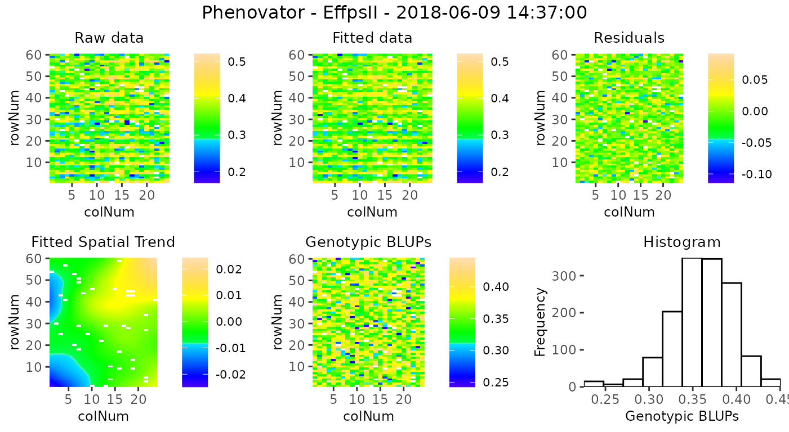

For assessing the importance of the fitted spatial trends at one glance,
and for comparison between time points, the plot of the fitted spatial
trend can be displayed as a ratio of the raw phenotypic mean:
SpatTrend(proportion) = Estimated SpatTrend / mean(raw EffpsII). In this
case, the scale will be in percentage and the min/max will be adjusted
based on all the time points used but will be at least 10%. This
empirical threshold allows visualizing fitted trends that have a
relatively small to large importance.

``` r

plot(modPhenoSp,
     timePoints = 36,
     plotType = "spatial",
     spaTrend = "percentage")
```

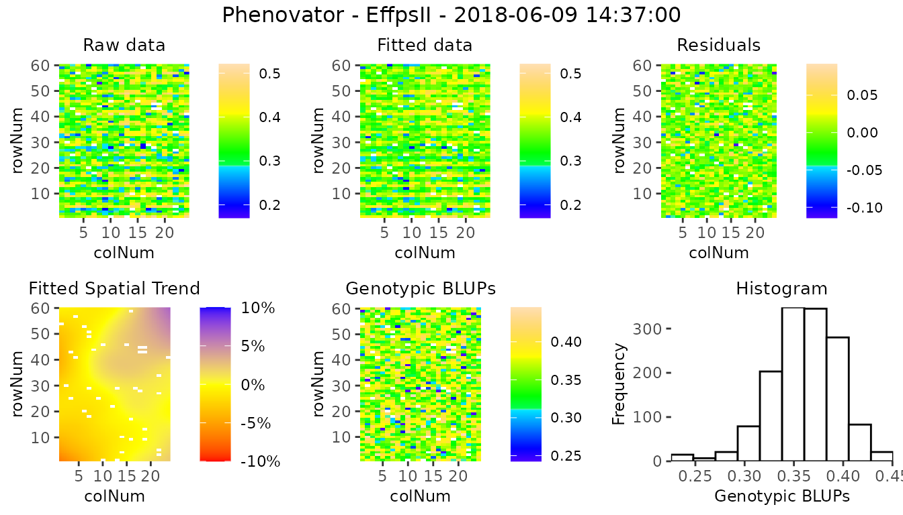

It is also possible to create a time lapse of the ratio of spatial
trends over time. The scale is the same as previously described. The
time lapse is always written to an output file.

``` r

plot(modPhenoSp, 
     plotType = "timeLapse",
     outFile = "TimeLapse_modPhenoSp.gif")
```

Here is an illustration with three time points:
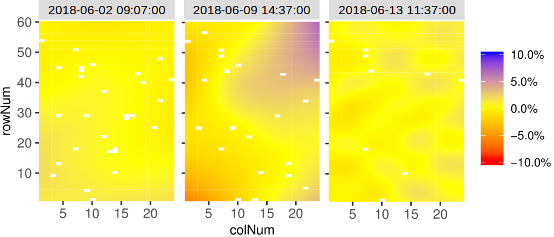

#### Extracting model results

All results that can be extracted are shown in the table below. The
first column contains the function names. The second column contains a
short description of the result that will be extracted and, where
needed, states for which modeling engines it can be extracted.

| FUNCTION | DESCRIPTION |
|----|----|
| getGenoPred | Best Linear Unbiased Predictions (BLUPS, genotype as random) or Estimators (BLUEs, genotype as fixed) |
| getCorrected | Spatially corrected values at the experimental unit level |
| getVar | Variance components |
| getHerit | Generalized heritabilities - only when genotype is random |
| getEffDims | Effective dimensions - only for SpATS engine |

By default, all the functions run for all the time points. It is
possible to select some of them using `timePoints`. The ratio of the
effective dimensions can also be extracted using `EDType = "ratio"` in
the `getEffDims` function.

The output of the function `getGenoPred` is a list of two dataframes:
“genoPred” which contains the predicted values for all tested genotypes
and “checkPred” which contains the predicted values of the check
genotypes, when `useCheck = TRUE` in the model. “checkPred” is empty
when `useCheck = FALSE`.

``` r

## Extract the genotypic predictions for one time point: 
genoPredSp <- getGenoPred(modPhenoSp, timePoints = 6)
## Extract the corrected values for one time point: 
spatCorrSp <- getCorrected(modPhenoSp, timePoints = 6)
## Extract model components: 
varianceSp <- getVar(modPhenoSp)
heritSp    <- getHerit(modPhenoSp)
effDimSp   <- getEffDims(modPhenoSp)
```

The genotypic predictions of the test genotypes for one time point are
displayed in a table like the following:

| timeNumber |      timePoint      | genotype | predicted.values | standard.errors |
|:----------:|:-------------------:|:--------:|:----------------:|:---------------:|
|     6      | 2018-06-02 09:07:00 |  check1  |    0.6659103     |    0.0042991    |
|     6      | 2018-06-02 09:07:00 |  check2  |    0.5894471     |    0.0059116    |
|     6      | 2018-06-02 09:07:00 |  check3  |    0.6675676     |    0.0057804    |
|     6      | 2018-06-02 09:07:00 |  check4  |    0.6746556     |    0.0042381    |
|     6      | 2018-06-02 09:07:00 |   G001   |    0.6664412     |    0.0077009    |
|     6      | 2018-06-02 09:07:00 |   G002   |    0.6650949     |    0.0077011    |

The corrected values are obtained by considering only the estimated
sources of variation which are of interest. Here, the correction follows
the procedure described in ([Welham et al. 2004](#ref-Welham2004)). They
propose a partition of the explanatory variables in three groups: (i)
those for which predicted values are required (*i.e.* population and
genotypic effects), (ii) those to be averaged over (*i.e.* experimental
factors effects), and (iii) those to be ignored (*i.e.* spatial
effects). The corrected trait is obtained as follows (in simplified
terms, for full explanation see Pérez *et al.* (*in prep*)):
$`\tilde{y}_t = \hat \mu_t + \widehat{geno}_t + \widehat{fixed}_t + \hat{\epsilon}_t`$  
where $`\widehat{fixed}_t`$ are the fixed covariates of interest
(e.g. population effect).

This allows keeping the data at the experimental unit level (plants) and
having more degrees of freedom for further modeling (e.g. time course
modeling and estimation of the time course parameter(s)).

> *NOTE: The estimated fixed effects included in `extraFixedFactors` are
> removed from the corrected phenotype ($`\tilde{y}_t`$).*

The corrected values of one time point are displayed in a table like the
following:

| timeNumber | timePoint | EffpsII_corr | EffpsII | wt | genotype | rowId | colId | plotId |
|:--:|:--:|:--:|:--:|:--:|:--:|:--:|:--:|:--:|
| 6 | 2018-06-02 09:07:00 | 0.6472045 | 0.645 | 1756.311 | check1 | 28 | 11 | c11r28 |
| 6 | 2018-06-02 09:07:00 | 0.6477295 | 0.658 | 1756.311 | check1 | 10 | 16 | c16r10 |
| 6 | 2018-06-02 09:07:00 | 0.6854932 | 0.678 | 1756.311 | check1 | 56 | 9 | c9r56 |
| 6 | 2018-06-02 09:07:00 | 0.6589555 | 0.669 | 1756.311 | check1 | 30 | 4 | c4r30 |
| 6 | 2018-06-02 09:07:00 | 0.6698425 | 0.669 | 1756.311 | check1 | 4 | 20 | c20r4 |
| 6 | 2018-06-02 09:07:00 | 0.6804443 | 0.679 | 1756.311 | check1 | 35 | 13 | c13r35 |

#### Plotting model results

Different plots can be displayed for the `fitMod` object. The first one
is **rawPred**, it plots the raw data (colored dots, one color per
plotId) overlaid with the predicted values (black dots) from the fitted
model. One plot is made per genotype with all its plotId. These plots
are put together in a 5×5 grid per page.  
Using the parameter `genotypes`, a subset of genotypes will be plotted.
By default, data are plotted as dots but this can be changed by setting
`plotLine = TRUE`.

``` r

plot(modPhenoSp, 
     plotType = "rawPred",
     genotypes = c("check1", "check2", "G007", "G058")) 
```

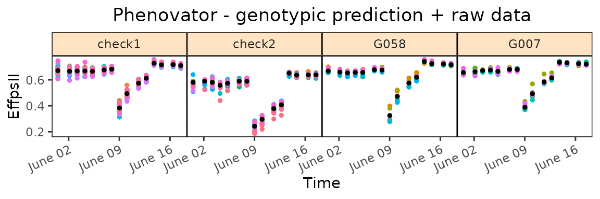

The second one is **corrPred**, it plots the spatially corrected data
(colored dots, one color per plotId) overlaid with the predicted values
from the fitted model (black dots). One plot is made per genotype with
all its plotId. These plots are put together in a 5×5 grid per page.  
Using the parameter `genotypes`, a subset of genotypes will be plotted.
By default, data are plotted as dots but this can be changed by setting
`plotLine = TRUE`.

``` r

plot(modPhenoSp, 
     plotType = "corrPred",
     genotypes = c("check1", "check2", "G007", "G058") )
```

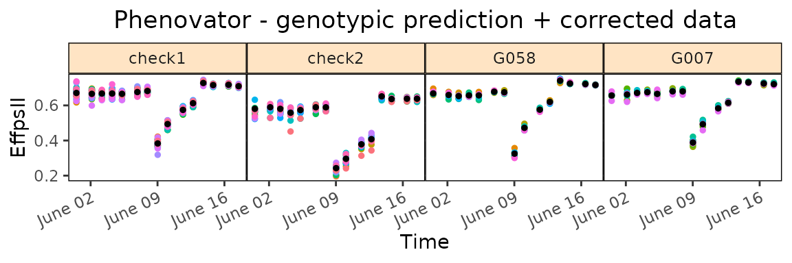

Note that when check genotypes are used for modeling, for the two
previous plot types (`rawPred` and `corrPred`), the parameter
`plotChecks` should be set to `TRUE` to display check genotypes.

``` r

plot(modPhenoSpCheck, 
     plotType = "rawPred",
     plotChecks = TRUE,
     genotypes = c("check1", "check2", "G007", "G058")) 
```

The last three types of plot display different model parameters over
time. Plot type **herit** plots the heritability over time. If
`geno.decomp` is used when fitting the model, heritabilities are plotted
for each level of the genotype groups in a single plot (see section
[**4**](#genodecomp)). The scale of the plot can be adjusted using
`yLim`.

``` r

plot(modPhenoSp, 
     plotType = "herit",
     yLim = c(0.5, 1))
```

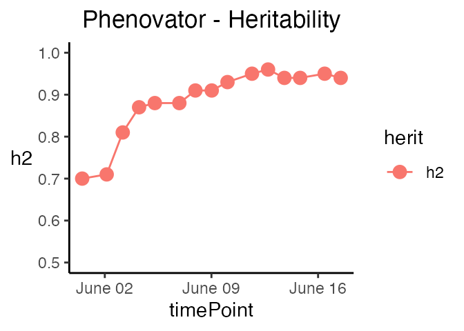

Plot type **variance** plots the residual, column and row variances over
time. These plots can serve as diagnostics of the experiment. The scale
of the plot can be adjusted using `yLim`.

``` r

plot(modPhenoSp, 
     plotType = "variance",
     yLim = c(0, 0.00125))
```

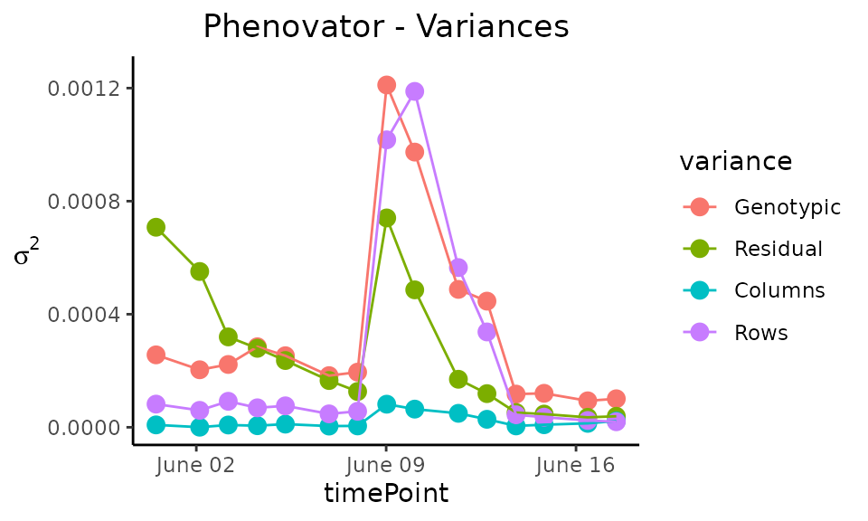

Plot type **effDim** plots the effective dimension from models fitted
using SpATS over time. By default, all the spatial components are
plotted. This can be restricted using the option `whichED`. The scale of
the plot can be adjusted using `yLim`.

``` r

plot(modPhenoSp, 
     plotType = "effDim",
     whichED = c("colId", "rowId", "fColRow","colfRow", "surface"),
     EDType = "ratio")
```

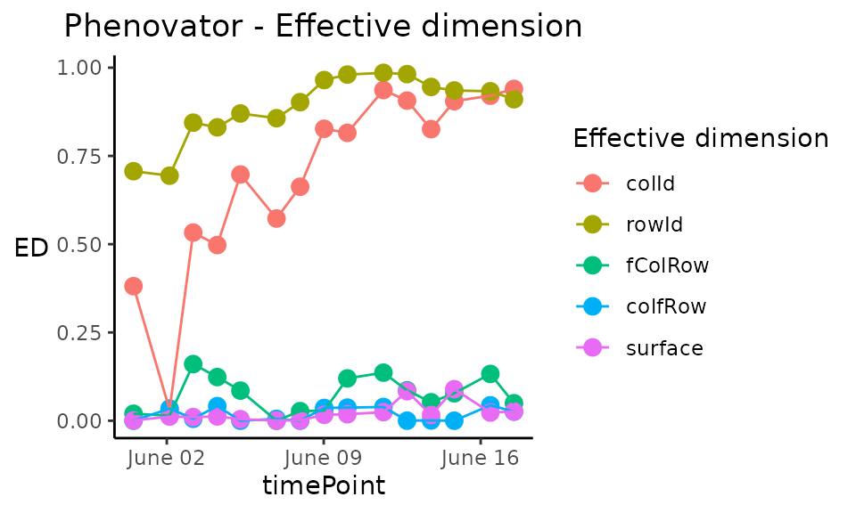

The effective dimensions are also known as the effective degrees of
freedom. They can be interpreted as a measure of the complexity of the
corresponding component: if the effective dimension of one component is
large, it indicates that there are strong spatial trends in this
direction. For better comparison between components, the ratio of
effective dimensions vs. total dimensions can be used. It has a value
between 0, no spatial trend, and 1, strong spatial trend (almost all the
degrees of freedom are used to model it).

The table below gives an overview of the effective dimensions and an
explanation of their meaning.

| EFFECTIVE DIMENSION | EXPLANATION                                           |
|:--------------------|:------------------------------------------------------|
| colId               | Linear trend along columns                            |
| rowId               | Linear trend along rows                               |
| fCol                | Smooth trend along columns                            |
| fRow                | Smooth trend along rows                               |
| fColRow             | Linear trend in rows changing smoothly along cols     |
| colfRow             | Linear trend in cols changing smoothly along rows     |
| fColfRow            | Smooth-by-smooth interaction trend over rows and cols |
| surface             | Sum of smooth trends                                  |

### Spatial model with ASReml

When ASReml is used for modeling and `spatial = TRUE`, four models are
fitted with different random terms and covariance structures. The best
model is determined based on a goodness-of-fit criterion, AIC, on 20% of
the time points or at least 10 time points. The best model is then run
on all time points. As for SpATS, all the ASReml models can be extended
by fitting extra fixed factors using the option `extraFixedFactors`.

> *Note that for the moment, it is only running with ASReml-R version 4
> or higher.*

| OPTION | MODEL FITTED | SPATIAL TERM |
|----|----|----|
| spatial = TRUE | $`y`$ = $`\mu`$ + **genotype** + **row** + **col** + **$`\epsilon`$** | AR1(rowId):AR1(colId) |
|  |  | AR1(rowId):colId |
|  |  | rowId:AR1(colId) |
|  |  | \- |
| spatial = TRUE, extraFixedFactors = c(“A”, “B”) | $`y`$ = $`\mu`$ + *A* + *B* + **genotype** + **row** + **col** + **$`\epsilon`$** | AR1(rowId):AR1(colId) |
|  |  | AR1(rowId):colId |
|  |  | rowId:AR1(colId) |
|  |  | \- |
| spatial = TRUE, repID = TRUE | $`y`$ = $`\mu`$ + *repId* + **genotype** + **repId:row** + **repId:col** + **$`\epsilon`$** | AR1(rowId):AR1(colId) |
|  |  | AR1(rowId):colId |
|  |  | rowId:AR1(colId) |
|  |  | \- |

In the models above, fixed effects are indicated in *italics* whereas
random effects are indicated in **bold**. “genotype” can be fitted as
**random** or *fixed* effect using the option `what`. The option
`useCheck` is not displayed in the table but works the same as for
SpATS: treating some genotypes as check (see section [**2.1**](#SpATS)
for details).

Calling ASReml is done by changing the `engine` option in the
`fitModels` function.

``` r

if (requireNamespace("asreml", quietly = TRUE)) {
  ## Fit a model on few time points with spatial function:
  modPhenoSpAs <- fitModels(TP = phenoTPOut, 
                            trait = "EffpsII",
                            timePoints = seq(from = 1, to = 73, by = 5),
                            engine = "asreml",
                            spatial = TRUE) 
  summary(modPhenoSpAs)
}
```

Here the best spatial model is: trait = **genotype** + **row** +
**col** + **$`\epsilon`$**, with a spatial component:
**AR1(rowId):AR1(colId)**. It has been selected using 10 time points.

Plotting and extracting results is then done the same way as for SpATS.
Below are a few examples.

``` r

if (requireNamespace("asreml", quietly = TRUE)) {
  spatCorrSpAs <- getCorrected(modPhenoSpAs, timePoints = 6)
}
```

``` r

if (requireNamespace("asreml", quietly = TRUE)) {
  plot(modPhenoSpAs, 
       plotType = "herit",
       yLim = c(0.5, 1))
}
```

Note that when the engine is ASReml, the heritability is calculated
using the formula provided in ([Cullis et al. 2006](#ref-Cullis2006)).

## Modeling without spatial terms with ASReml

When the row and column coordinates are not available, only ASReml can
be used for modeling. In that case, the model simply uses the genotype
and the extraFixedFactors, if any.

| OPTION | MODEL FITTED | SPATIAL TERM |
|----|----|----|
| spatial = FALSE | $`y_t`$ = **genotype** + **$`\epsilon`$** | \- |
| spatial = FALSE, extraFixedFactors = c(“A”, “B”) | $`y_t`$ = *A* + *B* + **genotype** + **$`\epsilon`$** | \- |

In the models above and below, fixed effects are indicated in *italics*
whereas random effects are indicated in **bold**. `genotype` can be
fitted as **random** or *fixed* effect using the option `what`. The
option `useCheck` is not displayed in the table, but works the same as
for SpATS (see section [**3.1**](#SpATS)).

``` r

## Fit a model on few time points without spatial function.
modPhenoAs <- fitModels(TP = phenoTPOut, 
                        trait = "EffpsII",
                        timePoints = seq(from = 1, to = 73, by = 5),
                        engine = "asreml",
                        spatial = FALSE)
```

## Modeling with decomposition of genotypes using Example 2

When an experimental treatment is applied, for example, a water
scenario, it is required to decompose the genotypic variance into the
levels of the treatment. In the following example, two water scenarios,
well-watered (WW) and water deficit (WD), were applied. Thus, instead of
modeling one genotypic variance, there will be one genotypic variance
per treatment. In this part, we will describe briefly what is specific
of such modeling with the statgenHTP package using the second example
data set.

We will use the `TP` object **phenoTParchOut** in which annotated time
points have been replaced by NA (see [**statgenHTP tutorial: 2. Outlier
detection for single
observations**](https://biometris.github.io/statgenHTP/index.html/articles/vignettesSite/OutlierSingleObs_HTP.md)).

We can first check the number of time points containing data for a given
trait:

``` r

countValid(phenoTParchOut, "LeafArea")
#> 2017-04-13 2017-04-14 2017-04-15 2017-04-16 2017-04-17 2017-04-18 2017-04-19 
#>        815       1346       1666       1665       1669       1671       1192 
#> 2017-04-20 2017-04-21 2017-04-22 2017-04-23 2017-04-24 2017-04-25 2017-04-26 
#>       1532        823       1673       1617       1221       1672       1072 
#> 2017-04-27 2017-04-28 2017-04-29 2017-04-30 2017-05-01 2017-05-02 2017-05-03 
#>       1673       1134       1137       1074       1134       1137       1092 
#> 2017-05-04 2017-05-05 2017-05-06 2017-05-07 2017-05-08 2017-05-09 2017-05-10 
#>       1449        782       1058       1240       1034        665        885 
#> 2017-05-11 2017-05-12 2017-05-13 2017-05-14 2017-05-15 
#>       1022       1313       1044        452        840
```

In this case, time point “2017-05-14” has only 455 observations, less
than half of the total number of observations. It can bias the modeling
at this time point and one may want to remove it before running the
spatial analysis.

``` r

# getTimePoints(phenoTParchOut)
phenoTParchOut <- removeTimePoints(phenoTParchOut,
                                   timePoints = 32)
```

### Modeling

Using the `geno.decomp` option when modeling will have two main
consequences in the model: the `geno.decomp` variable(s) will be added
as a fixed main effect for the grouping factor and separate variance
components for the genotypes at each level of the grouping or
decomposing factor (and the extraFixedFactors and/or check, if any, with
SpATS only). The table below provides one example with three models:

| OPTION | ENGINE | MODEL FITTED | SPATIAL TERM |
|----|----|----|----|
| geno.decomp = “treatment” | SpATS | $`y`$ = $`\mu`$ + *treatment* + **treatment:genotype** + **rowId** + **colId** + **$`\epsilon`$** | PSANOVA |
| geno.decomp = “treatment”, useCheck = TRUE, extraFixedFactors = “covar1” | SpATS | $`y`$ = $`\mu`$ + *treatment* + *treatment:covar1* + *treatment:check* + **treatment:genoCheck** + **rowId** + **colId** + **$`\epsilon`$** | PSANOVA |
| spatial = TRUE, geno.decomp = “treatment” | ASReml | $`y`$ = $`\mu`$ + *treatment* + **treatment:genotype** + **rowId** + **colId** + **$`\epsilon`$** | AR1(rowId):AR1(colId) |

> *NOTE: At the moment, it is not possible to use the combination of
> `geno.decomp` and `what = "fixed"`.*

Using the Phenoarch example, we will apply a genotype decomposition
using the variables “Scenario” and “population”:

``` r

modPhenoSpGD <- fitModels(TP = phenoTParchOut,
                          trait = "LeafArea",
                          geno.decomp = c("Scenario", "population"),
                          timePoints = seq(from = 1, to = 33, by = 3))
```

### Output

Extracting results and plotting from the models work exactly the same as
previously. For example, the spatial plot on this data set looks like
the following for one time point:

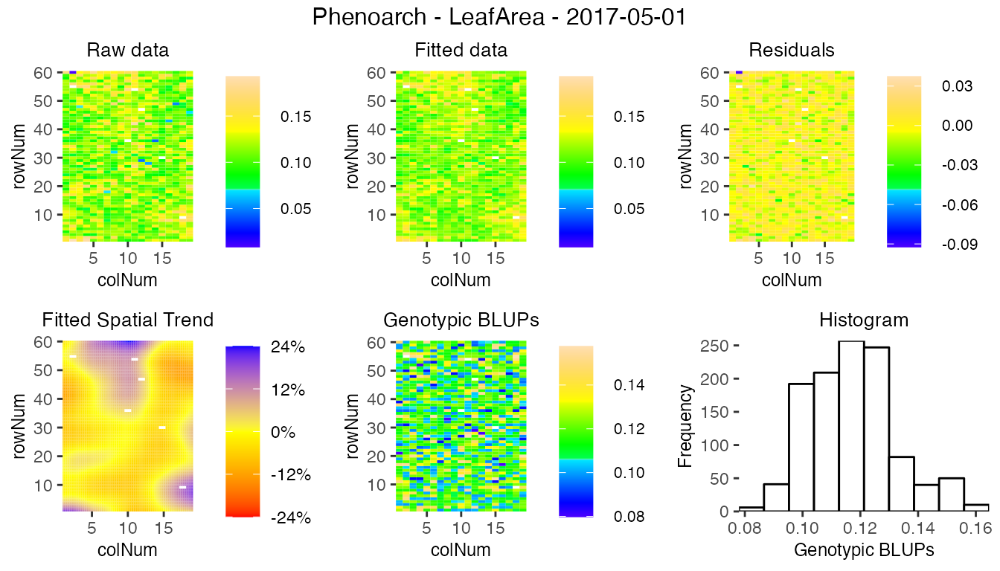

There are some significant differences in the display of some results
and plots. They are highlighted below.

The predictions have two values per genotype, one for each level of the
decomposition `geno.decomp`, here “Scenario_population”, as illustrated
in the table below for three genotypes predicted from the SpATS model
`modPhenoSpGD`.

| timeNumber | timePoint  | geno.decomp | genotype | predicted.values | standard.errors |
|:----------:|:----------:|:-----------:|:--------:|:----------------:|:---------------:|
|     16     | 2017-04-28 |  WD_Panel1  | GenoA01  |    0.0680753     |    0.0032742    |
|     16     | 2017-04-28 |  WD_Panel1  | GenoA02  |    0.0812845     |    0.0032697    |
|     16     | 2017-04-28 |  WD_Panel2  | GenoB01  |    0.0767823     |    0.0043653    |
|     16     | 2017-04-28 |  WD_Panel2  | GenoB02  |    0.0748107     |    0.0043197    |
|     16     | 2017-04-28 |  WW_Panel1  | GenoA01  |    0.0714313     |    0.0025789    |
|     16     | 2017-04-28 |  WW_Panel1  | GenoA02  |    0.0802842     |    0.0025788    |
|     16     | 2017-04-28 |  WW_Panel2  | GenoB01  |    0.0731028     |    0.0041211    |
|     16     | 2017-04-28 |  WW_Panel2  | GenoB02  |    0.0771899     |    0.0041214    |

The heritabilities are now given for each of the `geno.decomp` levels
and their plot now displays one line per level.

| timeNumber | timePoint  | WD_Panel1 | WW_Panel1 | WD_Panel2 | WW_Panel2 |
|:----------:|:----------:|:---------:|:---------:|:---------:|:---------:|
|     1      | 2017-04-13 |   0.89    |   0.91    |   0.52    |   0.49    |
|     4      | 2017-04-16 |   0.94    |   0.95    |   0.72    |   0.67    |
|     7      | 2017-04-19 |   0.92    |   0.94    |   0.73    |   0.64    |
|     10     | 2017-04-22 |   0.94    |   0.96    |   0.80    |   0.73    |
|     13     | 2017-04-25 |   0.94    |   0.95    |   0.79    |   0.71    |
|     16     | 2017-04-28 |   0.91    |   0.94    |   0.79    |   0.71    |

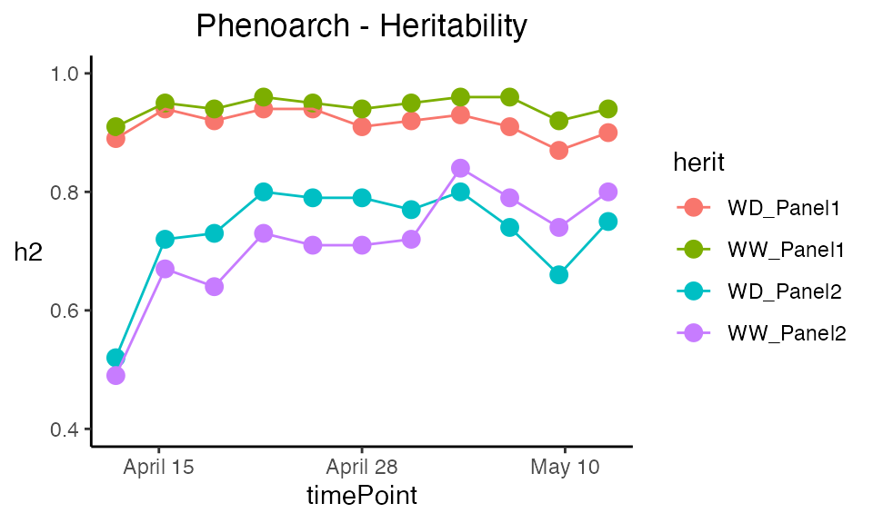

The prediction and corrected data plots display one plot per combination
genotype × geno.decomp.

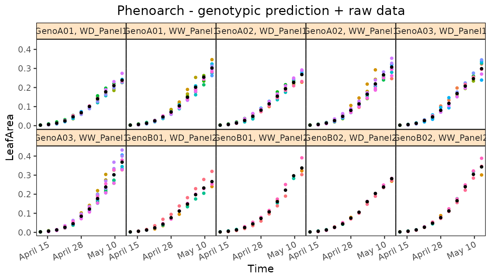

------------------------------------------------------------------------

### References

Butler, D. G., B. R. Cullis, A. R. Gilmour, B. G. Gogel, and R.
Thompson. 2017. *ASReml-r Reference Manual Version 4*.
<https://www.vsni.co.uk/>.

Cabrera-Bosquet, Llorenç, Christian Fournier, Nicolas Brichet, Claude
Welcker, Benoît Suard, and François Tardieu. 2016. “High-Throughput
Estimation of Incident Light, Light Interception and Radiation-Use
Efficiency of Thousands of Plants in a Phenotyping Platform.” *New
Phytologist* 212 (1): 269–81. <https://doi.org/10.1111/nph.14027>.

Cullis, B. R., A. B. Smith, and N. E. Coombes. 2006. “On the Design of
Early Generation Variety Trials with Correlated Data.” *Journal of
Agricultural, Biological, and Environmental Statistics* 11 (4): 381–93.
<https://doi.org/10.1198/108571106X154443>.

Lee, Dae-Jin, María Durbán, and Paul Eilers. 2013. “Efficient
Two-Dimensional Smoothing with p-Spline ANOVA Mixed Models and Nested
Bases.” *Computational Statistics & Data Analysis* 61 (May): 22–37.
<https://doi.org/10.1016/j.csda.2012.11.013>.

Pérez-Valencia, Diana M, María Xosé Rodríguez-Álvarez, Martin P Boer, et
al. 2022. “A Two-Stage Approach for the Spatio-Temporal Analysis of
High-Throughput Phenotyping Data.” *Scientific Reports* 12 (1): 1–16.
<https://doi.org/10.1038/s41598-022-06935-9>.

Rodríguez-Álvarez, María, Martin P. Boer, Fred van Eeuwijk, and Paul H.
C. Eilers. 2018. “Correcting for Spatial Heterogeneity in Plant Breeding
Experiments with p-Splines.” *Spatial Statistics* 23 (October): 52–71.
<https://doi.org/10.1016/j.spasta.2017.10.003>.

Velazco, Julio G., María Xosé Rodríguez-Álvarez, Martin P. Boer, et al.
2017. “Modelling Spatial Trends in Sorghum Breeding Field Trials Using a
Two-Dimensional P-Spline Mixed Model.” *Theoretical and Applied
Genetics* 130 (7): 1375–92. <https://doi.org/10.1007/s00122-017-2894-4>.

Welham, Sue, Brian Cullis, Beverley Gogel, Arthur Gilmour, and Robin
Thompson. 2004. “Prediction in Linear Mixed Models.” *Australian & New
Zealand Journal of Statistics* 46 (3): 325–47.
<https://doi.org/10.1111/j.1467-842X.2004.00334.x>.
