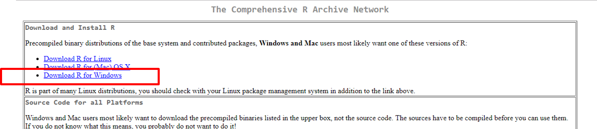
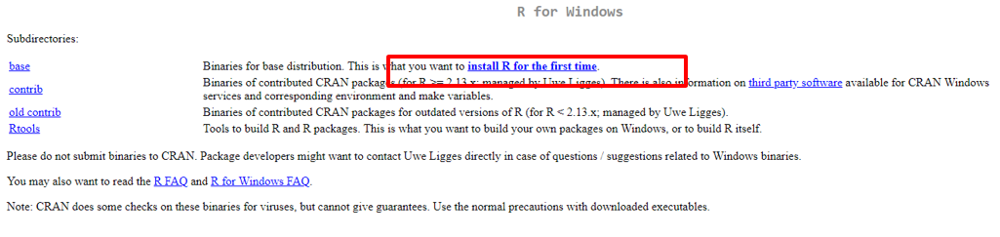
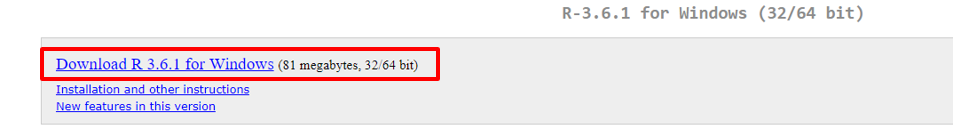
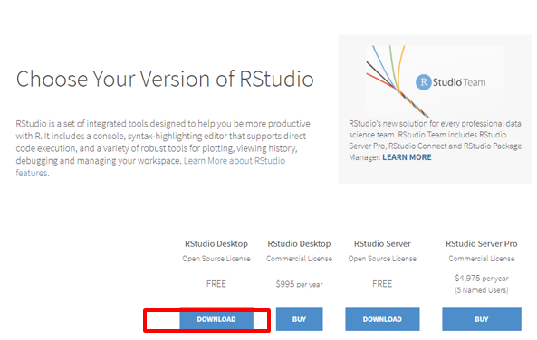
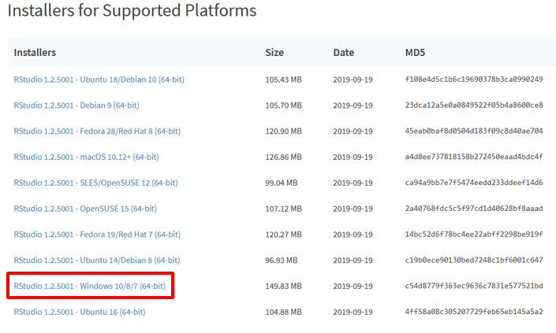
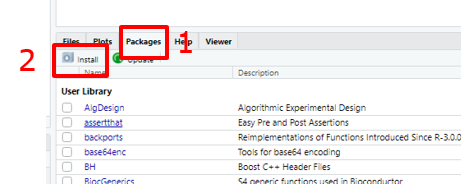
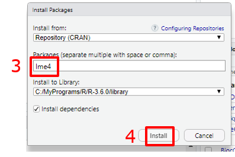
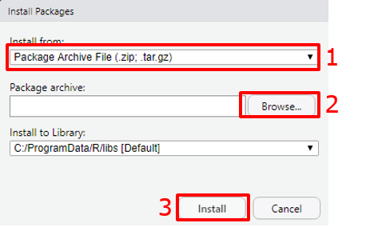

```{r setup, include=FALSE}
knitr::opts_chunk$set(echo = TRUE,
                      fig.path = "figures")
options(rmarkdown.html_vignette.check_title = FALSE)
```

# Getting started

This document describes how to install R and RStudio and the statgen packages. The screenshots shown will be for an installation on Windows. Installation on other operation systems is very similar.

## Installation of R

To install R go to https://cloud.r-project.org and click the links indicated in the screenshots.

<center>
{width=80%}
</center>


<center>

</center>


<center>

</center>

This will download the installer for the latest version of R (at the time of writing R 3.6.1). After downloading run the installer and follow the steps to install R. All installation settings can be left at their default values. 

## Installation of RStudio

RStudio is an interface to simplify the use of R. Before installing RStudio make sure R is installed as described above. To install RStudio go to https://www.rstudio.com/products/rstudio/download/ and click the links indicated below.


<center>

</center>

<center>

</center>

This will download the installer for the latest version of RStudio (at the time of writing 1.2.50001). After downloading the installer, run it to install RStudio.
All installation settings can be left at their default values.

## Installation of packages

A lot of R packages are available on CRAN (https://cran.r-project.org/). Installation of those packages can be done as follows from within RStudio.

<center>
{width=80%}
</center>

<center>

</center>

This example will install the lme4 package from CRAN. Multiple packages can be installed at once by supplying them as a comma separated list at the third step.    

Some of the statgen packages are not yet available on CRAN, but are distributed as a zip file. To install those packages, follow the steps below. At the second step after clicking browse, select the zip file containing the package.

<center>

</center>

