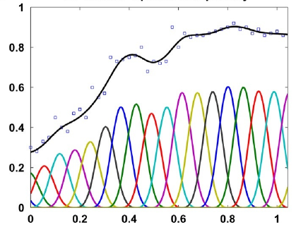
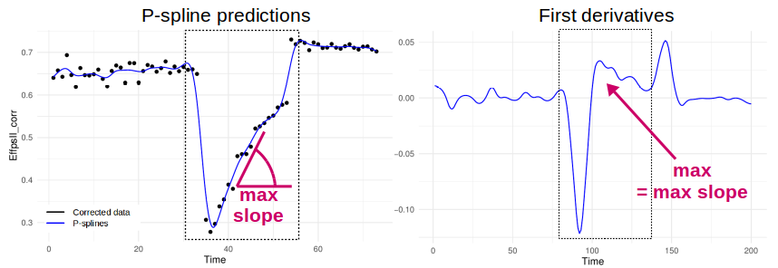

```{r setup, include = FALSE}
knitr::opts_chunk$set(
  collapse = TRUE,
  comment = "#>"
  )
options(rmarkdown.html_vignette.check_title = FALSE)
library(statgenHTP)
```

# Introduction 

It consists in detecting outliers in a set of time courses resulting from the observation of one single trait. The detection procedure is applied to each trait individually without considering other traits, meaning that distinct outlier datasets are associated with each considered trait. 

The final step consists in extracting interesting parameterd from the modelled time course, for example a maximum rate of growth, or a minimum value in a specific period. These parameters could then be further analysed, for example a GxE analysis (see *statgenGxE*), or a genetic analysis (see *statgenGWAS*).

## A nonparametric smoothing associated with a PCA

Each time course is modelled by a nonparametric smoothing spline with a fixed number of
knots. This is a piecewise cubic polynomial ([@Eubank1999], [@Eilers2015]) fitted with the ‘gam’ function of the R-package ‘mgcv’. 

<center>
{width=40%}

P-spline illustration with 20 knots, from [@Hugelier2016]. The individual B-splines (with the correct coefficients) are shown (colored lines), as well as their sum representing the fit (thick black line).
</center>

The estimates for the spline coefficients are then
extracted per time course (typically per plant) and correlations between those coefficient
vectors are calculated to identify outlying time courses, i.e., plants. An outlying time course will have low correlation to the majority of time courses. To support the analysis by correlations, a principal component analysis can be done on the plant (time course) by spline coefficient matrix. A PCA plot of the plant scores will show the outlying plant.

*To note,* for p-splines in generalized additive model (gam), the smoothing coefficient is optimised by restricted maximum likelihood but the number of knots is chosen by the user.

This document describes the procedure to detect outlying time course with examples on experimental data sets (see *Intro_HTP*). The data on which the procedures apply are the variables of interest. They may be variables measured directly or indirectly (through image analysis for example). The way they were obtained doesn't matter. The following functions can be applied to corrected data (see *SpatialModel_HTP*) or on raw data.


----

# Illustration of the non-parametric smoothing associated with a PCA

The function `fitSpline()` fits a p-spline per plant for the selected `trait` using the number of `knots`
chosen by the user. In P-spline, the knots are equally spaced and their number can be large. The user should also chose an appropriate proportion of minimum number of time points that should be in the 
dataset per plant `perMinTP`. When a plant has less time point than the minimum, it will be skipped from the analysis.

The functions are illustrated with the three example data sets. For more information about the data, see *Intro_HTP*.

## Example 1

The data from the Phenovator platform have been corrected for spatial trends and time points outliers have been removed (see *XXXXX*). At this stage, the cleaned and corrected data are used:

```{r fitSplineVator, echo=TRUE, message=FALSE, warning=FALSE, eval=TRUE}
data(spatCorrVator)  
# Format the timepoint
spatCorrVator$timePoint <- lubridate::as_datetime(spatCorrVator$timePoint)
# Run the function to fit p-spline using the mgcv package on a subset of genotypes
subGeno <- c("G70","G160","G151","G179","G175","G4","G55")
#
fit.spline <- fitSpline(corrDat = spatCorrVator,
                        trait = "EffpsII_corr",
                        genotypes = subGeno,
                        knots = 50,
                        perMinTP = 0.8)
# Extracting the tables of predicted values and pspline coeficients
pred.Dat <- fit.spline$predDat
coef.Dat <- fit.spline$coefDat
```

The object `fit.spline` contains the predicted value (`pred.value` in the table below), i.e 
the values predicted using the P-spline model coefficients. Conversion to numerical time is required by the mgcv package. In order to keep the same time scale as in the original `timePoint` column, a simple numerical transformation of the time points is made (column `timeNumber`). Predictions are made on a denser grid of time points: the time points for prediction are calculated as the smallest gap between two time points divided by 9, so dividing the smallest gap in 10 segments. The object `fit.spline` also contains the first derivatives (`deriv` **see part XXX about Parameters estimation**).

```{r headpredDat, echo=FALSE, message=FALSE, eval=TRUE}
knitr::kable(head(pred.Dat), align=c('c','c'), booktabs = TRUE)
```

The numerical time can be provided by the user, for example when using thermal time or a manual conversion. In this example, we provide a new column with time in hour since first measurement.

```{r formatNum, echo=FALSE, message=FALSE, warning=FALSE, eval=TRUE}
timy <- data.frame(timePoint = unique(spatCorrVator$timePoint),
                   timePointP1 = c(unique(spatCorrVator$timePoint)[2:73],
                                   lubridate::ymd_hms("2018-06-18 16:37:00")),
                   timeNum = NA)
# diff between two time point in hour
timeNum <- sapply( 1:nrow(timy), function(x) {
    as.numeric(lubridate::ymd_hms(timy$timePointP1[x])-
                             lubridate::ymd_hms(timy$timePoint)[x])
})
timy$timeNumDiff <- c(0,timeNum[1:(length(timeNum)-1)])
# cum sum
timy$timeNum <- cumsum(timy$timeNumDiff)
# add to spatCorrVator
spatCorrVator$timeNumHour <- timy$timeNum[match(spatCorrVator$timePoint,timy$timePoint)]
```


```{r fitSplineVatorNum, echo=TRUE, message=FALSE, warning=FALSE, eval=TRUE}
fit.splineNum <- fitSpline(corrDat = spatCorrVator,
                           trait = "EffpsII_corr",
                           genotypes = subGeno,
                           knots = 50,
                           perMinTP = 0.8,
                           useTimeNumber = TRUE,
                           timeNumber = "timeNumHour")
```

We can then visualise the p-spline predictions and first derivatives for a subset of genotypes or for a subset of plots.

```{r plotSplGeno,  fig.height=4, fig.width=7, message=FALSE, eval=TRUE}
plot(fit.spline,
     genotypes = "G160")
```

```{r plotSplPlot,  fig.height=2.5, fig.width=4, message=FALSE, eval=TRUE}
plot(fit.spline,
     plotIds = "c10r29",
     plotType =  "predictions")
plot(fit.spline,
     plotIds = "c10r29",
     plotType =  "derivatives")
```


The object `fit.spline` also contains the values of the P-splines coefficients:

```{r headcoefDat, echo=FALSE, message=FALSE, eval=TRUE}
knitr::kable(head(coef.Dat), align=c('c','c'), booktabs = TRUE)
```

The coefficients are then used to tag suspect time courses with the function `detectOutliers()`. This function performs a PCA on the coefficients (from data frame `coef.Dat`) per `genotype` and tags the plants that have a coordinate on the second PC axis above a threshold (`thrPca`), see the lines 'reason = pc2' in the table below. The function also calculates the pairwise-correlation of the coefficients per genotype. Plants are tagged when the correlation is below a given threshold (`thrCor`), see the lines `reason = mean corr` in the table below. 

For obvious reasons, the detection will only work when there are at least three replicates per genotypes. Genotypes with less than three replicates will be skipped. (TRUE?)

```{r OutVator, echo=TRUE, message=FALSE, warning=FALSE, eval=TRUE}
outVator <-
  detectTimeCourseOutliers(corrDat = spatCorrVator,
                           predDat = pred.Dat,
                           coefDat = coef.Dat,
                           trait = "EffpsII_corr",
                           genotypes = subGeno,
                           thrCor = 0.9,
                           thrPca = 1) 
```


```{r headOutPoint, echo=FALSE, message=FALSE, eval=TRUE}
knitr::kable(head(outVator), align=c('c','c'), booktabs = TRUE, row.names=F)
```

For this subset of genotypes, 4 plants were tagged as outliers:

* c21r25 and c9r4 had both low correlations and extreme PC axis coordinates,  
* c11r55 and c4r13 had extreme PC axis coordinates.

The `outVator` can be visualised by selecting genotypes. Here genotype G151 which has plant c21r25 tagged as outlier:

```{r plotOutVator,  fig.height=6, fig.width=6, echo=TRUE, message=FALSE, warning=FALSE}
plot(outVator, genotypes = "G151")
```

The figure above contains:

* (top) A scatter plot of the trait value in y axis and time in x axis. Points are the raw or corrected data and lines are the p-spline predictions, with one colour per plant (in legend).  
* (bottom left) A correlation matrix of the plant scores as a heatmap. The scale is centered on 0.9 to see at a glance the outlying plants with low correlations (usually correlation are high between plants).  
* (bottom right) A PCA plot of the plant scores. Usually, all plants are grouped and the first axis explained most of the variation. When a plant is outlying, it will be located apart from the other plants on the second axis. 


Finally, the outlying plants can be removed from the dataset...

```{r rmOutVator}
spatCorrVatorOut <- removeTimeCourseOutliers(dat = spatCorrVator,
                                            timeCourseOutliers = outVator)
# Check one value annotated as outlier in the original corrected data frame
head(spatCorrVator[spatCorrVator$plotId=="c21r25",
                  c("EffpsII_corr","EffpsII")])
# Check the same value in the new corrected data frame
head(spatCorrVatorOut[spatCorrVatorOut$plotId=="c21r25",
                c("EffpsII_corr","EffpsII")])
```

... and from the predictions.
```{r rmOutVatorspline}
fit.splineOut <- removeTimeCourseOutliers(fitSpline = fit.spline,
                                          timeCourseOutliers = outVator)
fit.splineNumOut <- removeTimeCourseOutliers(fitSpline = fit.splineNum,
                                             timeCourseOutliers = outVator)
```


### Impact of the number of knots on the smoothing

For one plant of the example 1, we fit the p-spline with 10 or 50 knots and visualise the predictions to compare the smoothness. We advise the user to perform tests of the number of knots on a subset of plants before running the function on all plants. 

*With 10 knots:*
```{r fitSplineVatorKnots10, fig.height=3, fig.width=4, echo=TRUE, warning=FALSE, eval=TRUE}
sp10k <- fitSpline(corrDat = spatCorrVator,
                        trait = "EffpsII_corr",
                        plotIds = "c10r29",
                        knots = 10,
                        perMinTP = 0.8)
plot(sp10k)
```

The predicted curve is very smooth and, in this case, it is not following precisely the real data curve shape. When comparing the plants of a same genotype with this curve shape we might not identify the outlying plant.


*With 50 knots:*
```{r fitSplineVatorKnots50, fig.height=3, fig.width=4, echo=TRUE, warning=FALSE, eval=TRUE}
sp50k <- fitSpline(corrDat = spatCorrVator,
                        trait = "EffpsII_corr",
                        plotIds = "c10r29",
                        knots = 50,
                        perMinTP = 0.8)
plot(sp50k)
```

The predicted curve is less smooth and follows the actual curve shape. This seems to be a good setting to detect strange curve shape among the replicates of a genotype.


## Example 2

The data from the PhenoArch platform have been corrected for spatial trends and time points outliers have been removed (see *XXXXX*). At this stage, the cleaned and corrected data are used:

```{r fitSplineArch, echo=TRUE, message=FALSE, warning=FALSE, eval=TRUE}
data(spatCorrArch)  
spatCorrArch$timePoint <- lubridate::as_datetime(spatCorrArch$timePoint)
subGeno <- c("GenoA1","GenoA2","GenoA3","GenoA4","GenoB1","GenoB2","GenoB3")
#
fit.splineArch <- fitSpline(corrDat = spatCorrArch, 
                            trait = "Biomass_Estimated_corr",
                            genotypes = subGeno,
                            knots = 15,
                            perMinTP = 0.5)
#
pred.DatArch <- fit.splineArch$predDat
coef.DatArch <- fit.splineArch$coefDat
```

```{r plotArch,  fig.height=3, fig.width=4, message=FALSE, eval=TRUE}
plot(fit.splineArch,
     plotIds = "c11r9",
     plotType =  "predictions")
plot(fit.splineArch,
     plotIds = "c11r9",
     plotType =  "derivatives")
```

Here, the `geno.decomp` option is also used to split the plants of each genotypes between 
well watered and drought. The outliers detection is run per treatment.

```{r OutArch, echo=TRUE, message=FALSE, warning=FALSE, eval=TRUE}
outArch <- 
  detectTimeCourseOutliers(corrDat = spatCorrArch,
                           predDat = pred.DatArch,
                           coefDat = coef.DatArch,
                           trait = "Biomass_Estimated_corr",
                           genotypes = subGeno,
                           thrCor = 0.9,
                           thrPca = 1,
                           geno.decomp = "geno.decomp")
```

```{r headOutPointArch, echo=FALSE, message=FALSE, eval=TRUE}
knitr::kable(head(outArch), align=c('c','c'), booktabs = TRUE, row.names=F)
```

```{r plotOutArch,  fig.height=6, fig.width=6, echo=TRUE, message=FALSE, warning=FALSE, eval=TRUE}
plot(outArch, genotypes = "GenoB3")
```

```{r rmOutArch}
spatCorrArchOut <- removeTimeCourseOutliers(dat = spatCorrArch,
                                            timeCourseOutliers = outArch)
# Check one value annotated as outlier in the original corrected data frame
head(spatCorrArch[spatCorrArch$plotId=="c17r40",
                  c("Biomass_Estimated_corr","Biomass_Estimated")])
# Check the same value in the new corrected data frame
head(spatCorrArchOut[spatCorrArchOut$plotId=="c17r40",
                c("Biomass_Estimated_corr","Biomass_Estimated")])
```

## Example 3

The data from the RootPhAir platform have not been corrected for spatial trends but time points outliers have been removed (see *XXXXX*). At this stage, the cleaned data are used:

```{r fitSplineRoot, echo=TRUE, message=FALSE, warning=FALSE, eval=TRUE}
noCorrRoot$timePoint <- lubridate::as_datetime(noCorrRoot$timePoint)
subGeno <- c( "2","6","8","9","10","520","522")
fit.splineRoot <- fitSpline(corrDat = noCorrRoot,
                            trait = "tipPos_y",
                            knots = 10,
                            genotypes = subGeno,
                            perMinTP = 0.001,
                            useTimeNumber = TRUE,
                            timeNumber = "thermalTime")

pred.DatRoot <- fit.splineRoot$predDat
coef.DatRoot <- fit.splineRoot$coefDat
row.names(coef.DatRoot) <- 1:nrow(coef.DatRoot)
```


```{r plotRoot,  fig.height=4, fig.width=7, message=FALSE, eval=TRUE}
plot(fit.splineRoot,
     genotypes = "2")
```

```{r OutRoot, echo=TRUE, message=FALSE, warning=FALSE, eval=TRUE}
outRoot <- detectTimeCourseOutliers(corrDat = noCorrRoot,
                                    predDat = pred.DatRoot,
                                    coefDat = coef.DatRoot,
                                    trait = "tipPos_y",
                                    genotypes = as.character(subGeno),
                                    thrCor = 0.9,
                                    thrPca = 1.2)

```

```{r plotRootOut,  fig.height=6, fig.width=7, message=FALSE, eval=TRUE}
plot(outRoot,
     genotypes = "2")
```


```{r rmOutRoot}
noCorrRootOut <- removeTimeCourseOutliers(dat = noCorrRoot,
                                            timeCourseOutliers = outRoot)
# Check one value annotated as outlier in the original corrected data frame
head(noCorrRoot[noCorrRoot$plotId=="A_53_4","tipPos_y"])
# Check the same value in the new corrected data frame
head(noCorrRootOut[noCorrRootOut$plotId=="A_53_4","tipPos_y"])
```


# Extraction parameters from curve

After all the steps of cleaning and modeling... blablabla extract parameters from the curve
that are relevant for biology. Some examples are provided below for the Phenovator data set (example 1).

## Example 1

We will use the `fit.splineNumOut` previously created which contains the p-spline prediction without the time course outliers. We could estimate the maximum value of the trait at the beginning of the time course: 

```{r paramVator, fig.height=3, fig.width=4, echo=TRUE, message=FALSE, warning=FALSE, eval=TRUE}
subGeno <- c("G70","G160","G151","G179","G175","G4","G55")
paramVator1 <-
  estimateSplineParameters(HTPSpline = fit.splineNumOut,
                           estimate = "predictions",
                           what = "max",
                           timeMin = 330,
                           timeMax = 432,
                           genotypes = subGeno)
#
library(ggplot2)
ggplot(paramVator1, aes(x = genotype, y = x)) + 
  geom_boxplot() +
  theme_minimal()
```

For this subset of genotypes, there is a variability in the maximum values of the psII efficiency after the light treatment. This could be used in genetic analysis and maybe to perform a GWAS.

Another example is using the derivative during the recovery period to get the maximum slope, or the maximum rate of the psII per time unit during this period.

<center>
{width=80%}
</center>

```{r paramVator2, fig.height=3, fig.width=4, echo=TRUE, message=FALSE, warning=FALSE, eval=TRUE}
paramVator2 <-
  estimateSplineParameters(HTPSpline = fit.splineNumOut,
                           estimate = "derivatives",
                           what = "max",
                           timeMin = 210,
                           timeMax = 312,
                           genotypes = subGeno)
#
ggplot(paramVator2, aes(x = genotype, y = x)) + 
  geom_boxplot() +
  theme_minimal()
```


----

## References

