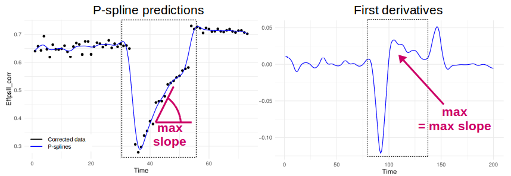

```{r setup, include = FALSE}
knitr::opts_chunk$set(
  collapse = TRUE,
  comment = "#>"
  )
options(rmarkdown.html_vignette.check_title = FALSE)
library(statgenHTP)
library(ggplot2)
```

# Introduction

This document presents the final step of the HTP data analysis: extracting interesting parameters from the modelled time course, for example a maximum rate of growth, or a minimum value in a specific period. These parameters could then be further analysed, for example a GxE analysis (see [*statgenGxE*](https://cran.r-project.org/web/packages/statgenSTA/index.html)), or a genetic analysis (see [*statgenGWAS*](https://cran.r-project.org/web/packages/statgenGWAS/index.html)).

The following functions can be applied to corrected data (see **statgenHTP tutorial: 3. Correction for spatial trends**), genotypic means (BLUEs or BLUPS) (see **statgenHTP tutorial: 3. Correction for spatial trends**) or on raw data.

------------------------------------------------------------------------

# Extraction parameters from curve

After all the steps of cleaning and modeling... blablabla extract parameters from the curve that are relevant for biology. Some examples are provided below for the Phenovator data set (example 1).

## Example 2

```{r fitSplineArch, echo=TRUE, message=FALSE, warning=FALSE, eval=TRUE}
data(spatCorrArch)  
spatCorrArch$timePoint <- lubridate::as_datetime(spatCorrArch$timePoint)
subGenoArch <- c("GenoA36","GenoA26","GenoA1","GenoA2","GenoA3","GenoA4",
                 "GenoB1","GenoB2","GenoB3","GenoA48","GenoA52")
#
fit.splineArch <- fitSpline(corrDat = spatCorrArch, 
                            trait = "LA_Estimated_corr",
                            genotypes = subGenoArch,
                            knots = 15,
                            perMinTP = 0.5)
#
# plot(fit.splineArch)
```


```{r paramArch1, fig.height=3, fig.width=4, echo=TRUE, message=FALSE, warning=FALSE, eval=TRUE}
paramArch1 <-
  estimateSplineParameters(HTPSpline = fit.splineArch,
                           estimate = "predictions",
                           what = "max",
                           genotypes = subGenoArch)
#
ggplot(paramArch1, aes(x = genotype, y = x)) + 
  geom_boxplot(na.rm = TRUE) +
  theme_minimal()
```


## Example 1

We will use the `fit.splineNumOut` previously created which contains the p-spline prediction without the time course outliers. We could estimate the maximum value of the trait at the beginning of the time course:

```{r paramVator, fig.height=3, fig.width=4, echo=TRUE, message=FALSE, warning=FALSE, eval=FALSE}
subGenoVator <- c("G70","G160","G151","G179","G175","G4","G55")
paramVator1 <-
  estimateSplineParameters(HTPSpline = fit.splineNumOut,
                           estimate = "predictions",
                           what = "max",
                           timeMin = 330,
                           timeMax = 432,
                           genotypes = subGenoVator)
#
ggplot(paramVator1, aes(x = genotype, y = x)) + 
  geom_boxplot(na.rm = TRUE) +
  theme_minimal()
```

For this subset of genotypes, there is a variability in the maximum values of the psII efficiency after the light treatment. This could be used in genetic analysis and maybe to perform a GWAS.

Another example is using the derivative during the recovery period to get the maximum slope, or the maximum rate of the psII per time unit during this period.

<center>

{width="80%"}

</center>

```{r paramVator2, fig.height=3, fig.width=4, echo=TRUE, message=FALSE, warning=FALSE, eval=FALSE}
paramVator2 <-
  estimateSplineParameters(HTPSpline = fit.splineNumOut,
                           estimate = "derivatives",
                           what = "max",
                           timeMin = 210,
                           timeMax = 312,
                           genotypes = subGenoVator)
#
ggplot(paramVator2, aes(x = genotype, y = x)) + 
  geom_boxplot(na.rm = TRUE) +
  theme_minimal()
```

------------------------------------------------------------------------

## References
