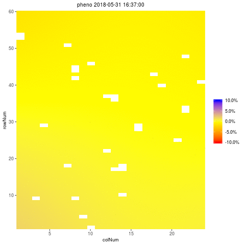

```{r, include = FALSE}
knitr::opts_chunk$set(
  collapse = TRUE,
  comment = "#>"
)
```

```{r setup}
library(statgenHTP)
```

# The statgenHTP Package  

The statgenHTP package is developed as an easy-to-use package for analyzing data coming  
from high throughput phenotyping platform experiments. The package provides many options 
for plotting and exporting the results of the analyses.  
It was developped within the EPPN^2020^ [project](https://eppn2020.plant-phenotyping.eu/).  
in response to demand for pipeline of analysis... blablabla joint work tested on several datasets... lablabla
<center>
{width=20%}
</center>

This vignette describes in detail how to prepare data for analysis, perform analyses using different modeling engines and extract the results from the models.

----

# Data preparation

A large majority of platform measure traits at several time point. The first step when 
modeling platform experiment data analysis with the statgenHTP package
is creating an object of class `TP` (Time Points). This object split the time points into
single data frame. It is then used throughout the statgenHTP package as input for analyses. 

## Creating a `TP` object

A `TP` object can be created from a `data.frame` with the function `createTimePoints`. 
This function does a number of things:  

* Rename columns to default column names used by the functions in the statgenHTP package. For example, the column in the data containing variety/accession/genotype is renamed to "genotype". Original column names are stored as an attribute of the `TP` object.
* Convert column types to the default column types. For example, the column 
"genotype" is converted to a factor and "rowCoord" to a numeric column.
* Split the data into separate data.frames by time points. A `TP` object is a
`list` of `data.frames` where each `data.frame` contains the data for a single
time point. If there is only one time points or no column time is defined, the output will 
be a `list` with only one item.
* Create a `data.frame` with columns `timeNumber` and `timePoint` is added as attribute timePoints to the data. This `data.frame` can be used for referencing the time points by their number.


## Example

The data from an experiment in the Phenovator platform (WUR, Netherlands, [@Flood2016]) with Arabidopsis 
plants will be used as an example throughout this vignette. It consists of one experiment 
with 1440 plants grown in a growth chamber. The number of tested genotypes is 192 with 6-7 
replicates per genotype. Four reference genotypes were also tested with 15 or 30 replicates. 
The studied trait is the photosystem efficiency measured over time
(PSII, see van [@vanRooi2017]).

For the example first a `TP` object is created containing all the time points. 
```{r createTP}
## Create a TP object containing the data from the Phenovator.
data("PhenovatorDat1")
phenoTP <- createTimePoints(dat = PhenovatorDat1, 
                            genotype = "Genotype",
                            timePoint = "timepoints",
                            repId = "Sowing_Block",
                            plotId = "pos",
                            rowNum = "y", colNum = "x",
                            addCheck = TRUE,
                            checkGenotypes = c("col", "ely", "evo1", "ler"))
```
The `TP` object just created is a `list` with 73 items, one for each time points 
 in the original `data.frame` (called `inDat`).
The column "Genotype" in the original data is renamed to "genotype" and converted to 
a factor. The columns "Sowing_Block" and "pos" are renamed and converted likewise. 
The newly created column "plotID" needs to be a unique identifier for a plot or a plant. 
It cannot occur more than once per time point. 
The columns "y" and "x" are renamed to "rowNum" and "colNum" respectively. 
Simultaneously two columns "rowId" and "colId" are created containing 
the same information converted to a factor. This seemingly
duplicate information is needed for spatial analysis. The information about which columns
have been renamed when creating a `TP` object is stored as an attribute of each 
individual `data.frame` in the object.
The option `addCheck` is set as `TRUE` to specify that the genotypes listed in
`checkGenotypes` are reference genotypes (or check). This option will create a column 
"check" with a value "noCheck" for the genotypes that are not in `checkGenotypes` and
the name of the genotype for the `checkGenotypes`. Also a column
"genoCheck"" is added with the names of the genotypes that are not in
`checkGenotypes` and `NA` for the `checkGenotypes`. These
columns are necessary for fitting models on data in case of augmented design.

## Plotting a `TP` object

Several plots can be made to further investigate the contents of a `TP` object.    

The first type of plot displays the layout of the experiment as a grid using the roow and column coordinates in "plotID". The default plot creates plots of all time points in the `TP` object.
This can be restricted to selected time points using their number in the option `timePoints`.
If replicates ("repId") are available, a black line is plotted between them. Missing plots are indicated in white.
```{r layoutPlot, fig.height=4, fig.width=5, fig.align = 'center'}
plot(phenoTP, 
     plotType = "layout",
     timePoints = c(3))
```

Here, the 3rd time point is displayed which corresponds to the 1st of June at 11:37. 
This plot can be extended by highlighting interesting genotypes in the layout. Here the
check genotypes are highlighted:
```{r layoutPlotHL, fig.height=4, fig.width=5, fig.align = 'center'}
## Plot the layout for the 3rd time point with the check genotypes highlighted.
plot(phenoTP, 
     plotType = "layout",
     timePoints = c(3),  
     highlight = c("col", "ely", "evo1", "ler"))
```

It is possible to add the names of the genotypes to the layout. 
```{r layoutPlotSG, fig.height=4, fig.width=5, fig.align = 'center'}
## Plot the layout for the 3rd time points.
plot(phenoTP, 
     plotType = "layout",
     timePoints = c(3),  
     highlight = c("col", "ely", "evo1", "ler"),
     showGeno = TRUE)
```

Boxplots can be made to get an idea of the contents of the data in the `TP` object.
By default a box is plotted per time point for the specified traits using all time points. Boxplots for selected time points can be made.
```{r boxPlot, fig.height=4, fig.width=7, fig.align = 'center'}
## Create a boxplot for PSII using the default all time points.
plot(phenoTP, 
     plotType = "box",
     traits = "pheno") 
```

Colors can be applied to groups within time points using the parameter `colorBy`. The boxes 
for the (groups of) time points can be ordered using `orderBy`. Boxes can be ordered by external vector or by the group mean.
```{r boxPlotCL, fig.height=4, fig.width=6, fig.align = 'center'}
## Create a boxplot for PSII with 5 time points and boxes colored by repIds within
## time point.
plot(phenoTP, 
     plotType = "box",
     traits = "pheno", 
     timePoints = c(1:5),
     colorBy = "repId")
```

The time points in the boxplot can be grouped using the parameter `groupBy`. 
```{r boxPlotGP, fig.height=4, fig.width=4, fig.align = 'center'}
## Create a boxplot for PSII with 5 time points and boxes grouped by repIds.
plot(phenoTP, 
     plotType = "box",
     traits = "pheno", 
     timePoints = c(1:5),
     groupBy = "repId")
```

The last plot that can be made is a plot of the correlations between the time points for
a specified trait. The order of the plot is the time and by default all time points are used.
```{r corPlot, fig.height=5, fig.width=6, fig.align = 'center'}
## Create a correlation plot for PSII for a selection of time points.
plot(phenoTP, 
     plotType = "cor",
     traits = "pheno",
     timePoints = seq(from=1,to=73,by=5))
```

When the number of time points is large, each plot can be exported to a pdf document by using the «outFile» option containing the name of the document.

----

# Modeling

After creating a `TP` object, a model can be fitted on the trial data. The aim is to accurately separate the genotype effects from the spatial effects at each time point. This is done 
using the function `fitModels`. 
High dimensionality of data from HTP exepriment with several time point = automatic fit of model that is robust 
and identical for each time point = best to limit the selection steps
Default engine is SpATS: has proven as good alternative to AR1×AR1 in the field [@Velazco2017] and also suitable for platform, has been tested on several datasets in the EPPN^2020^ project.

Depending on the options,  
different models can be fitted. 

The output of `fitModels` is an object of class `fitMod`, a
`list` of fitted models with one item for each trial the model was fitted for. 

`fitModels` uses two different engines for fitting the models, namely
SpATS [@RodAlv2017] and asreml [@Gilmour2017]. For models with row and column coordinate,
SpATS is the default engine (see part 3.1). This can  be overruled by specifying the 
function parameter `engine` and using asreml for spatial model (see part 3.2). When the 
row and column coordinates are not available, asreml is used for modeling without a
spatial function (see part 3.3). Finaly, it is possible to decomposed the genotypic 
variance using for example a treatment effect (see part 3.4).

## Spatial model using SpATS without genotypic variance decomposition

When SpATS is used for modeling, an extra spatial term is included in the model. This spatial component is composed using the `PSANOVA` function in the SpATS package which uses 2-dimensional 
smoothing with P-splines as described in @Lee2013 and in @RodAlv2017. See `help(PSANOVA, SpATS)`
for a detailed description. Extra fixed effects may be fitted using the parameter `covariates`. 
The model can also be fitted following a resolvable row-column design using `useRepId`.
The model specifications are listed in the table below. 

otpion | model fitted | spatial term |
-------------------- | ------------------------------------------------- | --------- |
default | trait = *covariates* + **genotype** + $\epsilon$ | PSANOVA |
covariates = c("A","B") | trait = *A* + *B* + **genotype** + $\epsilon$ | PSANOVA |
useRepId = TRUE | trait = *covariates* + *repId* + **genotype** + **repId:rowId** + **repId:colId** +  $\epsilon$ | PSANOVA |
useCheck = TRUE | trait = *covariates* + *check* + **genoCheck** +  $\epsilon$ | PSANOVA |

In the models above, fixed effects are indicated in *italics* whereas random 
effects are indicated in **bold**. "genotype" can be fitted as **random** or *fixed* effect
using the option `what`. The same model will run with genotype as fixed. The option 
`useCheck` allows treating some genotypes as check: it splits the column genotypes
into two columns as follow:

<center>

| genotype | check | genoCheck |
|:----------:|:----------:|:----------:|
| G~1~ | noCheck | G~1~ |
| G~2~ | noCheck | G~2~ |
| ... | noCheck | ... |
| G~n-1~ | noCheck | G~n-1~ |
| G~n~ | noCheck | G~n~ |
| check~1~ | 1 | NA |
| check~2~ | 2 | NA |
| ... | ... | ... |
| check~n-1~ | n-1 | NA |
| check~n~ | n | NA |

</center>

### Calling SpATS

Using the `TP` object "phenoTP" from the previous section, a model for the 3rd time point 
 and trait PSII can now be fitted on the data as follows. Since `engine` is not 
supplied as a parameter, SpATS is used for fitting the following model:
pheno = **genotype** + **rowId** + **colId** + $\epsilon$

```{r fitSp, message=FALSE}
## Fit a model few time points.
modPhenoSp <- fitModels(TP = phenoTP, 
                        trait = "pheno",
                        timePoints = c(3,10,20,30,60))
```

The output is a `fitMod`  object containing one list per time point. Note that by not supplying the `what` argument to the function, genotype is set as random. We can run it again with genotype as fixed using `what`:
pheno = *genotype* + **rowId** + **colId** + $\epsilon$

```{r fitSpFix, message=FALSE}
## Fit a model for a single time point.
modPhenoSpFix <- fitModels(TP = phenoTP, 
                           trait = "pheno",
                           timePoints = 3,
                           what="fixed")
```

We can extend the model by including covariates as main fixed effect:  
pheno = *repId* + *Image_pos* + **genotype** + **rowId** + **colId** + $\epsilon$

```{r fitSpCov, message=FALSE}
## Fit a model for a single time point with covariates.
modPhenoSpCov <- fitModels(TP = phenoTP, 
                           trait = "pheno",
                           covariates = c("repId", "Image_pos"), 
                           timePoints = 3)
```

We can also extend this model by including check genotypes:  
pheno = *repId* + *Image_pos* + *check* + **genoCheck** + **rowId** + **colId** + $\epsilon$

```{r fitSpCheck, message=FALSE}
## Fit a model for a single time point with covariates and check genotypes.
modPhenoSpCheck <- fitModels(TP = phenoTP, 
                             trait = "pheno",
                             covariates = c("repId", "Image_pos"),
                             useCheck = TRUE,
                             timePoints = 3)
```

We can finally fit the model following a resolvable row-column design: including the
interactions between replicate and row-col.  
pheno = *repId* + **genoCheck** + **repId:rowId** + **repId:colId** + $\epsilon$

```{r fitSpRCD, message=FALSE}
## Fit a model for a single time point.
# modPhenoSpRCD <- fitModels(TP = phenoTP, 
                           # trait = "pheno",
                           # timePoints = 3,
                           # useRepId = TRUE)
```

### Model plots

summary(modPhenoSp)
`plot.fitMod` function

Effective dimensions blablabla

Creates a plot of the spatial trends of models per time point.
```{r plotSpat,  fig.height=5, fig.width=6, message=FALSE, eval=FALSE, include=FALSE}
plot(modPhenoSp, 
     plotType = "spatial",
     timepoints = 3,
     what = "raw")
```


Creates a time lapse of the spatial trends of models fitted using SpATS over time.
```{r plotTimeLapse,  fig.height=5, fig.width=6, message=FALSE, eval=FALSE, include=TRUE}
plot(modPhenoSp, 
     plotType = "timeLapse",
     outFile = "TimeLapse_modPhenoSp.gif")
```

<center>
{width=30%}
</center>


### Extracting model results

All results that can be extracted are shown in the table below. The first column
shows what function needs to be called in order to be able to extract the result.
The last column gives a short description of the result that will be extracted and, where
needed, also states for which modeling engines it can be extracted.

function |  description |
------------- | --------------------------------------------------------------- |
getGenoPred() | Best Linear Unbiased Predictions (BLUPS, genotype as random) or Estimators (BLUEs, genotype as fixed) |
getCorrected() | Spatially corrected values at the experimental unit level |
getVar() | Variance components |
getHerit() | Generalised heritabilities (Cullis) - only when genotype is random |
getEffDims() | Extract effective dimensions - only for `SpATS` |

```{r getFun, message=FALSE}
# Extraction of output from the first spatial model. 
genoPredSp <- getGenoPred(modPhenoSp, timePoints = 3)
genoPredSpCov <- getGenoPred(modPhenoSpCov, timePoints = 3)
spatCorrSp <- getCorrected(modPhenoSp, timePoints = 3)
varianceSp <- getVar(modPhenoSp)
heritSp <- getHerit(modPhenoSp)
effDimSp <- getEffDims(modPhenoSp)
```
By default, all the functions run for all the time points. It is possible to select some of them using `TimePoint`.

The genotypic predictions of one time point are displayed in a table like the following:

```{r getPred, echo=FALSE, message=FALSE}
knitr::kable(head(genoPredSp), align=c('c','c','c','c','c'), padding = 0)
```

TO NOTE: when covariates are used, the standard error from SpATS are wrong. We are waiting for a update of the package.

The corrected values are obtained by by subtracting the estimated sources of variation which
are of no interest to the raw data:  
corrected data = raw data − estimated(spatial) − estimated(row) − estimated(col)  
This allows keeping the data at the experimental unit level (plants) and having more degrees of freedom for further modelling. The corrected values of one time point are displayed in a table like the following:

```{r getCorr, echo=FALSE, message=FALSE}
knitr::kable(head(spatCorrSp), align=c('c','c','c','c','c','c','c'), padding = 0)
```


### Ploting model results

Different plots can be displayed from the fitmod.TD object. The first one is "rawPred" and 
it plots the raw data (colored) overlayed with the predicted values (black line) from the fitted model.
For each genotype a plot is made per plot/plant over time. These plots are
put together in a 5x5 grid. By using the parameter `genotypes` a
selection of genotypes can be plotted.

```{r plotSpPred, message=FALSE, fig.height=2, fig.width=6, fig.align = 'center'}
plot(modPhenoSp, 
     plotType = "rawPred",
     genotypes = c("col", "ler", "ely", "evo1"))
```

The second one is "corrPred" and it plots the spatially corrected data (colored lines) overlayed with the predicted values from the fitted model (black line). For each genotype a plot is made per plot/plant over time. These plots are put together in a 5×5 grid. By using the parameter
`genotypes` a selection of genotypes can be plotted.

```{r plotSpCorr, message=FALSE, fig.height=2, fig.width=6, fig.align = 'center'}
plot(modPhenoSp, 
     plotType = "corrPred",
     genotypes = c("col", "ler", "ely", "evo1") )
```

The three last type of plots display different model parameters over time. Option "herit"
plots the heritability over time. If `geno.decomp` is used when fitting
the model, heritabilities are plotted for each level of geno.decomp in a
single plot (see section 3.4).

```{r plotSpHerit, message=FALSE, fig.height=2, fig.width=3, fig.align = 'center'}
plot(modPhenoSp, 
     plotType = "herit")
```

Option "effDim" plots the effective dimension from models fitted using SpATS over time.
```{r plotSpED, message=FALSE, fig.height=2, fig.width=4, fig.align = 'center'}
plot(modPhenoSp, 
     plotType = "effDim",
     whichED = c("colId", "rowId", "fColRow","colfRow", "surface"))
```

By default, all the spatial components are plotted. This can be restricted using the option `whichED`.

Option "variance" plots the residual, column and row variance for the fitted model over time.
```{r plotSpVar, fig.height=2, fig.width=4, message=FALSE, fig.align = 'center'}
plot(modPhenoSp, 
     plotType = "variance")
```


## Spatial model with ASReml without variance decomposition

When asreml is used for modeling and spatial = TRUE four models are fitted with different random terms and covariance structure. The best model is determined based on a goodness-of-fit criterion, either AIC or BIC, on 20% on the time points or at least 10 time points. The best model is then run on all time point. Same as for SpATS, all the asreml model can be extended by fitting fixed covariates using the option `covariates`.

| option | model fitted | spatial term |
|----------------------|------------------------------------------|-----------------|
| spatial = TRUE | trait = **genotype** + **row** + **col** + $\epsilon$ <br> trait = **genotype** + **row** + $\epsilon$ <br> trait = **genotype** + **col** + $\epsilon$ <br> trait = **genotype** + **row** + **col** + $\epsilon$| ar1(rowId):ar1(colId) <br> ar1(rowId):colId <br> rowId:ar1(colId) <br> - |
| spatial = TRUE, covariates = c("A","B") | trait = *A* + *B* + **genotype** + **row** + **col** + $\epsilon$ <br> trait = *A* + *B* + **genotype** + **row** + $\epsilon$ <br> trait = *A* + *B* + **genotype** + **col** + $\epsilon$ <br> trait = *A* + *B* + **genotype** + **row** + **col** + $\epsilon$ <br> | ar1(rowId):ar1(colId) <br> ar1(rowId):colId <br> rowId:ar1(colId) <br> - |
| spatial = TRUE, <br> repID = TRUE | trait = *repId* + **genotype** + **repId:row** + **repId:col** + $\epsilon$ <br> trait = *repId* + **genotype** + **repId:row** + $\epsilon$ <br> trait = *repId* + **genotype** + **repId:col** + $\epsilon$ <br> trait = *repId* + **genotype** + **repId:row** + **repId:col** + $\epsilon$ <br> | ar1(rowId):ar1(colId) <br> ar1(rowId):colId <br> rowId:ar1(colId) <br> - |

In the models above, fixed effects are indicated in *italics* whereas random 
effects are indicated in **bold**. "genotype" can be fitted as **random** or *fixed* effect
using the option `what`. The same model will run with genotype as fixed. The option `useCheck` 
is not displayed in the table but works the same as for SpATS: treating some genotypes as check (see section 3.1).

Calling asreml is done by changing the "engine" option in the `fitModels` function.

```{r fitSpASReml, message=FALSE}
## Fit a model on few time points without spatial function.
modPhenoAs <- fitModels(TP = phenoTP, 
                        trait = "pheno",
                        timePoints = c(3,10,20,30,60),
                        engine = "asreml",
                        spatial = FALSE)
## Fit a model on few time points with spatial function.
modPhenoSpAs <- fitModels(TP = phenoTP, 
                          trait = "pheno",
                          timePoints = c(3,10,20,30,60),
                          engine = "asreml",
                          spatial = TRUE)
# summary(modPhenoSpAs)
```

Here the best spatial model is: trait = **genotype** + **row** + **col** + $\epsilon$ with a spatial function **ar1(rowId):colId**. It has run on all the specified time points "timePoints = c(3,10,20,30,60)" to be selected. 

Plotting and extracting results is then done the same way as for SpATS. Below are few examples.

```{r getFunAs, message=FALSE}
spatCorrSpAs <- getCorrected(modPhenoSpAs, timePoints = 3)
genoPredSpAs <- getGenoPred(modPhenoSpAs, timePoints = 3)
```

```{r getCorrAs, echo=FALSE, message=FALSE}
knitr::kable(head(spatCorrSpAs), align=c('c','c','c','c','c','c','c'), padding = 0)
```

```{r plotSpAsHerit, message=FALSE, fig.height=2, fig.width=4, fig.align = 'center'}
plot(modPhenoSpAs, 
     plotType = "herit")
```

Note that when using asreml the heritability is calculating with the formula provided in [@Cullis2006].

## Modelling without spatial terms with ASReml without variance decomposition

When the row and column coordinates are not available, asreml can be used for modelling.
In that case, the model simply uses the genotype and the covariates, if any.

| option | model fitted | spatial term |
|---------------|---------------------------------------------|-------------------|
| spatial = FALSE | trait = **genotype** + $\epsilon$ |  - |
| spatial = FALSE, covariates = c("A","B") | trait = *A* + *B* + **genotype** + $\epsilon$ | - |

In the models above and below, fixed effects are indicated in *italics* whereas random 
effects are indicated in **bold**. "genotype" can be fitted as **random** or *fixed* effect
using the option `what`. The same model will run with genotype as fixed. The option `useCheck` is not displayed in the table but works the same as for SpATS (see section 3.1).


## Modelling with variance decomposition

Including treatment and other possible level of genotypic variance decomposition.  
**WARNING: Fitting genotype as fixed with the SpATS engine and the geno.decomp option is not available yet**

Example with two models, one per engine:

| option | engine | model fitted | spatial term |
|---------------|--------|-----------------------------------------|---------------|
| spatial = TRUE, geno.decomp = c("variable") | spats | trait = *variable* + **variable:genotype** + **row** + **col** + $\epsilon$ |  PSANOVA |
| spatial = FALSE, geno.decomp = c("variable") | asreml | trait = *variable* + + **variable:genotype** + **row** + **col** + $\epsilon$ | ar1(row):ar1(col) |

```{r fitSpGD, message=FALSE}
## Fit a model few time points using spats.
modPhenoSpGD <- fitModels(TP = phenoTP, 
                          trait = "pheno",
                          geno.decomp = c("Basin"),
                          timePoints = c(3,10,20,30,60))

## Fit a model few time points using asreml
modPhenoSpAsGD <- fitModels(TP = phenoTP, 
                        trait = "pheno",
                        geno.decomp = c("Basin"),
                        timePoints = c(3,10,20,30,60),
                        spatial = TRUE,
                        engine = "asreml")
```

```{r plotextract1, message=FALSE}
genoPredSpGD <- getGenoPred(modPhenoSpGD, timePoints = 3)
spatCorrSpGD <- getCorrected(modPhenoSpGD, timePoints = 3)
varianceSpGD <- getVar(modPhenoSpGD)
heritSpGD <- getHerit(modPhenoSpGD)
effDimSpGD <- getEffDims(modPhenoSpGD)

genoPredSpAsGD <- getGenoPred(modPhenoSpAsGD, timePoints = 3)
spatCorrSpAsGD <- getCorrected(modPhenoSpAsGD, timePoints = 3)
varianceSpAsGD <- getVar(modPhenoSpAsGD)
heritSpAsGD <- getHerit(modPhenoSpAsGD)
# effDimSpAsGD <- getEffDims(modPhenoSpAsGD)

```


----

## References

