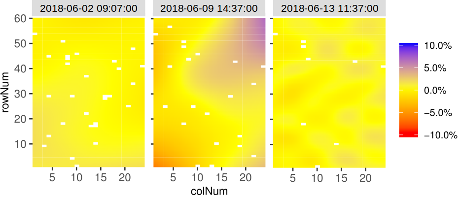

```{r setup, include = FALSE}
knitr::opts_chunk$set(
  collapse = TRUE,
  comment = "#>"
)
library(statgenHTP)
```

# The statgenHTP Package  

The statgenHTP package is developed as an easy-to-use package for analyzing data coming 
from high throughput phenotyping (HTP) platform experiments. The package provides many options 
for plotting and exporting the results of the analyses. It was developed within the 
EPPN^2020^ [project](https://eppn2020.plant-phenotyping.eu/) to meet the needs for automated analyses of HTP data.

New phenotyping techniques enable measuring trait at high throughput, with traits being 
measured at multiple time points for hundreds/thousands of plants. This requires an 
automatic modeling of the data [@Tardieu2017] with a model that is robust and with 
easy selection steps.

Phenotyping facilities display spatial heterogeneity. For example, the spatial variability
of incident light can go up to 100% between pots within a greenhouse [@Cabrera2016]. 
Taking into account these spatial trends is a prerequisite for precise estimation of 
genetic and treatment effects. In the same way as in field trials, platform experiment 
should obey standard principles for experimental design and statistical modeling.

Popular mixed models to separate spatial trends from treatment and genetic effects rely 
on the use of autoregressive correlation functions defined on rows and columns (AR1×AR1) 
to model the local trends [@Cullis2006]. These models are sometimes difficult to fit and 
the selection of a best model is complicated therefore preventing from an automated 
phenotypic analysis of series of trials. An attractive alternative is the use of 
2-dimensional P-spline surfaces, the SpATS model (Spatial Analysis of Trials using Splines, 
[@RodAlv2017]). This model corrects for spatial trends, row and column effects and has 
the advantage of avoiding the model selection step. It also provides the user with 
graphical output easy to interpret. It has proven to be a good alternative to the 
classical AR1×AR1 modeling in the field [@Velazco2017]. It is also suitable for 
phenotyping platform data and has been tested on several datasets in the
EPPN^2020^ project. 

The aim of this package is to accurately separate the genetic effects from the spatial 
effects at each time point. It will provide user with either genotypic values or corrected
values that can be used for further modeling, e.g. time series modeling to extract 
responses to environment [@vanEeuw2019]. 
Note that two extensions will be included later for an overall structure of the package
in three main parts:  
1. Correction for spatial trends - *this version of the statgenHTP*  
2. Outliers detection - *a tutorial provided by the Mistea group (INRA, France)*  
3. Time course modeling - *extension of this package planned for 2020*  

This tutorial describes in detail how to prepare data for analysis, perform analyses 
to correct for spatial trends using different modeling engines (part I) and extract 
the results from the models.

----

# Data preparation

The first step when modeling platform experiment data analysis with the statgenHTP package
is creating an object of class `TP` (Time Points). In this object, the time points are
split into single data frames. It is then used throughout the statgenHTP package as input 
for analyses. 

## Creating a `TP` object

A `TP` object can be created from a `data.frame` with the function `createTimePoints`. 
This function does a number of things:

* Rename columns to default column names used by the functions in the statgenHTP package. For example, the column in the data containing variety/accession/genotype is renamed to "genotype". Original column names are stored as an attribute of the `TP` object.
* Convert column types to the default column types. For example, the column "genotype" is converted to a factor and "rowCoord" to a numeric column.
* Split the data into separate data.frames by time points. A `TP` object is a `list` of `data.frames` where each `data.frame` contains the data for a single time point. If there is only one time points or no column time is defined, the output will be a `list` with only one item.
* Create a `data.frame` with columns `timeNumber` and `timePoint` is added as attribute 
"timePoints" to the data. This data.frame can be used for referencing the time points by their number.


### Example 1

The first example used in this tutorial contains data from an experiment in the Phenovator 
platform (WUR, Netherlands, [@Flood2016]) with Arabidopsis plants. It consists of one experiment 
with 1440 plants grown in a growth chamber. The number of tested genotypes is 192 with 6-7 
replicates per genotype. Four reference genotypes were also tested with 15 or 30 replicates. 
The studied trait is the photosystem II efficiency ("EffpsII") extracted from the pictures over time
[@vanRooi2017].

For the example first a `TP` object is created containing all the time points. 
```{r createTP}
## Create a TP object containing the data from the Phenovator.
data("PhenovatorDat1")
phenoTP <- createTimePoints(dat = PhenovatorDat1,
                            experimentName = "Phenovator",
                            genotype = "Genotype",
                            timePoint = "timepoints",
                            repId = "Replicate",
                            plotId = "pos",
                            rowNum = "y", colNum = "x",
                            addCheck = TRUE,
                            checkGenotypes = c("check1", "check2", "check3", "check4"))
summary(phenoTP)
```
The `TP` object just created is a `list` with 73 items, one for each time points 
in the original `data.frame` (called "PhenovatorDat1"). The option `experimentName`
is used for identifying the dataset and is a requirement. The column "Genotype" in the 
original data is renamed to "genotype" and converted to a factor. The columns 
"Sowing_Block" and "pos" are renamed and converted likewise. The newly created column 
"plotID" needs to be a unique identifier for a plot or a plant. It cannot occur more 
than once per time point. The columns "y" and "x" are renamed to "rowNum" and "colNum" 
respectively. Simultaneously, two columns "rowId" and "colId" are created containing 
the same information converted to a factor. This seemingly duplicate information is 
needed for spatial analysis. The information about which columns have been renamed when
creating a `TP` object is stored as an attribute of each individual `data.frame` in the object.
The option `addCheck` is set as `TRUE` to specify that the genotypes listed in
`checkGenotypes` are reference genotypes (or check). This option will create a column 
"check" with a value "noCheck" for the genotypes that are not in `checkGenotypes` and
the name of the genotype for the `checkGenotypes`. Also a column "genoCheck" is added with
the names of the genotypes that are not in `checkGenotypes` and `NA` for the
`checkGenotypes` (see section **3.1**). These columns are necessary for fitting models on 
data in case of augmented design [@Piepho2016].

## Plotting a `TP` object

Several plots can be made to further investigate the content of a `TP` object.    

The first type of plot displays the layout of the experiment as a grid using the row and 
column coordinates in "plotID". The default option creates plots of all time points in 
the `TP` object. This can be restricted to selected time points using their number in 
the option `timePoints`. If replicates ("repId") are available, a black line is plotted 
between them. Missing plots are indicated in white.
```{r layoutPlot, fig.height=4, fig.width=5, fig.align = 'center'}
plot(phenoTP, 
     plotType = "layout",
     timePoints = c(3))
```

Here, the third time point is displayed which corresponds to the 1^st^ of June at 11:37. Note
that the title can be manually changed using the `title` option. This plot can be extended 
by highlighting interesting genotypes in the layout. Hereafter the check genotypes are highlighted:
```{r layoutPlotHL, fig.height=4, fig.width=5, fig.align = 'center'}
## Plot the layout for the third time point with the check genotypes highlighted.
plot(phenoTP, 
     plotType = "layout",
     timePoints = c(3),  
     highlight = c("check1", "check2", "check3", "check4"))
```

It is possible to add the names of the genotypes to the layout. 
```{r layoutPlotSG, fig.height=5, fig.width=7, fig.align = 'center'}
## Plot the layout for the third time point.
plot(phenoTP, 
     plotType = "layout",
     timePoints = c(3),  
     highlight = c("check1", "check2", "check3", "check4"),
     showGeno = TRUE)
```

Raw data can be displayed per genotype (by default all genotypes are used).
```{r rawVator, include=TRUE, fig.height=2, fig.width=6, fig.align = 'center'}
plot(phenoTP, 
     traits = "EffpsII",
     plotType = "raw",
     genotypes = c("G1","G2","check1","check2"))
```

Boxplots can be made to get an idea of the total variability of the trait in the `TP` object.
By default a box is plotted per time point for the specified trait using all time points.
```{r boxPlot, fig.height=4.5, fig.width=7, fig.align = 'center'}
## Create a boxplot for "EffpsII" using the default all time points.
plot(phenoTP, 
     plotType = "box",
     traits = "EffpsII") 
```

Colors can be applied to groups within time points using the option `colorBy`. The boxes 
for the (groups of) time points can be ordered using `orderBy`. Boxes can be ordered by 
external vector or by the group mean.
```{r boxPlotCL, fig.height=4.5, fig.width=6, fig.align = 'center'}
## Create a boxplot for "EffpsII" with 5 time points and boxes colored by "repId" within
## time point.
plot(phenoTP, 
     plotType = "box",
     traits = "EffpsII", 
     timePoints = c(1:5),
     colorBy = "repId")
```

The time points in the boxplot can be grouped using the option `groupBy`. 
```{r boxPlotGP, fig.height=4, fig.width=4, fig.align = 'center'}
## Create a boxplot for "EffpsII" with 5 time points and boxes grouped by "repId".
plot(phenoTP, 
     plotType = "box",
     traits = "EffpsII", 
     timePoints = c(1:5),
     groupBy = "repId")
```

The last plot that can be made is a plot of the correlations between the time points for
a specified trait. The order of the plot is the time and by default all time points are used.
```{r corPlot, fig.height=5, fig.width=6, fig.align = 'center'}
## Create a correlation plot for "EffpsII" for a selection of time points.
plot(phenoTP, 
     plotType = "cor",
     traits = "EffpsII",
     timePoints = seq(from=1,to=73,by=5))
```

When the number of time points is large, each plot can be exported to a pdf document by 
using the `outFile` option containing the name of the document.


----

# Modeling

After creating a `TP` object, a model can be fitted on the data. This is done 
using the function `fitModels`, which uses two different engines for fitting the models, namely
*SpATS* [@RodAlv2017] and *ASReml* [@Gilmour2017]. For models with row and column coordinates,
SpATS is the default engine (see part **3.1**). This can  be overruled by specifying the 
function parameter `engine` and using asreml for spatial model (see part **3.2**). When the 
row and column coordinates are not available, asreml is used for modeling without 
spatial function (see part **3.3**). Finally, it is possible to decomposed the genotypic 
variance using, for example, a treatment effect (see part **3.4**).

The output of `fitModels` is an object of class `fitMod`, a `list` of fitted models 
with one item for each time point the model was fitted for. 

## Spatial model using SpATS

When SpATS is used for modeling, an extra spatial term is included in the model. This 
spatial component is composed using the `PSANOVA` function in the SpATS package which 
uses 2-dimensional smoothing with P-splines as described in @Lee2013 and in @RodAlv2017. 
See `help(PSANOVA, SpATS)` for a detailed description. Extra fixed effects may be fitted 
using the option `covariates`. The model can also be fitted following a resolvable 
row-column design using `useRepId`. The model specifications are listed in the table below. 

option | model fitted | spatial term |
--------------------|-----------------------------------------|-----------------|
default | trait = **genotype** + $\epsilon$ | PSANOVA |
covariates = c("A","B") | trait = *A* + *B* + **genotype** + $\epsilon$ | PSANOVA |
useRepId = TRUE | trait = *repId* + **genotype** + **repId:rowId** + **repId:colId** +  $\epsilon$ | PSANOVA |
useCheck = TRUE | trait = *check* + **genoCheck** +  $\epsilon$ | PSANOVA |

In the models above, fixed effects are indicated in *italics* whereas random effects are 
indicated in **bold**. "genotype" can be fitted as **random** or *fixed* effect
using the option `what`. The same model will run with genotype as fixed. The option 
`useCheck` allows treating some genotypes as check: it splits the column "genotype"
into two columns as follow:

<center>

| genotype | check | genoCheck |
|:----------:|:----------:|:----------:|
| G~1~ | noCheck | G~1~ |
| G~2~ | noCheck | G~2~ |
| ... | noCheck | ... |
| G~n-1~ | noCheck | G~n-1~ |
| G~n~ | noCheck | G~n~ |
| check~1~ | check~1~ | NA |
| check~2~ | check~2~  | NA |
| ... | ... | ... |
| check~m-1~ | check~m-1~ | NA |
| check~m~ | check~m~ | NA |

</center>

> *Note that for the moment, it is not possible to use the check and genotype as fixed with SpATS.*

### Calling SpATS

Using the `TP` object "phenoTP" from the previous section, a model for few time points 
and trait "EffpsII" can now be fitted on the data as follows. Since `engine` is not supplied 
as an option , SpATS is used for fitting the following model:  
EffpsII = **genotype** + **rowId** + **colId** + $\epsilon$

```{r fitSp, message=FALSE}
## Fit a model few time points.
modPhenoSp <- fitModels(TP = phenoTP, 
                        trait = "EffpsII",
                        timePoints = seq(1,73,by=5)) 
summary(modPhenoSp)
```

The output is a `fitMod`  object containing one list per time point. Note that by not 
supplying the `what` argument to the function, genotype is set as random. 

We can run it again with genotype as fixed using `what`:  
EffpsII = *genotype* + **rowId** + **colId** + $\epsilon$

```{r fitSpFix, message=FALSE, eval=FALSE}
## Fit a model for a single time point.
modPhenoSpFix <- fitModels(TP = phenoTP, 
                           trait = "EffpsII",
                           timePoints = 3,
                           what = "fixed")
```

We can extend the model by including covariates as main fixed effects:  
EffpsII = *repId* + *Image_pos* + **genotype** + **rowId** + **colId** + $\epsilon$

```{r fitSpCov, message=FALSE, eval=FALSE}
## Fit a model for a single time point with covariates.
modPhenoSpCov <- fitModels(TP = phenoTP, 
                           trait = "EffpsII",
                           covariates = c("repId", "Image_pos"), 
                           timePoints = 3)
```

We can also extend this model by including check genotypes:  
EffpsII = *repId* + *Image_pos* + *check* + **genoCheck** + **rowId** + **colId** + $\epsilon$

```{r fitSpCheck, message=FALSE, eval=FALSE}
## Fit a model for a single time point with covariates and check genotypes.
modPhenoSpCheck <- fitModels(TP = phenoTP, 
                             trait = "EffpsII",
                             covariates = c("repId", "Image_pos"),
                             useCheck = TRUE,
                             timePoints = 3)
```

We can finally fit the model following a resolvable row-column design: including the
interactions between replicate and row-col.  
EffpsII = *repId* + **genoCheck** + **repId:rowId** + **repId:colId** + $\epsilon$

```{r fitSpRCD, message=FALSE, eval=FALSE, eval=FALSE}
## Fit a model for a single time point.
modPhenoSpRCD <- fitModels(TP = phenoTP,
                           trait = "EffpsII",
                           timePoints = 3,
                           useRepId = TRUE)
```

### Model plots

The first type of plot that can be made for fitted models is the spatial plots per time 
point using `plotType = "spatial"`. It consists of five plots, spatial plots of the raw 
data, fitted values, residuals and either BLUEs or BLUPs, and a histogram of the BLUEs or 
BLUPs. When SpATS is used for modeling an extra plot with the fitted spatial trend is included. 

Note that spatial plots can only be made if spatial information, i.e. "rowCoord" and
"colCoord", is available in the `TP` object.

```{r plotSpatRaw,  fig.height=4, fig.width=7, message=FALSE, eval=TRUE}
plot(modPhenoSp,
     timePoints = 36,
     plotType = "spatial",
     spaTrend = "raw")
```
For a straighforward interpretation of the fitted spatial trends and for comparison between
time points, the plot of fitted spatial trend can be displayed as a ratio of the raw 
phenotypic mean: SpatTrend(proportion) = Estimated SpatTrend / mean(raw EffpsII). 
In this case, the scale will be in percentage and the min/max will be adjusted based on 
all the time points used but will be at least 10%. This arbitrary threshold allows 
visualising fitted trends that have a relatively small to large importance.

```{r plotSpatPerc,  fig.height=4, fig.width=7, message=FALSE, eval=TRUE}
plot(modPhenoSp,
     timePoints = 36,
     plotType = "spatial",
     spaTrend = "percentage")
```


It is also possible to create a time lapse of the ratio of spatial trends over time. The 
scale is the same as previoulsy described.
```{r plotTimeLapse,  fig.height=5, fig.width=6, message=FALSE, eval=FALSE}
plot(modPhenoSp, 
     plotType = "timeLapse",
     outFile = "TimeLapse_modPhenoSp.gif")
```

Here is an illustration with three time points:
<center>
{width=80%}
</center>


### Extracting model results

All results that can be extracted are shown in the table below. The first column
shows what function needs to be called in order to be able to extract the result.
The last column gives a short description of the result that will be extracted and, where
needed, also states for which modeling engines it can be extracted.

function |  description |
------------- | --------------------------------------------------------------- |
getGenoPred() | Best Linear Unbiased Predictions (BLUPS, genotype as random) or Estimators (BLUEs, genotype as fixed) |
getCorrected() | Spatially corrected values at the experimental unit level |
getVar() | Variance components |
getHerit() | Generalised heritabilities - only when genotype is random |
getEffDims() | Extract effective dimensions - only for SpATS engine |

```{r getFun, message=FALSE}
# Extract the genotypic predictions: 
genoPredSp <- getGenoPred(modPhenoSp, timePoints = 6)
# Extract the corrected values: 
spatCorrSp <- getCorrected(modPhenoSp, timePoints = 6)
# Extract model components: 
varianceSp <- getVar(modPhenoSp)
heritSp    <- getHerit(modPhenoSp)
effDimSp   <- getEffDims(modPhenoSp)
```
By default, all the functions run for all the time points. It is possible to select some 
of them using `timePoints`. Effective dimensions ratio can also be extracted using 
`EDType = "ratio"` in the `getEffDims()` function.

The genotypic predictions of one time point are displayed in a table like the following:

```{r getPred, echo=FALSE, message=FALSE}
knitr::kable(head(genoPredSp), align=c('c','c','c','c','c'), padding = 0)
```

> *TO NOTE: when covariates are used, the standard error from SpATS are wrong. We are waiting for an update of the package.*

The corrected values are obtained by subtracting the estimated sources of variation which
are of no interest to the raw data:  
$CorrData = RawData - EstSpatial - EstRow - EstCol$  
This allows keeping the data at the experimental unit level (plants) and having more 
degrees of freedom for further modeling (e.g. time course modeling and estimation of 
time course parameter). The corrected values of one time point are displayed in a table
like the following:

```{r getCorr, echo=FALSE, message=FALSE}
knitr::kable(head(spatCorrSp), align=c('c','c','c','c','c','c','c'), padding = 0)
```


### Ploting model results

Different plots can be displayed from the `fitMod` object. The first one is "rawPred", it
plots the raw data (colored lines) overlayed with the predicted values (black line) from the 
fitted model. For each genotype a plot is made per plot/plant over time. These plots are
put together in a 5×5 grid. By using the option `genotypes`, only a subset of genotypes 
can be plotted.

```{r plotSpPred, message=FALSE, fig.height=2, fig.width=6, fig.align = 'center'}
plot(modPhenoSp, 
     plotType = "rawPred",
     genotypes = c("check1","check2","G7","G58")) 
```

The second one is "corrPred", it plots the spatially corrected data (colored lines) 
overlayed with the predicted values from the fitted model (black line). For each genotype 
a plot is made per plot/plant over time. These plots are put together in a 5×5 grid. 
By using the option `genotypes` a selection of genotypes can be plotted.

```{r plotSpCorr, message=FALSE, fig.height=2, fig.width=6, fig.align = 'center', eval=TRUE}
plot(modPhenoSp, 
     plotType = "corrPred",
     genotypes = c("check1","check2","G7","G58") )
```

The three last types of plot display different model parameters over time. Plot type "herit"
plots the heritability over time. If `geno.decomp` is used when fitting
the model, heritabilities are plotted for each level of variance decomposition in a
single plot (see section **3.4**). Scale of the plot can be adjusted using `yLim`.

```{r plotSpHerit, message=FALSE, fig.height=2.5, fig.width=3.5, fig.align = 'center'}
plot(modPhenoSp, 
     plotType = "herit",
     yLim = c(0.5,1))
```

Plot type "variance" plots the residual, column and row variances over time.
```{r plotSpVar, fig.height=3, fig.width=5, message=FALSE, fig.align = 'center'}
plot(modPhenoSp, 
     plotType = "variance")
```

Plot type "effDim" plots the effective dimension from model fitted using SpATS over time. 
By default, all the spatial components are plotted. This can be restricted using 
the option `whichED`.
```{r plotSpED, message=FALSE, fig.height=3, fig.width=5, fig.align = 'center'}
plot(modPhenoSp, 
     plotType = "effDim",
     whichED = c("colId", "rowId", "fColRow","colfRow", "surface"),
     EDType = "ratio")
```

The effective dimensions are also known as the effective degrees of freedom. They can be
interpreted as a measure of the complexity of the corresponding component: if the effective 
dimension of one component is large, it indicates that there are strong spatial trends 
in this direction. Here, for better comparison between components, the ratio of effective 
dimensions vs. total dimensions can be used. It has a value between 0, no spatial trend, 
and 1, strong spatial trend (almost all the degrees of freedom are used to model it).

## Spatial model with ASReml

When asreml is used for modeling and `spatial = TRUE`, four models are fitted with different 
random terms and covariance structures. The best model is determined based on a 
goodness-of-fit criterion, AIC, on 20% on the time points or at least 10 
time points. The best model is then run on all time points. Same as for SpATS, all the 
asreml models can be extended by fitting fixed covariates using the option `covariates`.

| option | model fitted | spatial term |
|----------------------|------------------------------------------|-----------------|
| spatial = TRUE | trait = **genotype** + **row** + **col** + $\epsilon$ | ar1(rowId):ar1(colId) |
|                | trait = **genotype** + **row** + $\epsilon$ | ar1(rowId):colId |
|                | trait = **genotype** + **col** + $\epsilon$ | rowId:ar1(colId) |
|                | trait = **genotype** + **row** + **col** + $\epsilon$|    - |
| spatial = TRUE, covariates = c("A","B") | trait = *A* + *B* + **genotype** + **row** + **col** + $\epsilon$ | ar1(rowId):ar1(colId) |
|                                         | trait = *A* + *B* + **genotype** + **row** + $\epsilon$ | ar1(rowId):colId |
|                                         | trait = *A* + *B* + **genotype** + **col** + $\epsilon$ | rowId:ar1(colId) |
|                                         | trait = *A* + *B* + **genotype** + **row** + **col** + $\epsilon$ |  - |
| spatial = TRUE, repID = TRUE | trait = *repId* + **genotype** + **repId:row** + **repId:col** + $\epsilon$ | ar1(rowId):ar1(colId) |
|                              | trait = *repId* + **genotype** + **repId:row** + $\epsilon$ | ar1(rowId):colId |
|                              | trait = *repId* + **genotype** + **repId:col** + $\epsilon$ | rowId:ar1(colId) |
|                              | trait = *repId* + **genotype** + **repId:row** + **repId:col** + $\epsilon$ | - |

In the models above, fixed effects are indicated in *italics* whereas random 
effects are indicated in **bold**. "genotype" can be fitted as **random** or *fixed* effect
using the option `what`. The same model will run with genotype as fixed. The option `useCheck` 
is not displayed in the table but works the same as for SpATS: treating some genotypes 
as check (see section **3.1** for details).

Calling asreml is done by changing the `engine` option in the `fitModels` function.

```{r fitSpASReml, message=FALSE}
if (requireNamespace("asreml", quietly = TRUE)) {
## Fit a model on few time points with spatial function:
modPhenoSpAs <- fitModels(TP = phenoTP, 
                          trait = "EffpsII",
                          timePoints = seq(1,73,by=5),
                          engine = "asreml",
                          spatial = TRUE) 
summary(modPhenoSpAs)
}
```

Here the best spatial model is: trait = **genotype** + **row** + **col** + $\epsilon$, 
with a spatial function: **ar1(rowId):ar1(colId)**. It has run on 10 time points to be selected. 

Plotting and extracting results is then done the same way as for SpATS. Below are few examples.

```{r getFunAs, message=FALSE}
if (requireNamespace("asreml", quietly = TRUE)) {
spatCorrSpAs <- getCorrected(modPhenoSpAs, timePoints = 6)
}
```

```{r getCorrAs, echo=FALSE, message=FALSE}
if (requireNamespace("asreml", quietly = TRUE)) {
knitr::kable(head(spatCorrSpAs), align=c('c','c','c','c','c','c','c'), padding = 0)
}
```

```{r plotSpAsHerit, message=FALSE, fig.height=2.5, fig.width=3.5, fig.align = 'center'}
if (requireNamespace("asreml", quietly = TRUE)) {
plot(modPhenoSpAs, 
     plotType = "herit",
     yLim = c(0.5,1))
}
```

Note that when the engine is asreml the heritability is calculating using the formula 
provided in [@Cullis2006].

## Modeling without spatial terms with ASReml

When the row and column coordinates are not available, asreml can be used for modeling.
In that case, the model simply uses the genotype and the covariates, if any.

| option | model fitted | spatial term |
|---------------|---------------------------------------------|-------------------|
| spatial = FALSE | trait = **genotype** + $\epsilon$ |  - |
| spatial = FALSE, covariates = c("A","B") | trait = *A* + *B* + **genotype** + $\epsilon$ | - |

In the models above and below, fixed effects are indicated in *italics* whereas random 
effects are indicated in **bold**. "genotype" can be fitted as **random** or *fixed* effect
using the option `what`. The same model will run with genotype as fixed. The option 
`useCheck` is not displayed in the table but works the same as for SpATS (see section **3.1**).

```{r asremlNoSpat, eval=FALSE }
## Fit a model on few time points without spatial function.
modPhenoAs <- fitModels(TP = phenoTP, 
                        trait = "EffpsII",
                        timePoints = seq(1,73,by=5),
                        engine = "asreml",
                        spatial = FALSE)
```

## Modeling with variance decomposition

When an experimental treatment is applied, for example, a water scenario, it is required
to decompose the genotypic variance into the levels of the treatment. In the following
example, two water scenarios, well-watered (WW) and water deficit (WD), were applied. Thus
instead of modeling one genotypic variance, there will be one genotypic variance per treatment.
In this part, we will describe briefly what are the specificities of such a modeling 
with the statgenHTP package using a another example dataset.

### Example 2

The second example used in this tutorial contains data from an experiment in the 
Phenoarch platform with maize plants (INRA, France, [@Cabrera2016]). It consists of 
one experiment with 1671 plants grown in a greenhouse. There are two populations of 
genotypes and two water scenarios, well-watered (WW) and water deficit (WD). 
The first panel contains 60 genotypes with 14 replicates: 7 in WW and 7 in WD. 
Note that there are more plants per replicates than one for the first panel 
(about 24 plants per genotypes).
The second population contains 30 genotypes with 8 replicates, 4 in WW and 4 in WD. 
The studied trait is the leaf area ("LA_Estimated") extracted from the pictures over time. 
Plants were pictured every day for 35 days.

A second `TP` object is created containing all the time points: 
```{r createTP2}
data("PhenoarchDat1")
phenoTParch <- createTimePoints(dat = PhenoarchDat1,
                                experimentName = "ZA17",
                                genotype = "geno",
                                timePoint = "Date",
                                repId = "Rep",
                                plotId = "pos",
                                rowNum = "Position", 
                                colNum = "Line")
summary(phenoTParch)
```
The "phenoTParch" object just created is a `list` with 35 items, one for each time points 
 in the original `data.frame` (called "PhenoarchDat1"). We can visualise the layout and the 
 raw data the same way as for the Phenovator data.

```{r layoutArch, echo=FALSE, fig.align='center', fig.height=5, fig.width=6}
plot(phenoTParch, 
     plotType = "layout",
     timePoints = c(3),
     highlight = c("GenoA1","GenoA2","GenoB1","GenoB2"))
```

Note that for the raw data, we can already use the geno.decomp option to split 
the genotypes using the water scenario:
```{r rawArch, include=TRUE, fig.height=2, fig.width=6, fig.align = 'center'}
plot(phenoTParch, 
     traits = "LA_Estimated",
     plotType = "raw",
     genotypes = c("GenoA1","GenoA2"),
     geno.decomp = c("Scenario"))
```

### Modeling

Using the `geno.decomp` option when modeling will have two main consequences in the 
model: the `geno.decomp` variable(s) will be added as main fixed effect(s) and also as 
interaction(s) with the genotype effect. 
The table below provides one example with two models, one per engine:

| option | engine | model fitted | spatial term |
|---------------|--------|-----------------------------------------|---------------|
| spatial = TRUE, geno.decomp = c("variable") | spats | trait = *variable* + **variable:genotype** + **row** + **col** + $\epsilon$ |  PSANOVA |
| spatial = FALSE, geno.decomp = c("variable") | asreml | trait = *variable* + **variable:genotype** + **row** + **col** + $\epsilon$ | ar1(row):ar1(col) |

> *Note that for the moment, it is not possible to use the geno.decomp and genotype as fixed.*

Using the Phenoarch example, we will apply a variance decomposition using the 
variables "Scenario" and "population":

```{r fitSpGD, message=FALSE, eval=TRUE}
modPhenoSpGD <- fitModels(TP = phenoTParch,
                          trait = "LA_Estimated",
                          geno.decomp = c("Scenario","population"),
                          timePoints = seq(1,35,by=3))
```

### Output

Extracting results and plotting from the models work exactly the same as previously. 
For example, the spatial plot on this dataset look like the following for one time point:

```{r plotSatASReml, echo=FALSE, message=FALSE, eval=TRUE, fig.height=4, fig.width=7, fig.align='center'}
plot(modPhenoSpGD,
     timePoints = 19,
     plotType = "spatial",
     spaTrend = "percentage")
```

There are some significant differences in the display of some results and plots. 
They are highlighted below.

The predictions have two values per genotype, one per combined level of `geno.decomp`, 
here "Scenario_population", as illustrated in the table below for three genotypes 
predicted from the SpATS model `modPhenoSpGD`.

```{r getPredSpGD, echo=FALSE, message=FALSE, eval=TRUE}
genoPredSpGD <- getGenoPred(modPhenoSpGD, timePoints = 16)
toto <- head(genoPredSpGD[genoPredSpGD$genotype%in%c("GenoA1","GenoA2","GenoB1","GenoB2"),],8)
row.names(toto) <- 1:nrow(toto)
knitr::kable(toto, align=c('c','c','c','c','c','c'), padding = 0)
```

The heritabilities are now split into `geno.decomp` levels and their plot now displays
one line per level.

```{r getHeritSpGD, echo=FALSE, message=FALSE}
genoHeritSpGD <- getHerit(modPhenoSpGD)
knitr::kable(head(genoHeritSpGD),align=c('c','c','c','c'), padding = 0)
```

```{r plotSpHeritGD, echo=FALSE, fig.align='center', fig.height=3, fig.width=5, message=FALSE}
plot(modPhenoSpGD, 
     plotType = "herit",
     yLim = c(0.4,1))
```

The prediction and corrected data plots display one plot per combination genotype × geno.decomp.

```{r plotSprawGD, echo=FALSE, message=FALSE, fig.height=4, fig.width=7, fig.align = 'center', eval=TRUE}
plot(modPhenoSpGD, 
     plotType = "rawPred",
     genotypes = c("GenoA1","GenoA2","GenoA3","GenoB1","GenoB2") )
```


----

## References

